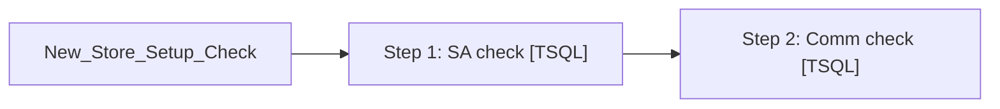

# Job: New_Store_Setup_Check

**Enabled:** No  
**Server:** bedrockdb01  
**Description:** Performs some checks on store setup and reports to the business user responsible for said setup  

## Architecture Diagram



## Steps

### Step 1: SA check
**Subsystem:** TSQL  

```sql
exec spNewStoreSetupCheckSA
```

### Step 2: Comm check
**Subsystem:** TSQL  

```sql
exec spNewStoreSetupCheckDE
```

