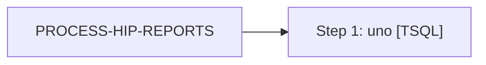

# Job: PROCESS-HIP-REPORTS

**Enabled:** No  
**Server:** bedrockdb01  
**Description:** Captures sales data for electronic sounds, sends email to HIP Digital.  

## Architecture Diagram



## Steps

### Step 1: uno
**Subsystem:** TSQL  

```sql
exec spAuditworksEmailHIP
```

