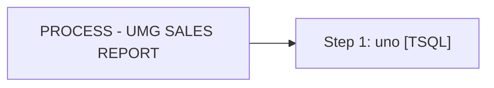

# Job: PROCESS - UMG SALES REPORT

**Enabled:** No  
**Server:** bedrockdb01  
**Description:** Captures UMG digital sales data, uploads to UMG group each month. --NO LONGER NEEDED, PER LISA WAGGONER - 1/13/2015  

## Architecture Diagram



## Steps

### Step 1: uno
**Subsystem:** TSQL  

```sql
exec spAuditworksUMGSalesFile
```

