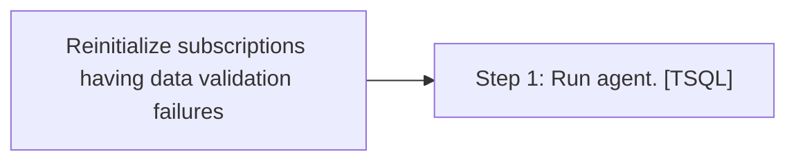

# Job: Reinitialize subscriptions having data validation failures

**Enabled:** Yes  
**Server:** bedrockdb01  
**Description:** Reinitializes all subscriptions that have data validation failures.  

## Architecture Diagram



## Steps

### Step 1: Run agent.
**Subsystem:** TSQL  

```sql
exec sys.sp_MSreinit_failed_subscriptions @failure_level = 1
```

