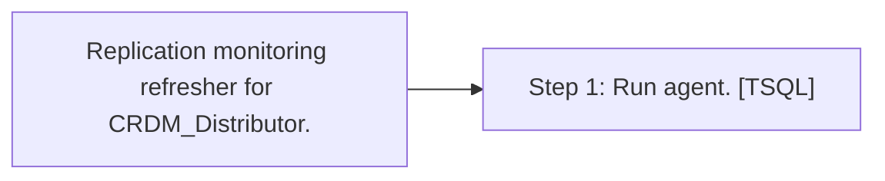

# Job: Replication monitoring refresher for CRDM_Distributor.

**Enabled:** No  
**Server:** bedrockdb01  
**Description:** Replication monitoring refresher for CRDM_Distributor.  

## Architecture Diagram



## Steps

### Step 1: Run agent.
**Subsystem:** TSQL  

```sql
exec dbo.sp_replmonitorrefreshjob
```

