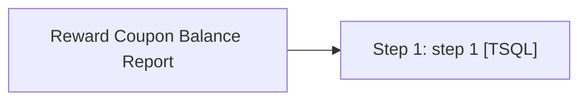

# Job: Reward Coupon Balance Report

**Enabled:** Yes  
**Server:** bedrockdb01  
**Description:** Send Reward Coupon Balance Report to Finance at period end  

## Architecture Diagram



## Steps

### Step 1: step 1
**Subsystem:** TSQL  

```sql
exec spRewardCouponBalanceReport
```

