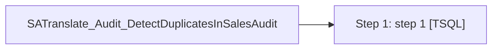

# Job: SATranslate_Audit_DetectDuplicatesInSalesAudit

**Enabled:** No  
**Server:** bedrockdb01  
**Description:** No description available.  

## Architecture Diagram



## Steps

### Step 1: step 1
**Subsystem:** TSQL  

```sql
exec spSA_DetectAndAlertAWproblems 30
```

