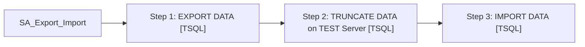

# Job: SA_Export_Import

**Enabled:** No  
**Server:** bedrockdb01  
**Description:** Exporting data from auditworks on the Production Server (BEDROCKDB01), Truncating data on test auditworks database (BEDROCKTESTDB01) and importing the data into the Test Server  

## Architecture Diagram



## Steps

### Step 1: EXPORT DATA
**Subsystem:** TSQL  

```sql
exec auditworks.dbo.EXPORT_DATA
```

### Step 2: TRUNCATE DATA on TEST Server
**Subsystem:** TSQL  

```sql
exec BEDROCKTESTDB01.auditworks.dbo.TRUNCATE_TEST_TABLES
```

### Step 3: IMPORT DATA
**Subsystem:** TSQL  

```sql
exec auditworks.dbo.IMPORT_DATA
```

