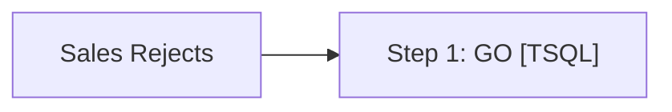

# Job: Sales Rejects

**Enabled:** No  
**Server:** bedrockdb01  
**Description:** Checks for existence of SA or IF rejects in Auditworks, sends emails.  

## Architecture Diagram



## Steps

### Step 1: GO
**Subsystem:** TSQL  

```sql
exec spAuditworksReportSalesRejects
```

