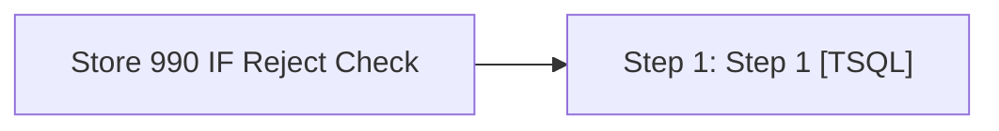

# Job: Store 990 IF Reject Check

**Enabled:** Yes  
**Server:** bedrockdb01  
**Description:** This job runs stored proc "spStore_990_IF_Reject_Check" which if the IF Reject qty for store 990 is past a set threshold, this validation will send an email alert to POSadmin so immediate action can be taken. If the threshold is passed, this is usually the result of a CL Import issue and needs to be resolved immediately.  

## Architecture Diagram



## Steps

### Step 1: Step 1
**Subsystem:** TSQL  

```sql
exec spStore_990_IF_Reject_Check
```

