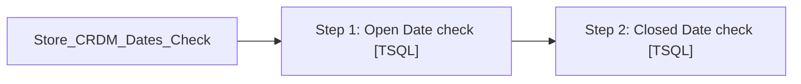

# Job: Store_CRDM_Dates_Check

**Enabled:** Yes  
**Server:** bedrockdb01  
**Description:** No description available. [1/25/2018 - Paul B] - Change Job name from 'OpenDateNULL' to 'Store_CRDM_Dates_Check'  

## Architecture Diagram



## Steps

### Step 1: Open Date check
**Subsystem:** TSQL  

```sql
exec spOpenDateNULL
```

### Step 2: Closed Date check
**Subsystem:** TSQL  

```sql
exec spStoresClosedDate
```

