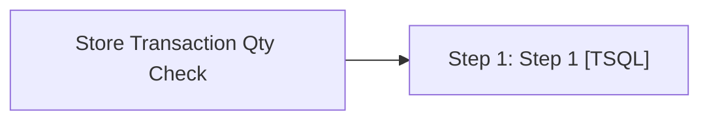

# Job: Store Transaction Qty Check

**Enabled:** Yes  
**Server:** bedrockdb01  
**Description:** This is a validation only script. If stores transaction count for the past 48 hours is past a set threshold, this validation will send an email alert so immediate action can be taken.  

## Architecture Diagram



## Steps

### Step 1: Step 1
**Subsystem:** TSQL  

```sql
exec spStoreTransactionQtyCheck
```

