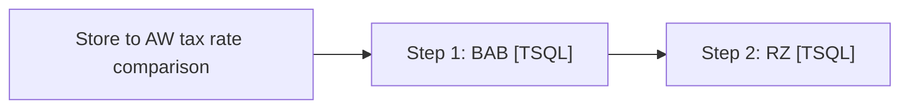

# Job: Store to AW tax rate comparison

**Enabled:** No  
**Server:** bedrockdb01  
**Description:** No description available.  

## Architecture Diagram



## Steps

### Step 1: BAB
**Subsystem:** TSQL  

```sql
SET QUOTED_IDENTIFIER ON 
GO
SET ANSI_NULLS ON 
GO

set nocount on 
declare @recipients varchar(8000) 
declare @subject varchar(500) 
declare @msg varchar(1000)
declare @iStore int 
declare @iStoreID int 
declare @sql varchar(8000)
declare @storeip varchar(12) 
declare @store varchar(10)

IF (Object_ID('tempdb..##activeStores') IS NOT NULL) DROP TABLE ##activeStores
IF (Object_ID('tempdb..##Store_Tax') IS NOT NULL) DROP TABLE ##Store_Tax
IF (Object_ID('tempdb..##final_compare') IS NOT NULL) DROP TABLE ##final_compare
create table ##Store_Tax (store_no int,tax_rule_id int,Effective_Date datetime,Expiration_Date datetime,Tax_Rate decimal(9,6))

select iStoreID, sStoreName, iCoalitionStore 
into ##activeStores
from KODIAK.BearHouse.dbo.tblStore 
where iCoalitionStore = '1' and iStoreID < '297'
order by iStoreID

Declare store_cursor Cursor for
select iStoreID from ##activeStores order by iStoreID
open store_cursor
fetch next from store_cursor into @iStoreID
while @@FETCH_STATUS = 0
begin
	set @store = convert(varchar, @iStoreID)
		if len(@store) = 2
			begin
			set @storeip = '10.0.' + substring(@store, 1,2) + '.101'	
			end
		else if len(@store) = 3
			begin
			set @storeip = '10.'+substring(@store, 1,1) + '.' + substring(@store, 2,2) + '.101'	
			end
		else
			set @storeip = '10.0.' + @store + '.101'		
set @sql = '
INSERT INTO ##Store_Tax
SELECT * FROM OPENROWSET(''SQLOLEDB'', ''' + @storeip + '''; ''sa'' ; ''5@5t0r3'', ''select s.store_no, tr.tax_rule_id, convert(varchar,tr.tax_rule_eff_dt,111),  
convert(varchar,tr.tax_rule_expr_dt,111), tr.tax_rate from USICOAL.dbo.store as s (nolock), USICOAL.dbo.tax_grp_zone_auth as tg (nolock), USICOAL.dbo.tax_rule as tr (nolock)
where s.tax_zone_id = tg.tax_zone_id and tr.tax_rule_id = tg.tax_rule_id and s.store_no = ''''' + @store + ''''' and tg.tax_group_id = 20'') as a'
exec (@sql)

fetch next from store_cursor into @iStoreID
End

close store_cursor 
deallocate store_cursor 

USE auditworks
select ##s.store_no as "Store #", tj.tax_jurisdiction_id as "TJ ID", tj.tax_jurisdiction as "TJ Jurisdiction", 
	tj.jurisdiction_name as "TJ Name", tj.tax_jurisdiction as "TR Jurisdiction", tr.tax_rate_id as "Tax Rate ID", 
	tr.effective_from_date as "TJ Effective From",
	tr.effective_until_date as "TJ Effective Until", ##s.Tax_Rate as "Store's Tax Rate", tr.combined_rate as "AW Tax Rate"
into ##final_compare
from tax_jurisdiction tj (nolock)
	join tax_rate tr (nolock) on tr.tax_jurisdiction = tj.tax_jurisdiction
	inner join ##Store_Tax ##s on ##s.tax_rule_id = tr.tax_rate_id
where tr.effective_until_date is null 
order by ##s.store_no

--select * from ##final_compare where "Store's Tax Rate" <>  "AW Tax Rate";

set @recipients = 'posadmin@buildabear.com'
set @subject = 'Store to Audiworks tax rate discrepancy'

if (select count(*) from ##final_compare) > 0  
begin
	exec msdb.dbo.sp_send_dbmail
		@recipients = @recipients,
		@subject=@subject, 
		@query_result_width = 250,
		@body = @msg,
		@query= 'select * from ##final_compare'
end

GO
```

### Step 2: RZ
**Subsystem:** TSQL  

```sql
-- STORE TO AW SALES TAX VALIDATION QUERY (RZ)
SET QUOTED_IDENTIFIER ON 
GO
SET ANSI_NULLS ON 
GO

set nocount on 
declare @recipients varchar(8000) 
declare @subject varchar(500) 
declare @msg varchar(1000)
declare @iStore int 
declare @iStoreID int 
declare @sql varchar(8000)
declare @storeip varchar(12) 
declare @store varchar(10)

IF (Object_ID('tempdb..##activeStores') IS NOT NULL) DROP TABLE ##activeStores
IF (Object_ID('tempdb..##Store_Tax') IS NOT NULL) DROP TABLE ##Store_Tax
IF (Object_ID('tempdb..##final_compare') IS NOT NULL) DROP TABLE ##final_compare

create table ##Store_Tax (store_no int,tax_rule_id int,Effective_Date datetime,Expiration_Date datetime,Tax_Rate decimal(9,6))

select iStoreID, sStoreName, iCoalitionStore 
into ##activeStores
from KODIAK.BearHouse.dbo.tblStore 
where iCoalitionStore = '1' 
	and (iStoreID like '15%') 
	and len(iStoreID) = 4 
order by iStoreID

Declare store_cursor Cursor for
select iStoreID from ##activeStores order by iStoreID
open store_cursor
fetch next from store_cursor into @iStoreID
while @@FETCH_STATUS = 0
begin
set @store = convert(varchar, @iStoreID)
set @storeip = '10.15.' + substring(@store, 3,2) + '.101'
set @sql = '
INSERT INTO ##Store_Tax
SELECT * FROM OPENROWSET(''SQLOLEDB'', ''' + @storeip + '''; ''sa'' ; ''5@5t0r3'', ''select s.store_no, tr.tax_rule_id, convert(varchar,tr.tax_rule_eff_dt,111),  
convert(varchar,tr.tax_rule_expr_dt,111), tr.tax_rate from USICOAL.dbo.store as s, USICOAL.dbo.tax_grp_zone_auth as tg, USICOAL.dbo.tax_rule as tr
where s.tax_zone_id = tg.tax_zone_id and tr.tax_rule_id = tg.tax_rule_id and s.store_no = ''''' + @store + ''''' and tg.tax_group_id = 20'') as a'
exec (@sql)
fetch next from store_cursor into @iStoreID
End
close store_cursor 
deallocate store_cursor 

USE auditworks
select ##s.store_no as "Store #", tj.tax_jurisdiction_id as "TJ ID", tj.tax_jurisdiction as "TJ Jurisdiction", 
tj.jurisdiction_name as "TJ Name", tj.tax_jurisdiction as "TR Jurisdiction", tr.tax_rate_id as "Tax Rate ID", 
tr.effective_from_date as "TJ Effective From",
tr.effective_until_date as "TJ Effective Until", ##s.Tax_Rate as "Store's Tax Rate", tr.combined_rate as "AW Tax Rate"
into ##final_compare
from tax_jurisdiction tj 
join tax_rate tr on tr.tax_jurisdiction = tj.tax_jurisdiction
inner join ##Store_Tax ##s on ##s.tax_rule_id = tr.tax_rate_id
where tr.effective_until_date is null 
order by ##s.store_no

select * from ##final_compare where "Store's Tax Rate" <>  "AW Tax Rate";

set @recipients = 'posadmin@buildabear.com'
set @subject = 'Store to Audiworks tax rate discrepancy (RZ)'

if (select count(*) from ##final_compare) > 0  
begin
	exec msdb.dbo.sp_send_dbmail
		@recipients = @recipients,
		@subject=@subject, 
		@query_result_width = 250,
		@body = @msg,
		@query= 'select * from ##final_compare'
end


GO
```

