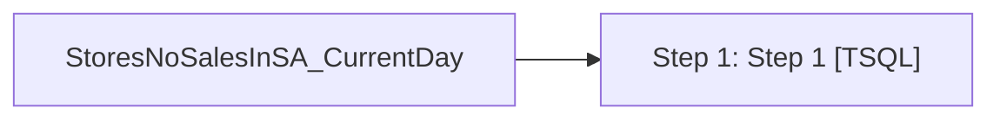

# Job: StoresNoSalesInSA_CurrentDay

**Enabled:** Yes  
**Server:** bedrockdb01  
**Description:** Reports stores that are not showing Sale transactions in Sales Audit for today and highlights any if no sales for more than the last two consecutive days  

## Architecture Diagram



## Steps

### Step 1: Step 1
**Subsystem:** TSQL  

```sql
exec spStoresNoSales @DaysBack = 0
```

