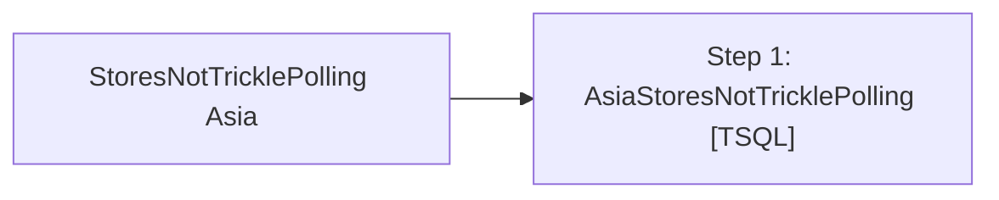

# Job: StoresNotTricklePolling Asia

**Enabled:** Yes  
**Server:** bedrockdb01  
**Description:** Emails Asia stores that have not trickle polled in 3 hours prior to job run  

## Architecture Diagram



## Steps

### Step 1: AsiaStoresNotTricklePolling
**Subsystem:** TSQL  

```sql
USE auditworks
EXEC spAsiaStoresNotPolling
```

