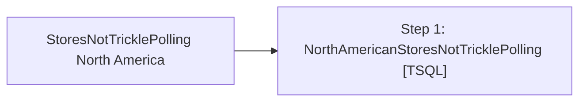

# Job: StoresNotTricklePolling North America

**Enabled:** Yes  
**Server:** bedrockdb01  
**Description:** No description available.  

## Architecture Diagram



## Steps

### Step 1: NorthAmericanStoresNotTricklePolling
**Subsystem:** TSQL  

```sql
USE auditworks
exec spNorthAmericaStoresNotPolling


/*  -- OLD JOB STEP REPLACED BY PAUL BECKMAN ON 13 APR 2009

IF (Object_ID('tempdb..#stores') IS NOT NULL) DROP TABLE #stores
SELECT DISTINCT reg.store_no 
INTO #stores
FROM register reg
join store_salesaudit store
on reg.store_no = store.store_no
where reg.register_type = 11
	and reg.translate_lookup_version = 6 -- North American Coalition Stores	
--	and reg.translate_lookup_version = 8 -- UK Coalition Stores	
	and store.open_date < getdate()+1
	and reg.store_no NOT IN (17,155,165,179,180,212,242,285,470,482,485,486,990,991,1502,1505,1506,1507,1508,1509,1511,1570)
order by reg.store_no

IF (Object_ID('tempdb..#edittime') IS NOT NULL) DROP TABLE #edittime
SELECT DATEPART (mm,getdate()) * 100000000000.0 + DATEPART ( dd, getdate() ) * 1000000000.0 + (DATEPART ( hh, getdate() ) -3 )* 10000000.0 + DATEPART ( mi, getdate() ) * 100000.0 + DATEPART ( ss, getdate() ) * 1000.0 + DATEPART ( ms, getdate() ) AS edittime
INTO #edittime

IF (Object_ID('tempdb..#stores_polled') IS NOT NULL) DROP TABLE #stores_polled
SELECT th.store_no, MAX(edit_timestamp) AS last_poll_time
INTO #stores_polled
--FROM transaction_header th
FROM (select store_no, edit_timestamp from transaction_header where cast(convert(varchar,transaction_date,101) as datetime) = cast(convert(varchar,getdate(),101) as datetime))th 
join #stores s
on th.store_no =s.store_no
GROUP BY th.store_no

IF (Object_ID('tempdb..##StoresNotPolled') IS NOT NULL) DROP TABLE ##StoresNotPolled
SELECT DISTINCT th.store_no as Store_No,
				substring(convert(varchar,convert(numeric,last_poll_time)),len(convert(numeric,last_poll_time))-8,2) + ':' + substring(convert(varchar,convert(numeric,last_poll_time)),len(convert(numeric,last_poll_time))-6,2) as Last_Poll_Time
into ##StoresNotPolled
FROM OURSBLANC.auditworks.dbo.transaction_header th
join #stores_polled sp
on th.store_no = sp.store_no
where sp.last_poll_time < (SELECT edittime FROM #edittime)
ORDER BY  th.store_no

exec master..xp_sendmail @recipients = 'RS Polling'
	,@message = 'The following North American Coalition stores have not reported sales in Auditworks for the last 3 hours:'
	,@subject = 'North American Stores Not Trickle Polling'
	,@query = 'select Store_No, Last_Poll_Time from ##StoresNotPolled'

*/
```

