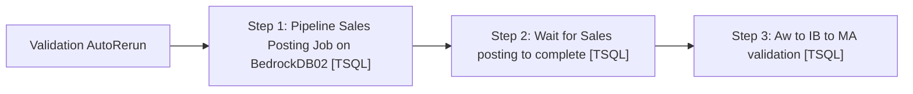

# Job: Validation AutoRerun

**Enabled:** Yes  
**Server:** bedrockdb01  
**Description:** Run sales posting Pipeline segments then Aw to IB to MA validations again if there is a problem email gereated from scheduled validations  

## Architecture Diagram



## Steps

### Step 1: Pipeline Sales Posting Job on BedrockDB02
**Subsystem:** TSQL  

```sql
EXEC [BEDROCKDB02].msdb.dbo.sp_start_job @job_name = 'MERCHANDISING - Process - Pipeline Sales Posting';
```

### Step 2: Wait for Sales posting to complete
**Subsystem:** TSQL  

```sql
WAITFOR DELAY '00:30:00'; --wait for 30 min
```

### Step 3: Aw to IB to MA validation
**Subsystem:** TSQL  

```sql
EXEC [auditworks].[dbo].[spAuditworksReportAWtoIBtoMACompareUpdate]
```

