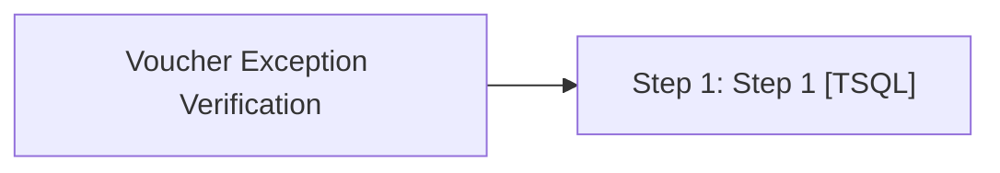

# Job: Voucher Exception Verification

**Enabled:** Yes  
**Server:** bedrockdb01  
**Description:** Flags Party Deposit, SFS vouchers, and Serialized Coupon customer liability exceptions as Verified if the sync flag is set to '0' (Synced). This eliminates the need for the Sales Audit team to do this from the front end application  

## Architecture Diagram



## Steps

### Step 1: Step 1
**Subsystem:** TSQL  

```sql
exec spVoucher_Exception_Verification
```

