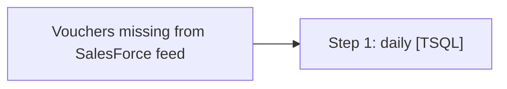

# Job: Vouchers missing from SalesForce feed

**Enabled:** Yes  
**Server:** bedrockdb01  
**Description:** No description available.  

## Architecture Diagram



## Steps

### Step 1: daily
**Subsystem:** TSQL  

```sql
exec [dbo].[spVouchersMissingFromSalesForceLoad]
```

