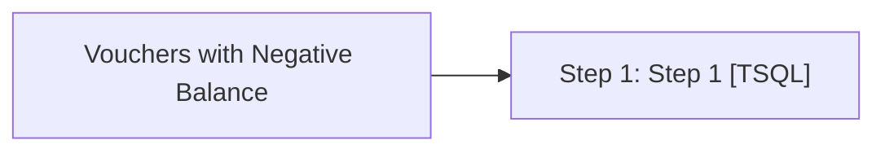

# Job: Vouchers with Negative Balance

**Enabled:** Yes  
**Server:** bedrockdb01  
**Description:** Emails notification if vouchers are found with a negative balance  

## Architecture Diagram



## Steps

### Step 1: Step 1
**Subsystem:** TSQL  

```sql
exec spVouchers_with_Negative_Balance
```

