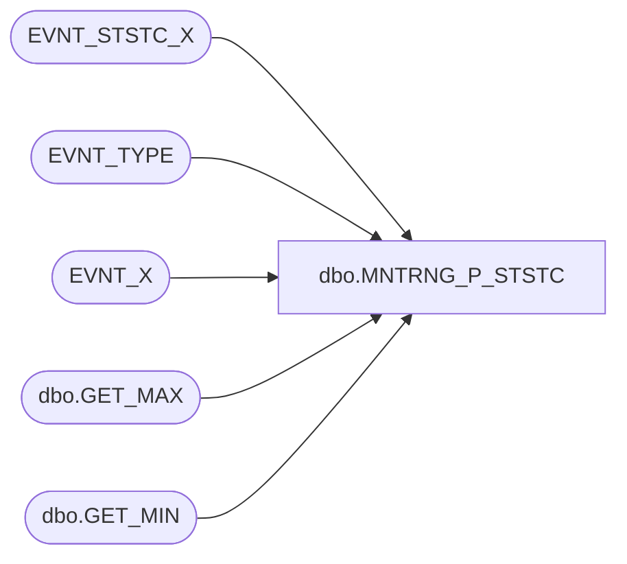

# dbo.MNTRNG_P_STSTC

**Database:** COMM_EVENT  
**Server:** bedrockdb01  

## Architecture Diagram



## Table Dependencies

| Referenced Table |
|---|
| EVNT_STSTC_X |
| EVNT_TYPE |
| EVNT_X |
| dbo.GET_MAX |
| dbo.GET_MIN |

## Stored Procedure Code

```sql
/**************************************************************** 
 Name           : MNTRNG_P_STSTC 
 Purpose        : Create Hour statistics for this event type
 Parameters     : Batch Size
 Returns        : > 0 - successful (number of events processed), -1 to -6 - unsuccessful 
 Created by     : Philippe Lanthier 
 Creation Date  : Dec-14-2004
****************************************************************/ 
CREATE PROCEDURE [dbo].[MNTRNG_P_STSTC] 
@BATCH_SIZE as int			--Max number of records in a batch
AS
--Create temporary event table
CREATE TABLE dbo.#TMP_EVNT_X
(
	POST_DTM smalldatetime NOT NULL,
	FLD_1 int NOT NULL,
	FLD_2 int NOT NULL,
	FLD_3 int NOT NULL,
	FLD_4 int NOT NULL
) ON [PRIMARY]
--Variables
DECLARE @MAX_EVNT_ID as int,		   --Last event id processed during this cycle
		  @STRT_EVNT_ID as int,		   --First event of batch
		  @END_EVNT_ID as int,		   --Last event of batch
		  @LAST_STSTC_EVNT_ID as int,	--Last event id processed in the previous cycle
		  @EVNT_TYPE_ID as int, 		--Constant for Event Type ID
		  @ERROR as int,				   --Error return code
        @ROWS as int,               --Total number of events processed
        @ROWCOUNT as int            --Number of events processed in a batch
SELECT @EVNT_TYPE_ID = 1 --TO BE CHANGED
SELECT @ERROR = 0 , @ROWS = 0, @END_EVNT_ID = 0
--Get last event id processed during this cycle
SELECT @MAX_EVNT_ID = MAX(ISNULL(EVNT_ID,0))
  FROM EVNT_X
--Loop to process all events by doing it in smaller batch
WHILE @END_EVNT_ID < @MAX_EVNT_ID
BEGIN
	BEGIN TRAN
	
	--Get last event id processed in the previous cycle
	SELECT @LAST_STSTC_EVNT_ID = ISNULL(LAST_STSTC_EVNT_ID,0)
	  FROM EVNT_TYPE
	 WHERE EVNT_TYPE_ID = @EVNT_TYPE_ID
	
	IF (@@ERROR <> 0)
	BEGIN
		ROLLBACK TRAN
		SELECT @ERROR = -1
		BREAK
	END
	--Set the batch range
	SELECT @STRT_EVNT_ID = @LAST_STSTC_EVNT_ID + 1, 
	       @END_EVNT_ID = @LAST_STSTC_EVNT_ID + @BATCH_SIZE
	
	--Make sure to stay within the range of events to process
	IF @END_EVNT_ID > @MAX_EVNT_ID
		SELECT @END_EVNT_ID = @MAX_EVNT_ID
   
   IF @STRT_EVNT_ID > @END_EVNT_ID
   BEGIN
      COMMIT TRAN
      SELECT @ERROR = @ROWS 
      BREAK
   END
	--Populate the temporary event table using only the new events
	INSERT INTO #TMP_EVNT_X 
	SELECT DATEADD(ms, -DATEPART(ms, EVNT_POST_DTM), DATEADD(ss, -DATEPART(ss, EVNT_POST_DTM), DATEADD(mi, -DATEPART(mi, EVNT_POST_DTM), EVNT_POST_DTM))),
		    FLD_1,
    		 FLD_2,
		    FLD_3,
		    FLD_4
	 FROM EVNT_X
	WHERE EVNT_ID >= @STRT_EVNT_ID 
	  AND EVNT_ID <= @END_EVNT_ID
   --Get the number of rows processed
   SELECT @ROWCOUNT = @@ROWCOUNT, @ERROR = @@ERROR
	IF (@ERROR <> 0)
	BEGIN
		ROLLBACK TRAN
		SELECT @ERROR = -2
		BREAK
	END
   --Add the processed rows
   SELECT @ROWS = @ROWS + @ROWCOUNT
	--Update statistics for existing buckets of the temporary statistic table
	UPDATE EVNT_STSTC_X SET 
		    EVNT_STSTC_X.LAST_MDFD_DTM = getdate(),
		    EVNT_STSTC_X.FLD_4_SUM = s.FLD_4_SUM + te.FLD_4,
		    EVNT_STSTC_X.FLD_4_MIN = dbo.GET_MIN(s.FLD_4_MIN, te.FLD_4),
		    EVNT_STSTC_X.FLD_4_MAX = dbo.GET_MAX(s.FLD_4_MAX, te.FLD_4),
		    EVNT_STSTC_X.FLD_4_LAST = te.FLD_4
	FROM #TMP_EVNT_X te, EVNT_STSTC_X s
	WHERE s.POST_DTM = te.POST_DTM
     AND s.KEY_1 = te.FLD_1
     AND s.KEY_2 = te.FLD_2
     AND s.KEY_3 = te.FLD_3
	
	IF (@@ERROR <> 0)
	BEGIN
		ROLLBACK TRAN
		SELECT @ERROR = -3
		BREAK
	END
	
	--Delete temporary events already used to update statistics
	DELETE #TMP_EVNT_X
	  FROM #TMP_EVNT_X te, EVNT_STSTC_X s
	 WHERE s.POST_DTM = te.POST_DTM
      AND s.KEY_1 = te.FLD_1
      AND s.KEY_2 = te.FLD_2
      AND s.KEY_3 = te.FLD_3
	
	IF (@@ERROR <> 0)
	BEGIN
		ROLLBACK TRAN
		SELECT @ERROR = -4
		BREAK
	END
	
	--Insert statistics using the remaining temporary events
	INSERT EVNT_STSTC_X (KEY_1, KEY_2, KEY_3, POST_DTM, CNT, FLD_4_SUM, FLD_4_MIN, FLD_4_MAX, FLD_4_FRST, FLD_4_LAST)
	SELECT FLD_1, FLD_2, FLD_3, MIN(POST_DTM), COUNT(*), SUM(FLD_4), MIN(FLD_4), MAX(FLD_4), MIN(FLD_4), MAX(FLD_4)
	  FROM #TMP_EVNT_X
	 GROUP BY POST_DTM, FLD_1, FLD_2, FLD_3
	
	IF (@@ERROR <> 0)
	BEGIN
		ROLLBACK TRAN
		SELECT @ERROR = -5
		BREAK
	END
	
  	 TRUNCATE TABLE #TMP_EVNT_X
	--Update the last event id processed
	UPDATE EVNT_TYPE
	   SET LAST_STSTC_EVNT_ID = @END_EVNT_ID
	 WHERE EVNT_TYPE_ID = @EVNT_TYPE_ID 
	
	IF (@@ERROR <> 0)
	BEGIN
		ROLLBACK TRAN
		SELECT @ERROR = -6
		BREAK
	END
	
	COMMIT TRAN
END --WHILE
DROP TABLE #TMP_EVNT_X
IF @ERROR <> 0
   RETURN @ERROR
ELSE
   RETURN @ROWS
```

