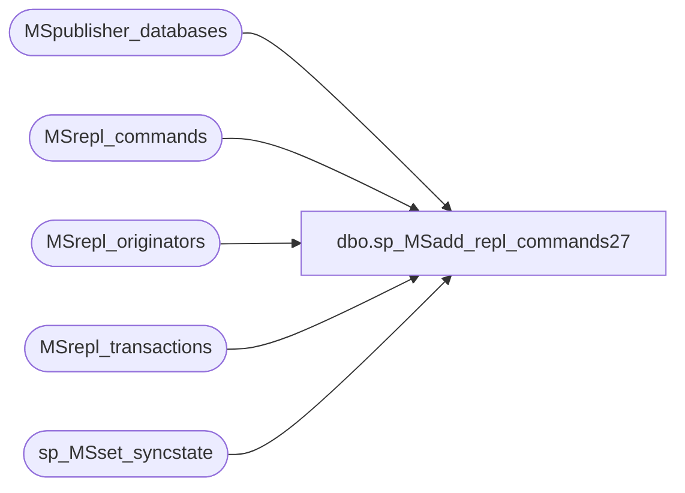

# dbo.sp_MSadd_repl_commands27

**Database:** CRDM_Distributor  
**Server:** bedrockdb01  

## Architecture Diagram



## Table Dependencies

| Referenced Table |
|---|
| MSpublisher_databases |
| MSrepl_commands |
| MSrepl_originators |
| MSrepl_transactions |
| sp_MSset_syncstate |

## Stored Procedure Code

```sql
CREATE PROCEDURE sp_MSadd_repl_commands27
(
@publisher_id smallint,
@publisher_db sysname,
@xact_id varbinary(16) = 0x0,
@xact_seqno varbinary(16) = 0x0,
@originator sysname,
@originator_db sysname,
@article_id int,
@command_id int,
@type int = 0,
@partial_command bit,
@command varbinary(1024),

@1xact_id varbinary(16) = 0x0,

@1xact_seqno varbinary(16) = 0x0,
@1originator sysname = NULL,
@1originator_db sysname = NULL,
@1article_id int = 0,
@1command_id int = 0,
@1type int = 0,
@1partial_command bit = 0,
@1command varbinary(1024) = NULL,

@2xact_id varbinary(16) = 0x0,

@2xact_seqno varbinary(16) = 0x0,
@2originator sysname = NULL,
@2originator_db sysname = NULL,
@2article_id int = 0,
@2command_id int = 0,
@2type int = 0,
@2partial_command bit = 0,
@2command varbinary(1024) = NULL,

@3xact_id varbinary(16) = 0x0,

@3xact_seqno varbinary(16) = 0x0,
@3originator sysname = NULL,
@3originator_db sysname = NULL,
@3article_id int = 0,
@3command_id int = 0,
@3type int = 0,
@3partial_command bit = 0,
@3command varbinary(1024) = NULL,

@4xact_id varbinary(16) = 0x0,

@4xact_seqno varbinary(16) = 0x0,
@4originator sysname = NULL,
@4originator_db sysname = NULL,
@4article_id int = 0,
@4command_id int = 0,
@4type int = 0,
@4partial_command bit = 0,
@4command varbinary(1024) = NULL,

@5xact_id varbinary(16) = 0x0,

@5xact_seqno varbinary(16) = 0x0,
@5originator sysname = NULL,
@5originator_db sysname = NULL,
@5article_id int = 0,
@5command_id int = 0,
@5type int = 0,
@5partial_command bit = 0,
@5command varbinary(1024) = NULL,

@6xact_id varbinary(16) = 0x0,

@6xact_seqno varbinary(16) = 0x0,
@6originator sysname = NULL,
@6originator_db sysname = NULL,
@6article_id int = 0,
@6command_id int = 0,
@6type int = 0,
@6partial_command bit = 0,
@6command varbinary(1024) = NULL,

@7xact_id varbinary(16) = 0x0,

@7xact_seqno varbinary(16) = 0x0,
@7originator sysname = NULL,
@7originator_db sysname = NULL,
@7article_id int = 0,
@7command_id int = 0,
@7type int = 0,
@7partial_command bit = 0,
@7command varbinary(1024) = NULL,

@8xact_id varbinary(16) = 0x0,

@8xact_seqno varbinary(16) = 0x0,
@8originator sysname = NULL,
@8originator_db sysname = NULL,
@8article_id int = 0,
@8command_id int = 0,
@8type int = 0,
@8partial_command bit = 0,
@8command varbinary(1024) = NULL,

@9xact_id varbinary(16) = 0x0,

@9xact_seqno varbinary(16) = 0x0,
@9originator sysname = NULL,
@9originator_db sysname = NULL,
@9article_id int = 0,
@9command_id int = 0,
@9type int = 0,
@9partial_command bit = 0,
@9command varbinary(1024) = NULL,

@10xact_id varbinary(16) = 0x0,

@10xact_seqno varbinary(16) = 0x0,
@10originator sysname = NULL,
@10originator_db sysname = NULL,
@10article_id int = 0,
@10command_id int = 0,
@10type int = 0,
@10partial_command bit = 0,
@10command varbinary(1024) = NULL,

@11xact_id varbinary(16) = 0x0,

@11xact_seqno varbinary(16) = 0x0,
@11originator sysname = NULL,
@11originator_db sysname = NULL,
@11article_id int = 0,
@11command_id int = 0,
@11type int = 0,
@11partial_command bit = 0,
@11command varbinary(1024) = NULL,

@12xact_id varbinary(16) = 0x0,

@12xact_seqno varbinary(16) = 0x0,
@12originator sysname = NULL,
@12originator_db sysname = NULL,
@12article_id int = 0,
@12command_id int = 0,
@12type int = 0,
@12partial_command bit = 0,
@12command varbinary(1024) = NULL,

@13xact_id varbinary(16) = 0x0,

@13xact_seqno varbinary(16) = 0x0,
@13originator sysname = NULL,
@13originator_db sysname = NULL,
@13article_id int = 0,
@13command_id int = 0,
@13type int = 0,
@13partial_command bit = 0,
@13command varbinary(1024) = NULL,

@14xact_id varbinary(16) = 0x0,

@14xact_seqno varbinary(16) = 0x0,
@14originator sysname = NULL,
@14originator_db sysname = NULL,
@14article_id int = 0,
@14command_id int = 0,
@14type int = 0,
@14partial_command bit = 0,
@14command varbinary(1024) = NULL,

@15xact_id varbinary(16) = 0x0,

@15xact_seqno varbinary(16) = 0x0,
@15originator sysname = NULL,
@15originator_db sysname = NULL,
@15article_id int = 0,
@15command_id int = 0,
@15type int = 0,
@15partial_command bit = 0,
@15command varbinary(1024) = NULL,

@16xact_id varbinary(16) = 0x0,

@16xact_seqno varbinary(16) = 0x0,
@16originator sysname = NULL,
@16originator_db sysname = NULL,
@16article_id int = 0,
@16command_id int = 0,
@16type int = 0,
@16partial_command bit = 0,
@16command varbinary(1024) = NULL,

@17xact_id varbinary(16) = 0x0,

@17xact_seqno varbinary(16) = 0x0,
@17originator sysname = NULL,
@17originator_db sysname = NULL,
@17article_id int = 0,
@17command_id int = 0,
@17type int = 0,
@17partial_command bit = 0,
@17command varbinary(1024) = NULL,

@18xact_id varbinary(16) = 0x0,

@18xact_seqno varbinary(16) = 0x0,
@18originator sysname = NULL,
@18originator_db sysname = NULL,
@18article_id int = 0,
@18command_id int = 0,
@18type int = 0,
@18partial_command bit = 0,
@18command varbinary(1024) = NULL,

@19xact_id varbinary(16) = 0x0,

@19xact_seqno varbinary(16) = 0x0,
@19originator sysname = NULL,
@19originator_db sysname = NULL,
@19article_id int = 0,
@19command_id int = 0,
@19type int = 0,
@19partial_command bit = 0,
@19command varbinary(1024) = NULL,

@20xact_id varbinary(16) = 0x0,

@20xact_seqno varbinary(16) = 0x0,
@20originator sysname = NULL,
@20originator_db sysname = NULL,
@20article_id int = 0,
@20command_id int = 0,
@20type int = 0,
@20partial_command bit = 0,
@20command varbinary(1024) = NULL,

@21xact_id varbinary(16) = 0x0,

@21xact_seqno varbinary(16) = 0x0,
@21originator sysname = NULL,
@21originator_db sysname = NULL,
@21article_id int = 0,
@21command_id int = 0,
@21type int = 0,
@21partial_command bit = 0,
@21command varbinary(1024) = NULL,

@22xact_id varbinary(16) = 0x0,

@22xact_seqno varbinary(16) = 0x0,
@22originator sysname = NULL,
@22originator_db sysname = NULL,
@22article_id int = 0,
@22command_id int = 0,
@22type int = 0,
@22partial_command bit = 0,
@22command varbinary(1024) = NULL,

@23xact_id varbinary(16) = 0x0,

@23xact_seqno varbinary(16) = 0x0,
@23originator sysname = NULL,
@23originator_db sysname = NULL,
@23article_id int = 0,
@23command_id int = 0,
@23type int = 0,
@23partial_command bit = 0,
@23command varbinary(1024) = NULL,

@24xact_id varbinary(16) = 0x0,

@24xact_seqno varbinary(16) = 0x0,
@24originator sysname = NULL,
@24originator_db sysname = NULL,
@24article_id int = 0,
@24command_id int = 0,
@24type int = 0,
@24partial_command bit = 0,
@24command varbinary(1024) = NULL,

@25xact_id varbinary(16) = 0x0,

@25xact_seqno varbinary(16) = 0x0,
@25originator sysname = NULL,
@25originator_db sysname = NULL,
@25article_id int = 0,
@25command_id int = 0,
@25type int = 0,
@25partial_command bit = 0,
@25command varbinary(1024) = NULL,

@26xact_id varbinary(16) = 0x0,

@26xact_seqno varbinary(16) = 0x0,
@26originator sysname = NULL,
@26originator_db sysname = NULL,
@26article_id int = 0,
@26command_id int = 0,
@26type int = 0,
@26partial_command bit = 0,
@26command varbinary(1024) = NULL
)
AS
begin
    SET NOCOUNT ON

    DECLARE @publisher_database_id int
    DECLARE @date datetime
    declare @originator_id int
	declare @syncstat int

    SELECT @date = GETDATE()

    -- Get publisher database id.
    SELECT @publisher_database_id = id from MSpublisher_databases where publisher_id = @publisher_id and 
        publisher_db = @publisher_db
    
    -- First insert into MS_repl_transactions
    IF @command_id = 1
      INSERT INTO MSrepl_transactions VALUES (@publisher_database_id,
         @xact_id,  @xact_seqno, @date)

    IF @1xact_id = 0x0
      goto INSERT_CMDS
    IF @1command_id = 1
      INSERT INTO MSrepl_transactions VALUES (@publisher_database_id,
         @1xact_id,  @1xact_seqno, @date)

    IF @2xact_id = 0x0
      goto INSERT_CMDS
    IF @2command_id = 1
      INSERT INTO MSrepl_transactions VALUES (@publisher_database_id,
         @2xact_id,  @2xact_seqno, @date)
    
    IF @3xact_id = 0x0
      goto INSERT_CMDS
    IF @3command_id = 1
      INSERT INTO MSrepl_transactions VALUES (@publisher_database_id,
         @3xact_id,  @3xact_seqno, @date)

    IF @4xact_id = 0x0
      goto INSERT_CMDS
    IF @4command_id = 1
      INSERT INTO MSrepl_transactions VALUES (@publisher_database_id,
        @4xact_id,  @4xact_seqno, @date)

    IF @5xact_id = 0x0
      goto INSERT_CMDS

    IF @5command_id = 1
      INSERT INTO MSrepl_transactions VALUES (@publisher_database_id,
         @5xact_id,  @5xact_seqno, @date)

    IF @6xact_id = 0x0
      goto INSERT_CMDS
    IF @6command_id = 1
      INSERT INTO MSrepl_transactions VALUES (@publisher_database_id,
         @6xact_id,  @6xact_seqno, @date)

    IF @7xact_id = 0x0
      goto INSERT_CMDS
    IF @7command_id = 1
      INSERT INTO MSrepl_transactions VALUES (@publisher_database_id,
         @7xact_id,  @7xact_seqno, @date)

    IF @8xact_id = 0x0
      goto INSERT_CMDS
    IF @8command_id = 1
      INSERT INTO MSrepl_transactions VALUES (@publisher_database_id,
         @8xact_id,  @8xact_seqno, @date)

    IF @9xact_id = 0x0
      goto INSERT_CMDS
    IF @9command_id = 1
      INSERT INTO MSrepl_transactions VALUES (@publisher_database_id,
         @9xact_id,  @9xact_seqno, @date)

    IF @10xact_id = 0x0
      goto INSERT_CMDS
    IF @10command_id = 1
      INSERT INTO MSrepl_transactions VALUES (@publisher_database_id,
         @10xact_id,  @10xact_seqno, @date)

    IF @11xact_id = 0x0
      goto INSERT_CMDS
    IF @11command_id = 1
      INSERT INTO MSrepl_transactions VALUES (@publisher_database_id,
         @11xact_id,  @11xact_seqno, @date)

    IF @12xact_id = 0x0
      goto INSERT_CMDS
    IF @12command_id = 1
      INSERT INTO MSrepl_transactions VALUES (@publisher_database_id,
         @12xact_id,  @12xact_seqno, @date)

    IF @13xact_id = 0x0
      goto INSERT_CMDS
    IF @13command_id = 1
      INSERT INTO MSrepl_transactions VALUES (@publisher_database_id,
         @13xact_id,  @13xact_seqno, @date)

    IF @14xact_id = 0x0
      goto INSERT_CMDS
    IF @14command_id = 1
      INSERT INTO MSrepl_transactions VALUES (@publisher_database_id,
         @14xact_id,  @14xact_seqno, @date)

    IF @15xact_id = 0x0
      goto INSERT_CMDS
    IF @15command_id = 1
      INSERT INTO MSrepl_transactions VALUES (@publisher_database_id,
         @15xact_id,  @15xact_seqno, @date)

    IF @16xact_id = 0x0
      goto INSERT_CMDS
    IF @16command_id = 1
      INSERT INTO MSrepl_transactions VALUES (@publisher_database_id,
         @16xact_id,  @16xact_seqno, @date)

    IF @17xact_id = 0x0
      goto INSERT_CMDS
    IF @17command_id = 1
      INSERT INTO MSrepl_transactions VALUES (@publisher_database_id,
         @17xact_id,  @17xact_seqno, @date)

    IF @18xact_id = 0x0
      goto INSERT_CMDS
    IF @18command_id = 1
      INSERT INTO MSrepl_transactions VALUES (@publisher_database_id,
         @18xact_id,  @18xact_seqno, @date)

    IF @19xact_id = 0x0
      goto INSERT_CMDS
    IF @19command_id = 1
      INSERT INTO MSrepl_transactions VALUES (@publisher_database_id,
         @19xact_id,  @19xact_seqno, @date)

    IF @20xact_id = 0x0
      goto INSERT_CMDS
    IF @20command_id = 1
      INSERT INTO MSrepl_transactions VALUES (@publisher_database_id,
         @20xact_id,  @20xact_seqno, @date)

    IF @21xact_id = 0x0
      goto INSERT_CMDS
    IF @21command_id = 1
      INSERT INTO MSrepl_transactions VALUES (@publisher_database_id,
         @21xact_id,  @21xact_seqno, @date)

    IF @22xact_id = 0x0
      goto INSERT_CMDS
    IF @22command_id = 1
      INSERT INTO MSrepl_transactions VALUES (@publisher_database_id,
         @22xact_id,  @22xact_seqno, @date)

    IF @23xact_id = 0x0
      goto INSERT_CMDS
    IF @23command_id = 1
      INSERT INTO MSrepl_transactions VALUES (@publisher_database_id,
         @23xact_id,  @23xact_seqno, @date)

    IF @24xact_id = 0x0
      goto INSERT_CMDS
    IF @24command_id = 1
      INSERT INTO MSrepl_transactions VALUES (@publisher_database_id,
         @24xact_id,  @24xact_seqno, @date)

    IF @25xact_id = 0x0
      goto INSERT_CMDS
    IF @25command_id = 1
      INSERT INTO MSrepl_transactions VALUES (@publisher_database_id,
         @25xact_id,  @25xact_seqno, @date)

    IF @26xact_id = 0x0
      goto INSERT_CMDS
    IF @26command_id = 1
      INSERT INTO MSrepl_transactions VALUES (@publisher_database_id,
         @26xact_id,  @26xact_seqno, @date)

INSERT_CMDS:

    -- Get the originator_id for the first command 
    if @originator <> N'' and @originator_db <> N'' and @originator is not null and @originator_db is not null 
    begin 
        set @originator_id = null select @originator_id = id from MSrepl_originators where
            publisher_database_id = @publisher_database_id and UPPER(srvname) = UPPER(@originator) and
            dbname = @originator_db
        if @originator_id is null
        begin
            insert into MSrepl_originators (publisher_database_id, srvname, dbname) values
                (@publisher_database_id, @originator, @originator_db)
            select @originator_id = @@identity
        end
    end
    else
        select @originator_id = 0

    -- Now insert into MSrepl_commands
    IF @command IS NOT NULL
	begin
		if( @type in( 37,38 ) )
		begin
		  select @syncstat = 38 - @type
		  exec sp_MSset_syncstate @publisher_id, @publisher_db, @article_id, @syncstat, @xact_seqno
		end

        INSERT INTO MSrepl_commands (publisher_database_id, xact_seqno, type, article_id, originator_id, command_id, partial_command, command)
		VALUES (@publisher_database_id, 
            @xact_seqno,@type, @article_id, 
            @originator_id, 
            @command_id, @partial_command, @command)
	end

    IF @1xact_id = 0x0
      return

    IF @1command IS NOT NULL
    begin
            if @1originator <> N'' and @1originator_db <> N'' and @1originator is not null and @1originator_db is not null 
            begin 
                set @originator_id = null select @originator_id = id from MSrepl_originators where
                    publisher_database_id = @publisher_database_id and UPPER(srvname) = UPPER(@1originator) and
                    dbname = @1originator_db
                if @originator_id is null
                begin
                    insert into MSrepl_originators (publisher_database_id, srvname, dbname) values
                        (@publisher_database_id, @1originator, @1originator_db)
                    select @originator_id = @@identity
                end
            end
            else
                select @originator_id = 0
    
		if( @type in( 37,38 ) )
		begin
		  select @syncstat = 38 - @1type
		  exec sp_MSset_syncstate @publisher_id, @publisher_db, @1article_id, @syncstat, @1xact_seqno
		end

        INSERT INTO MSrepl_commands (publisher_database_id, xact_seqno, type, article_id, originator_id, command_id, partial_command, command)
		VALUES (@publisher_database_id, 
            @1xact_seqno,@1type, @1article_id, 
            @originator_id, 
            @1command_id, @1partial_command, @1command)
    end

    IF @2xact_id = 0x0
      return
    IF @2command IS NOT NULL
    begin
            if @2originator <> N'' and @2originator_db <> N'' and @2originator is not null and @2originator_db is not null 
            begin 
                set @originator_id = null select @originator_id = id from MSrepl_originators where
                    publisher_database_id = @publisher_database_id and UPPER(srvname) = UPPER(@2originator) and
                    dbname = @2originator_db
                if @originator_id is null
                begin
                    insert into MSrepl_originators (publisher_database_id, srvname, dbname) values
                        (@publisher_database_id, @2originator, @2originator_db)
                    select @originator_id = @@identity
                end
            end
            else
                select @originator_id = 0
    
		if( @type in( 37,38 ) )
		begin
		  select @syncstat = 38 - @2type
		  exec sp_MSset_syncstate @publisher_id, @publisher_db, @2article_id, @syncstat, @2xact_seqno 
		end

        INSERT INTO MSrepl_commands (publisher_database_id, xact_seqno, type, article_id, originator_id, command_id, partial_command, command)
		VALUES (@publisher_database_id, 
            @2xact_seqno,@2type, @2article_id, 
            @originator_id, 
            @2command_id, @2partial_command, @2command)
    end

    IF @3xact_id = 0x0
      return
    IF @3command IS NOT NULL
    begin
            if @3originator <> N'' and @3originator_db <> N'' and @3originator is not null and @3originator_db is not null 
            begin 
                set @originator_id = null select @originator_id = id from MSrepl_originators where
                    publisher_database_id = @publisher_database_id and UPPER(srvname) = UPPER(@3originator) and
                    dbname = @3originator_db
                if @originator_id is null
                begin
                    insert into MSrepl_originators (publisher_database_id, srvname, dbname) values
                        (@publisher_database_id, @3originator, @3originator_db)
                    select @originator_id = @@identity
                end
            end
            else
                select @originator_id = 0

		if( @type in( 37,38 ) )
		begin
		  select @syncstat = 38 - @3type
		  exec sp_MSset_syncstate @publisher_id, @publisher_db, @3article_id, @syncstat, @3xact_seqno 
		end
    
        INSERT INTO MSrepl_commands (publisher_database_id, xact_seqno, type, article_id, originator_id, command_id, partial_command, command)
		VALUES (@publisher_database_id, 
            @3xact_seqno,@3type, @3article_id, 
            @originator_id, 
            @3command_id, @3partial_command, @3command)
    end

    IF @4xact_id = 0x0
      return
    IF @4command IS NOT NULL
    begin
            if @4originator <> N'' and @4originator_db <> N'' and @4originator is not null and @4originator_db is not null 
            begin 
                set @originator_id = null select @originator_id = id from MSrepl_originators where
                    publisher_database_id = @publisher_database_id and UPPER(srvname) = UPPER(@4originator) and
                    dbname = @4originator_db
                if @originator_id is null
                begin
                    insert into MSrepl_originators (publisher_database_id, srvname, dbname) values
                        (@publisher_database_id, @4originator, @4originator_db)
                    select @originator_id = @@identity
                end
            end
            else
                select @originator_id = 0

		if( @type in( 37,38 ) )
		begin
		  select @syncstat = 38 - @4type
		  exec sp_MSset_syncstate @publisher_id, @publisher_db, @4article_id, @syncstat, @4xact_seqno 
		end
    
        INSERT INTO MSrepl_commands (publisher_database_id, xact_seqno, type, article_id, originator_id, command_id, partial_command, command)
		VALUES (@publisher_database_id, 
            @4xact_seqno,@4type, @4article_id, 
            @originator_id, 
            @4command_id, @4partial_command, @4command)
    end

    IF @5xact_id = 0x0
      return
    IF @5command IS NOT NULL
    begin
            if @5originator <> N'' and @5originator_db <> N'' and @5originator is not null and @5originator_db is not null 
            begin 
                set @originator_id = null select @originator_id = id from MSrepl_originators where
                    publisher_database_id = @publisher_database_id and UPPER(srvname) = UPPER(@5originator) and
                    dbname = @5originator_db
                if @originator_id is null
                begin
                    insert into MSrepl_originators (publisher_database_id, srvname, dbname) values
                        (@publisher_database_id, @5originator, @5originator_db)
                    select @originator_id = @@identity
                end
            end
            else
                select @originator_id = 0
    
		if( @type in( 37,38 ) )
		begin
		  select @syncstat = 38 - @5type
		  exec sp_MSset_syncstate @publisher_id, @publisher_db, @5article_id, @syncstat, @5xact_seqno 
		end

        INSERT INTO MSrepl_commands (publisher_database_id, xact_seqno, type, article_id, originator_id, command_id, partial_command, command)
		VALUES (@publisher_database_id, 
            @5xact_seqno,@5type, @5article_id, 
            @originator_id, 
            @5command_id, @5partial_command, @5command)
    end

    IF @6xact_id = 0x0
      return
    IF @6command IS NOT NULL
    begin
            if @6originator <> N'' and @6originator_db <> N'' and @6originator is not null and @6originator_db is not null 
            begin 
                set @originator_id = null select @originator_id = id from MSrepl_originators where
                    publisher_database_id = @publisher_database_id and UPPER(srvname) = UPPER(@6originator) and
                    dbname = @6originator_db
                if @originator_id is null
                begin
                    insert into MSrepl_originators (publisher_database_id, srvname, dbname) values
                        (@publisher_database_id, @6originator, @6originator_db)
                    select @originator_id = @@identity
                end
            end
            else
                select @originator_id = 0

		if( @type in( 37,38 ) )
		begin
		  select @syncstat = 38 - @6type
		  exec sp_MSset_syncstate @publisher_id, @publisher_db, @6article_id, @syncstat, @6xact_seqno 
		end
    
        INSERT INTO MSrepl_commands (publisher_database_id, xact_seqno, type, article_id, originator_id, command_id, partial_command, command)
		VALUES (@publisher_database_id, 
            @6xact_seqno,@6type, @6article_id, 
            @originator_id, 
            @6command_id, @6partial_command, @6command)
    end

    IF @7xact_id = 0x0
      return
    IF @7command IS NOT NULL
    begin
            if @7originator <> N'' and @7originator_db <> N'' and @7originator is not null and @7originator_db is not null 
            begin 
                set @originator_id = null select @originator_id = id from MSrepl_originators where
                    publisher_database_id = @publisher_database_id and UPPER(srvname) = UPPER(@7originator) and
                    dbname = @7originator_db
                if @originator_id is null
                begin
                    insert into MSrepl_originators (publisher_database_id, srvname, dbname) values
                        (@publisher_database_id, @7originator, @7originator_db)
                    select @originator_id = @@identity
                end
            end
            else
                select @originator_id = 0
    
		if( @type in( 37,38 ) )
		begin
		  select @syncstat = 38 - @7type
		  exec sp_MSset_syncstate @publisher_id, @publisher_db, @7article_id, @syncstat, @7xact_seqno 
		end

        INSERT INTO MSrepl_commands (publisher_database_id, xact_seqno, type, article_id, originator_id, command_id, partial_command, command)
		VALUES (@publisher_database_id, 
            @7xact_seqno,@7type, @7article_id, 
            @originator_id, 
            @7command_id, @7partial_command, @7command)
    end

    IF @8xact_id = 0x0
      return
    IF @8command IS NOT NULL
    begin
            if @8originator <> N'' and @8originator_db <> N'' and @8originator is not null and @8originator_db is not null 
            begin 
                set @originator_id = null select @originator_id = id from MSrepl_originators where
                    publisher_database_id = @publisher_database_id and UPPER(srvname) = UPPER(@8originator) and
                    dbname = @8originator_db
                if @originator_id is null
                begin
                    insert into MSrepl_originators (publisher_database_id, srvname, dbname) values
                        (@publisher_database_id, @8originator, @8originator_db)
                    select @originator_id = @@identity
                end
            end
            else
                select @originator_id = 0
    
		if( @type in( 37,38 ) )
		begin
		  select @syncstat = 38 - @8type
		  exec sp_MSset_syncstate @publisher_id, @publisher_db, @8article_id, @syncstat, @8xact_seqno 
		end

        INSERT INTO MSrepl_commands (publisher_database_id, xact_seqno, type, article_id, originator_id, command_id, partial_command, command)
		VALUES (@publisher_database_id, 
            @8xact_seqno,@8type, @8article_id, 
            @originator_id, 
            @8command_id, @8partial_command, @8command)
    end

    IF @9xact_id = 0x0
      return
    IF @9command IS NOT NULL
    begin
            if @9originator <> N'' and @9originator_db <> N'' and @9originator is not null and @9originator_db is not null 
            begin 
                set @originator_id = null select @originator_id = id from MSrepl_originators where
                    publisher_database_id = @publisher_database_id and UPPER(srvname) = UPPER(@9originator) and
                    dbname = @9originator_db
                if @originator_id is null
                begin
                    insert into MSrepl_originators (publisher_database_id, srvname, dbname) values
                        (@publisher_database_id, @9originator, @9originator_db)
                    select @originator_id = @@identity
                end
            end
            else
                select @originator_id = 0
    
		if( @type in( 37,38 ) )
		begin
		  select @syncstat = 38 - @9type
		  exec sp_MSset_syncstate @publisher_id, @publisher_db, @9article_id, @syncstat, @9xact_seqno 
		end

        INSERT INTO MSrepl_commands (publisher_database_id, xact_seqno, type, article_id, originator_id, command_id, partial_command, command)
		VALUES (@publisher_database_id, 
            @9xact_seqno,@9type, @9article_id, 
            @originator_id, 
            @9command_id, @9partial_command, @9command)
    end

    IF @10xact_id = 0x0
      return
    IF @10command IS NOT NULL
    begin
            if @10originator <> N'' and @10originator_db <> N'' and @10originator is not null and @10originator_db is not null 
            begin 
                set @originator_id = null select @originator_id = id from MSrepl_originators where
                    publisher_database_id = @publisher_database_id and UPPER(srvname) = UPPER(@10originator) and
                    dbname = @10originator_db
                if @originator_id is null
                begin
                    insert into MSrepl_originators (publisher_database_id, srvname, dbname) values
                        (@publisher_database_id, @10originator, @10originator_db)
                    select @originator_id = @@identity
                end
            end
            else
                select @originator_id = 0
    
		if( @type in( 37,38 ) )
		begin
		  select @syncstat = 38 - @10type
		  exec sp_MSset_syncstate @publisher_id, @publisher_db, @10article_id, @syncstat, @10xact_seqno 
		end

        INSERT INTO MSrepl_commands (publisher_database_id, xact_seqno, type, article_id, originator_id, command_id, partial_command, command)
		VALUES (@publisher_database_id, 
            @10xact_seqno,@10type, @10article_id, 
            @originator_id, 
            @10command_id, @10partial_command, @10command)
    end

    IF @11xact_id = 0x0
      return
    IF @11command IS NOT NULL
    begin
            if @11originator <> N'' and @11originator_db <> N'' and @11originator is not null and @11originator_db is not null 
            begin 
                set @originator_id = null select @originator_id = id from MSrepl_originators where
                    publisher_database_id = @publisher_database_id and UPPER(srvname) = UPPER(@11originator) and
                    dbname = @11originator_db
                if @originator_id is null
                begin
                    insert into MSrepl_originators (publisher_database_id, srvname, dbname) values
                        (@publisher_database_id, @11originator, @11originator_db)
                    select @originator_id = @@identity
                end
            end
            else
                select @originator_id = 0
    
		if( @type in( 37,38 ) )
		begin
		  select @syncstat = 38 - @11type
		  exec sp_MSset_syncstate @publisher_id, @publisher_db, @11article_id, @syncstat, @11xact_seqno 
		end

        INSERT INTO MSrepl_commands (publisher_database_id, xact_seqno, type, article_id, originator_id, command_id, partial_command, command)
		VALUES (@publisher_database_id, 
            @11xact_seqno,@11type, @11article_id, 
            @originator_id, 
            @11command_id, @11partial_command, @11command)
    end

    IF @12xact_id = 0x0
      return
    IF @12command IS NOT NULL
    begin
            if @12originator <> N'' and @12originator_db <> N'' and @12originator is not null and @12originator_db is not null 
            begin 
                set @originator_id = null select @originator_id = id from MSrepl_originators where
                    publisher_database_id = @publisher_database_id and UPPER(srvname) = UPPER(@12originator) and
                    dbname = @12originator_db
                if @originator_id is null
                begin
                    insert into MSrepl_originators (publisher_database_id, srvname, dbname) values
                        (@publisher_database_id, @12originator, @12originator_db)
                    select @originator_id = @@identity
                end
            end
            else
                select @originator_id = 0
    
		if( @type in( 37,38 ) )
		begin
		  select @syncstat = 38 - @12type
		  exec sp_MSset_syncstate @publisher_id, @publisher_db, @12article_id, @syncstat, @12xact_seqno 
		end

        INSERT INTO MSrepl_commands (publisher_database_id, xact_seqno, type, article_id, originator_id, command_id, partial_command, command)
		VALUES (@publisher_database_id, 
            @12xact_seqno,@12type, @12article_id, 
            @originator_id, 
            @12command_id, @12partial_command, @12command)
    end


    IF @13xact_id = 0x0
      return
    IF @13command IS NOT NULL
    begin
            if @13originator <> N'' and @13originator_db <> N'' and @13originator is not null and @13originator_db is not null 
            begin 
                set @originator_id = null select @originator_id = id from MSrepl_originators where
                    publisher_database_id = @publisher_database_id and UPPER(srvname) = UPPER(@13originator) and
                    dbname = @13originator_db
                if @originator_id is null
                begin
                    insert into MSrepl_originators (publisher_database_id, srvname, dbname) values
                        (@publisher_database_id, @13originator, @13originator_db)
                    select @originator_id = @@identity
                end
            end
            else
                select @originator_id = 0
    
		if( @type in( 37,38 ) )
		begin
		  select @syncstat = 38 - @13type
		  exec sp_MSset_syncstate @publisher_id, @publisher_db, @13article_id, @syncstat, @13xact_seqno 
		end

        INSERT INTO MSrepl_commands (publisher_database_id, xact_seqno, type, article_id, originator_id, command_id, partial_command, command)
VALUES (@publisher_database_id, 
            @13xact_seqno,@13type, @13article_id, 
            @originator_id, 
            @13command_id, @13partial_command, @13command)
    end

    IF @14xact_id = 0x0
      return
    IF @14command IS NOT NULL
    begin
            if @14originator <> N'' and @14originator_db <> N'' and @14originator is not null and @14originator_db is not null 
            begin 
                set @originator_id = null select @originator_id = id from MSrepl_originators where
                    publisher_database_id = @publisher_database_id and UPPER(srvname) = UPPER(@14originator) and
                    dbname = @14originator_db
                if @originator_id is null
                begin
                    insert into MSrepl_originators (publisher_database_id, srvname, dbname) values
                        (@publisher_database_id, @14originator, @14originator_db)
                    select @originator_id = @@identity
                end
            end
            else
                select @originator_id = 0
    
		if( @type in( 37,38 ) )
		begin
		  select @syncstat = 38 - @14type
		  exec sp_MSset_syncstate @publisher_id, @publisher_db, @14article_id, @syncstat, @14xact_seqno 
		end

        INSERT INTO MSrepl_commands (publisher_database_id, xact_seqno, type, article_id, originator_id, command_id, partial_command, command)
VALUES (@publisher_database_id, 
            @14xact_seqno,@14type, @14article_id, 
            @originator_id, 
            @14command_id, @14partial_command, @14command)
    end


    IF @15xact_id = 0x0
      return
    IF @15command IS NOT NULL
    begin
            if @15originator <> N'' and @15originator_db <> N'' and @15originator is not null and @15originator_db is not null 
            begin 
                set @originator_id = null select @originator_id = id from MSrepl_originators where
                    publisher_database_id = @publisher_database_id and UPPER(srvname) = UPPER(@15originator) and
                    dbname = @15originator_db
                if @originator_id is null
                begin
                    insert into MSrepl_originators (publisher_database_id, srvname, dbname) values
                        (@publisher_database_id, @15originator, @15originator_db)
                    select @originator_id = @@identity
                end
            end
            else
                select @originator_id = 0
    
		if( @type in( 37,38 ) )
		begin
		  select @syncstat = 38 - @15type
		  exec sp_MSset_syncstate @publisher_id, @publisher_db, @15article_id, @syncstat, @15xact_seqno 
		end

        INSERT INTO MSrepl_commands (publisher_database_id, xact_seqno, type, article_id, originator_id, command_id, partial_command, command)
VALUES (@publisher_database_id, 
            @15xact_seqno,@15type, @15article_id, 
            @originator_id, 
            @15command_id, @15partial_command, @15command)
    end

    IF @16xact_id = 0x0
      return
    IF @16command IS NOT NULL
    begin
            if @16originator <> N'' and @16originator_db <> N'' and @16originator is not null and @16originator_db is not null 
            begin 
                set @originator_id = null select @originator_id = id from MSrepl_originators where
                    publisher_database_id = @publisher_database_id and UPPER(srvname) = UPPER(@16originator) and
                    dbname = @16originator_db
                if @originator_id is null
                begin
                    insert into MSrepl_originators (publisher_database_id, srvname, dbname) values
                        (@publisher_database_id, @16originator, @16originator_db)
                    select @originator_id = @@identity
                end
            end
            else
                select @originator_id = 0
    
		if( @type in( 37,38 ) )
		begin
		  select @syncstat = 38 - @16type
		  exec sp_MSset_syncstate @publisher_id, @publisher_db, @16article_id, @syncstat, @16xact_seqno 
		end

        INSERT INTO MSrepl_commands (publisher_database_id, xact_seqno, type, article_id, originator_id, command_id, partial_command, command)
VALUES (@publisher_database_id, 
            @16xact_seqno,@16type, @16article_id, 
            @originator_id, 
            @16command_id, @16partial_command, @16command)
    end


    IF @17xact_id = 0x0
      return
    IF @17command IS NOT NULL
    begin
            if @17originator <> N'' and @17originator_db <> N'' and @17originator is not null and @17originator_db is not null 
            begin 
                set @originator_id = null select @originator_id = id from MSrepl_originators where
                    publisher_database_id = @publisher_database_id and UPPER(srvname) = UPPER(@17originator) and
                    dbname = @17originator_db
                if @originator_id is null
                begin
                    insert into MSrepl_originators (publisher_database_id, srvname, dbname) values
                        (@publisher_database_id, @17originator, @17originator_db)
                    select @originator_id = @@identity
                end
            end
            else
                select @originator_id = 0
    
		if( @type in( 37,38 ) )
		begin
		  select @syncstat = 38 - @17type
		  exec sp_MSset_syncstate @publisher_id, @publisher_db, @17article_id, @syncstat, @17xact_seqno 
		end

        INSERT INTO MSrepl_commands (publisher_database_id, xact_seqno, type, article_id, originator_id, command_id, partial_command, command)
VALUES (@publisher_database_id, 
            @17xact_seqno,@17type, @17article_id, 
            @originator_id, 
            @17command_id, @17partial_command, @17command)
    end


    IF @18xact_id = 0x0
      return
    IF @18command IS NOT NULL
    begin
            if @18originator <> N'' and @18originator_db <> N'' and @18originator is not null and @18originator_db is not null 
            begin 
                set @originator_id = null select @originator_id = id from MSrepl_originators where
                    publisher_database_id = @publisher_database_id and UPPER(srvname) = UPPER(@18originator) and
                    dbname = @18originator_db
                if @originator_id is null
                begin
                    insert into MSrepl_originators (publisher_database_id, srvname, dbname) values
                        (@publisher_database_id, @18originator, @18originator_db)
                    select @originator_id = @@identity
                end
            end
            else
                select @originator_id = 0
    
		if( @type in( 37,38 ) )
		begin
		  select @syncstat = 38 - @18type
		  exec sp_MSset_syncstate @publisher_id, @publisher_db, @18article_id, @syncstat, @18xact_seqno 
		end

        INSERT INTO MSrepl_commands (publisher_database_id, xact_seqno, type, article_id, originator_id, command_id, partial_command, command)
VALUES (@publisher_database_id, 
            @18xact_seqno,@18type, @18article_id, 
            @originator_id, 
            @18command_id, @18partial_command, @18command)
    end


    IF @19xact_id = 0x0
      return
    IF @19command IS NOT NULL
    begin
            if @19originator <> N'' and @19originator_db <> N'' and @19originator is not null and @19originator_db is not null 
            begin 
                set @originator_id = null select @originator_id = id from MSrepl_originators where
                    publisher_database_id = @publisher_database_id and UPPER(srvname) = UPPER(@19originator) and
                    dbname = @19originator_db
                if @originator_id is null
                begin
                    insert into MSrepl_originators (publisher_database_id, srvname, dbname) values
                        (@publisher_database_id, @19originator, @19originator_db)
                    select @originator_id = @@identity
                end
            end
            else
                select @originator_id = 0
    
		if( @type in( 37,38 ) )
		begin
		  select @syncstat = 38 - @19type
		  exec sp_MSset_syncstate @publisher_id, @publisher_db, @19article_id, @syncstat, @19xact_seqno 
		end

        INSERT INTO MSrepl_commands (publisher_database_id, xact_seqno, type, article_id, originator_id, command_id, partial_command, command)
VALUES (@publisher_database_id, 
            @19xact_seqno,@19type, @19article_id, 
            @originator_id, 
            @19command_id, @19partial_command, @19command)
    end


    IF @20xact_id = 0x0
      return
    IF @20command IS NOT NULL
    begin
            if @20originator <> N'' and @20originator_db <> N'' and @20originator is not null and @20originator_db is not null 
            begin 
                set @originator_id = null select @originator_id = id from MSrepl_originators where
                    publisher_database_id = @publisher_database_id and UPPER(srvname) = UPPER(@20originator) and
                    dbname = @20originator_db
                if @originator_id is null
                begin
                    insert into MSrepl_originators (publisher_database_id, srvname, dbname) values
                        (@publisher_database_id, @20originator, @20originator_db)
                    select @originator_id = @@identity
                end
            end
            else
                select @originator_id = 0
    
		if( @type in( 37,38 ) )
		begin
		  select @syncstat = 38 - @20type
		  exec sp_MSset_syncstate @publisher_id, @publisher_db, @20article_id, @syncstat, @20xact_seqno 
		end

        INSERT INTO MSrepl_commands (publisher_database_id, xact_seqno, type, article_id, originator_id, command_id, partial_command, command)
VALUES (@publisher_database_id, 
            @20xact_seqno,@20type, @20article_id, 
            @originator_id, 
            @20command_id, @20partial_command, @20command)
    end

    IF @21xact_id = 0x0
      return
    IF @21command IS NOT NULL
    begin
            if @21originator <> N'' and @21originator_db <> N'' and @21originator is not null and @21originator_db is not null 
            begin 
                set @originator_id = null select @originator_id = id from MSrepl_originators where
                    publisher_database_id = @publisher_database_id and UPPER(srvname) = UPPER(@21originator) and
                    dbname = @21originator_db
                if @originator_id is null
                begin
                    insert into MSrepl_originators (publisher_database_id, srvname, dbname) values
                        (@publisher_database_id, @21originator, @21originator_db)
                    select @originator_id = @@identity
                end
            end
            else
                select @originator_id = 0
    
		if( @type in( 37,38 ) )
		begin
		  select @syncstat = 38 - @21type
		  exec sp_MSset_syncstate @publisher_id, @publisher_db, @21article_id, @syncstat, @21xact_seqno 
		end

        INSERT INTO MSrepl_commands (publisher_database_id, xact_seqno, type, article_id, originator_id, command_id, partial_command, command)
VALUES (@publisher_database_id, 
            @21xact_seqno,@21type, @21article_id, 
            @originator_id, 
            @21command_id, @21partial_command, @21command)
    end

    IF @22xact_id = 0x0
      return
    IF @22command IS NOT NULL
    begin
            if @22originator <> N'' and @22originator_db <> N'' and @22originator is not null and @22originator_db is not null 
            begin 
                set @originator_id = null select @originator_id = id from MSrepl_originators where
                    publisher_database_id = @publisher_database_id and UPPER(srvname) = UPPER(@22originator) and
                    dbname = @22originator_db
                if @originator_id is null
                begin
                    insert into MSrepl_originators (publisher_database_id, srvname, dbname) values
                        (@publisher_database_id, @22originator, @22originator_db)
                    select @originator_id = @@identity
                end
            end
            else
                select @originator_id = 0
        end
    
		if( @type in( 37,38 ) )
		begin
		  select @syncstat = 38 - @22type
		  exec sp_MSset_syncstate @publisher_id, @publisher_db, @22article_id, @syncstat, @22xact_seqno 
		end

        INSERT INTO MSrepl_commands (publisher_database_id, xact_seqno, type, article_id, originator_id, command_id, partial_command, command)
VALUES (@publisher_database_id, 
            @22xact_seqno,@22type, @22article_id, 
            @originator_id, 
            @22command_id, @22partial_command, @22command)


    IF @23xact_id = 0x0
      return
    IF @23command IS NOT NULL
    begin
            if @23originator <> N'' and @23originator_db <> N'' and @23originator is not null and @23originator_db is not null 
            begin 
                set @originator_id = null select @originator_id = id from MSrepl_originators where
                    publisher_database_id = @publisher_database_id and UPPER(srvname) = UPPER(@23originator) and
                    dbname = @23originator_db
                if @originator_id is null
                begin
                    insert into MSrepl_originators (publisher_database_id, srvname, dbname) values
                        (@publisher_database_id, @23originator, @23originator_db)
                    select @originator_id = @@identity
                end
            end
            else
                select @originator_id = 0
    
		if( @type in( 37,38 ) )
		begin
		  select @syncstat = 38 - @23type
		  exec sp_MSset_syncstate @publisher_id, @publisher_db, @23article_id, @syncstat, @23xact_seqno 
		end

        INSERT INTO MSrepl_commands (publisher_database_id, xact_seqno, type, article_id, originator_id, command_id, partial_command, command)
VALUES (@publisher_database_id, 
            @23xact_seqno,@23type, @23article_id, 
            @originator_id, 
            @23command_id, @23partial_command, @23command)
    end

    IF @24xact_id = 0x0
      return
    IF @24command IS NOT NULL
    begin
            if @24originator <> N'' and @24originator_db <> N'' and @24originator is not null and @24originator_db is not null 
            begin 
                set @originator_id = null select @originator_id = id from MSrepl_originators where
                    publisher_database_id = @publisher_database_id and UPPER(srvname) = UPPER(@24originator) and
                    dbname = @24originator_db
                if @originator_id is null
                begin
                    insert into MSrepl_originators (publisher_database_id, srvname, dbname) values
                        (@publisher_database_id, @24originator, @24originator_db)
                    select @originator_id = @@identity
                end
            end
            else
                select @originator_id = 0
    
		if( @type in( 37,38 ) )
		begin
		  select @syncstat = 38 - @24type
		  exec sp_MSset_syncstate @publisher_id, @publisher_db, @24article_id, @syncstat, @24xact_seqno 
		end

        INSERT INTO MSrepl_commands (publisher_database_id, xact_seqno, type, article_id, originator_id, command_id, partial_command, command)
VALUES (@publisher_database_id, 
            @24xact_seqno,@24type, @24article_id, 
            @originator_id, 
            @24command_id, @24partial_command, @24command)
    end


    IF @25xact_id = 0x0
      return
    IF @25command IS NOT NULL
    begin
            if @25originator <> N'' and @25originator_db <> N'' and @25originator is not null and @25originator_db is not null 
            begin 
                set @originator_id = null select @originator_id = id from MSrepl_originators where
                    publisher_database_id = @publisher_database_id and UPPER(srvname) = UPPER(@25originator) and
                    dbname = @25originator_db
                if @originator_id is null
                begin
                    insert into MSrepl_originators (publisher_database_id, srvname, dbname) values
                        (@publisher_database_id, @25originator, @25originator_db)
                    select @originator_id = @@identity
                end
            end
            else
                select @originator_id = 0
    
		if( @type in( 37,38 ) )
		begin
		  select @syncstat = 38 - @25type
		  exec sp_MSset_syncstate @publisher_id, @publisher_db, @25article_id, @syncstat, @25xact_seqno 
		end

        INSERT INTO MSrepl_commands (publisher_database_id, xact_seqno, type, article_id, originator_id, command_id, partial_command, command)
VALUES (@publisher_database_id, 
            @25xact_seqno,@25type, @25article_id, 
            @originator_id, 
            @25command_id, @25partial_command, @25command)
    end


    IF @26xact_id = 0x0
      return
    IF @26command IS NOT NULL
    begin
            if @26originator <> N'' and @26originator_db <> N'' and @26originator is not null and @26originator_db is not null 
            begin 
                set @originator_id = null select @originator_id = id from MSrepl_originators where
                    publisher_database_id = @publisher_database_id and UPPER(srvname) = UPPER(@26originator) and
                    dbname = @26originator_db
                if @originator_id is null
                begin
                    insert into MSrepl_originators (publisher_database_id, srvname, dbname) values
                        (@publisher_database_id, @26originator, @26originator_db)
                    select @originator_id = @@identity
                end
            end
            else
                select @originator_id = 0
    
		if( @type in( 37,38 ) )
		begin
		  select @syncstat = 38 - @26type
		  exec sp_MSset_syncstate @publisher_id, @publisher_db, @26article_id, @syncstat, @26xact_seqno 
		end

        INSERT INTO MSrepl_commands (publisher_database_id, xact_seqno, type, article_id, originator_id, command_id, partial_command, command)
VALUES (@publisher_database_id, 
            @26xact_seqno,@26type, @26article_id, 
            @originator_id, 
            @26command_id, @26partial_command, @26command)
    end


    IF @@ERROR <> 0
      return (1)
end
```

