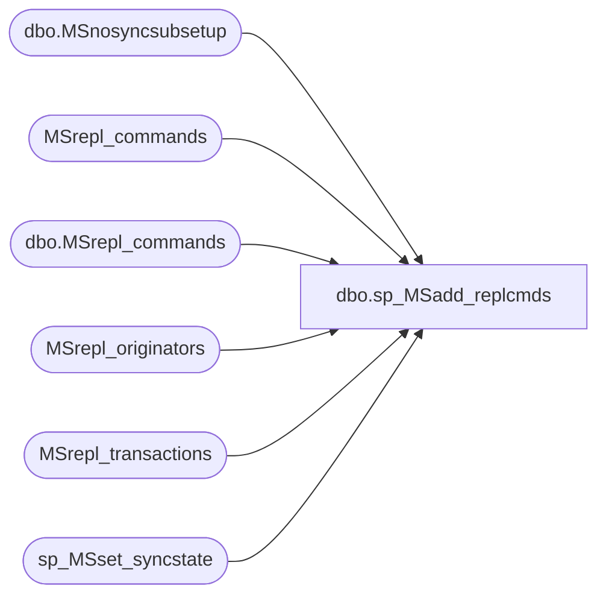

# dbo.sp_MSadd_replcmds

**Database:** CRDM_Distributor  
**Server:** bedrockdb01  

## Architecture Diagram



## Table Dependencies

| Referenced Table |
|---|
| dbo.MSnosyncsubsetup |
| MSrepl_commands |
| dbo.MSrepl_commands |
| MSrepl_originators |
| MSrepl_transactions |
| sp_MSset_syncstate |

## Stored Procedure Code

```sql
CREATE PROCEDURE sp_MSadd_replcmds
@publisher_database_id int,
@publisher_id smallint,
@publisher_db sysname,
@data varbinary(1595),
@1data varbinary(1595) = NULL,
@2data varbinary(1595) = NULL,
@3data varbinary(1595) = NULL,
@4data varbinary(1595) = NULL,
@5data varbinary(1595) = NULL,
@6data varbinary(1595) = NULL,
@7data varbinary(1595) = NULL,
@8data varbinary(1595) = NULL,
@9data varbinary(1595) = NULL,
@10data varbinary(1595) = NULL,
@11data varbinary(1595) = NULL,
@12data varbinary(1595) = NULL,
@13data varbinary(1595) = NULL,
@14data varbinary(1595) = NULL,
@15data varbinary(1595) = NULL,
@16data varbinary(1595) = NULL,
@17data varbinary(1595) = NULL,
@18data varbinary(1595) = NULL,
@19data varbinary(1595) = NULL,
@20data varbinary(1595) = NULL,
@21data varbinary(1595) = NULL,
@22data varbinary(1595) = NULL,
@23data varbinary(1595) = NULL,
@24data varbinary(1595) = NULL,
@25data varbinary(1595) = NULL,
@26data varbinary(1595) = NULL
AS
BEGIN
    SET NOCOUNT ON
    DECLARE @date datetime
			,@x int
			,@tempdata varbinary(1595)
			
	DECLARE @xactId			varbinary(10),
			@xactSeqNo		varbinary(10),
			@artId			int,
			@cmdId			int,
			@cmdType		int,
			@fIncomplete	bit,
			@cmdLen			int,
			@originator_id	int,
			@origSrvLen		int,
			@origDbLen		int,
			@origPublId		int,
			@origDbVersion	int,
			@origLSN		varbinary(10),
			@hashKey		int,
			@cmdText		varbinary(1595),
			@originator		sysname,
			@originatorDb	sysname
			
    SELECT @date = GETDATE()

	select @x = 0
	select @tempdata = null
	while @x <= 26
	begin
			select @tempdata = CASE @x
				when 0 then @data
				when 1 then @1data
				when 2 then @2data
				when 3 then @3data
				when 4 then @4data
				when 5 then @5data
				when 6 then @6data
				when 7 then @7data
				when 8 then @8data
				when 9 then @9data
				when 10 then @10data
				when 11 then @11data
				when 12 then @12data
				when 13 then @13data
				when 14 then @14data
				when 15 then @15data
				when 16 then @16data
				when 17 then @17data
				when 18 then @18data
				when 19 then @19data
				when 20 then @20data
				when 21 then @21data
				when 22 then @22data
				when 23 then @23data
				when 24 then @24data
				when 25 then @25data
				when 26 then @26data
			end

		if @tempdata is NULL
			goto END_CMDS

		-- We will now breakup the binary data. Check HP_FIXED_DATA 
		-- in publish.cpp for all of the offsets listed below...
		select @xactId 			= substring( @tempdata, 1, 10),
				@xactSeqNo		= substring( @tempdata, 11, 10),
				@artId			= substring( @tempdata, 21, 4),
				@cmdId			= substring( @tempdata, 25, 4),
				@cmdType		= substring( @tempdata, 29, 4),
				@fIncomplete	= convert(bit, substring( @tempdata, 33, 1)),
				@cmdLen			= substring( @tempdata, 34, 2),
				@origSrvLen		= substring( @tempdata, 36, 2),
				@origDbLen		= substring( @tempdata, 38, 2),
				@hashKey		= substring( @tempdata, 40, 2),
				-- @origPublId  = only done below if an originator len is detected : usually = substring( @tempdata, 42, 4)
				-- @origDbVersion=only done below if an originator len is detected : usually = substring( @tempdata, 46, 4)
				@origLSN		= substring( @tempdata, 50, 10),
				@cmdText		= substring( @tempdata, 60, @cmdLen)
				-- @originator  = only done below if an originator len is detected : usually = substring( @tempdata, 60 + @cmdLen, @origSrvLen)
				-- @originatorDb= only done below if an originator len is detected : usually = substring( @tempdata, 60 + @cmdLen + @origSrvLen, @origDbLen)
				
		IF @cmdId = 1
		begin
			INSERT INTO MSrepl_transactions 
				VALUES (@publisher_database_id, @xactId, @xactSeqNo, @date)
		end

		-- do special processing for the different command typs if needed
		if( @cmdType in( 37,38 ) )
		begin
			select @cmdType = 38 - @cmdType
			exec sp_MSset_syncstate @publisher_id, @publisher_db, @artId, @cmdType, @xactSeqNo
			select @cmdType = (38 - @cmdType) | 0x80000000
		end
		-- Check all posted cmds of SQLCMD type to see if they are tracer records
		-- sql cmd type is (47 | 0x40000000) or 1073741871
		else if @cmdType = 1073741871
		begin
			declare @tracer_id 	int,
				@retcode	int
			
			select @tracer_id = cast(cast(@cmdText as nvarchar) as int)

			exec @retcode = sys.sp_MSupdate_tracer_history @tracer_id = @tracer_id
			if @retcode <> 0 or @@error <> 0
				return 1
		end
		
		-- only add it if the command is not empty
	   	if @cmdLen > 0
	   	begin	  
			--handle nonsync subscription setup when command type is 
			-- REPL_NOSYNC_SUBSCRIPTION_SETUP_LOG_CMD (54)
			if ((@cmdType & 0xFFFFFFF) = 54)
			begin
				-- When logreader gets a log record with this type,
				-- the MSnosyncsubsetup table should already exist,
				-- report the failure if it does not exist.
				if (object_id(N'dbo.MSnosyncsubsetup', 'U')) is NULL 
				begin
					goto Failure
				end
				else
				begin
					declare @nosyncCommandStr	nvarchar(max),
						@publisher 				sysname,
						@publication 				sysname,
						@article					sysname,
						@subscriber				sysname,
						@destination_db			sysname,
						@subscriptionlsn			binary(10),
						@lsnsource				tinyint,
						@originator_publication_id	int,
						@originator_db_version		int,
						@originator_meta_data		nvarchar(max),
						@nosync_setup_script		nvarchar(max),
						@next_valid_lsn			binary(10),
						@next_valid_lsn_from_log	binary(10)

					-- if most high bit is set to 1 then interprete buffer as a new format 99 <= 0xFFFFFF9D (supports 2^32 ids), otherwise it's a backward compatibility for 99 <= 0x39003900 (this is max id)
					select @originator_publication_id = CASE WHEN CAST(substring(@cmdText, 1, 4) AS int) <= 0 THEN -CAST(substring(@cmdText, 1, 4) AS int) ELSE CAST(CAST(substring(@cmdText, 1, 4) AS nvarchar) AS int) END,
						@next_valid_lsn_from_log = CAST(substring(@cmdText, 5, 10) AS binary(10))
					if @@error <> 0 goto Failure

					-- Verify that the number of parameters is correct before using 
					-- these parameters in sp_MSsetupnosyncsubwithlsnatdist
					if ((select count(*) from dbo.MSnosyncsubsetup
						where publisher_database_id = @publisher_database_id
						and publication_id = @originator_publication_id
						and artid = @artId
						and next_valid_lsn = @next_valid_lsn_from_log) <> 13) goto Failure
					if @@error <> 0 goto Failure

					select @publisher = cast((select parameterValue 
									from dbo.MSnosyncsubsetup
									where publisher_database_id = @publisher_database_id
										and publication_id = @originator_publication_id
										and artid = @artId
										and next_valid_lsn = @next_valid_lsn_from_log
										and parameterName = N'publisher') as sysname),
					@publisher_db = cast((select parameterValue 
									from dbo.MSnosyncsubsetup
									where publisher_database_id = @publisher_database_id
										and publication_id = @originator_publication_id
										and artid = @artId
										and next_valid_lsn = @next_valid_lsn_from_log
										and parameterName = N'publisher_db') as sysname),
					@publication = cast((select parameterValue 
									from dbo.MSnosyncsubsetup
									where publisher_database_id = @publisher_database_id
										and publication_id = @originator_publication_id
										and artid = @artId
										and next_valid_lsn = @next_valid_lsn_from_log
										and parameterName = N'publication') as sysname),
					@article = cast((select parameterValue 
									from dbo.MSnosyncsubsetup
									where publisher_database_id = @publisher_database_id
										and publication_id = @originator_publication_id
										and artid = @artId
										and next_valid_lsn = @next_valid_lsn_from_log
										and parameterName = N'article') as sysname),
					@subscriber = cast((select parameterValue 
									from dbo.MSnosyncsubsetup
									where publisher_database_id = @publisher_database_id
										and publication_id = @originator_publication_id
										and artid = @artId
										and next_valid_lsn = @next_valid_lsn_from_log
										and parameterName = N'subscriber') as sysname),
					@destination_db = cast((select parameterValue 
										from dbo.MSnosyncsubsetup
										where publisher_database_id = @publisher_database_id
											and publication_id = @originator_publication_id
											and artid = @artId
											and next_valid_lsn = @next_valid_lsn_from_log
											and parameterName = N'destination_db') as sysname),
					@subscriptionlsn = cast((select parameterValue 
										from dbo.MSnosyncsubsetup
										where publisher_database_id = @publisher_database_id
											and publication_id = @originator_publication_id
											and artid = @artId
											and next_valid_lsn = @next_valid_lsn_from_log
											and parameterName = N'subscriptionlsn') as binary(10)),
					@lsnsource = cast((select parameterValue 
									from dbo.MSnosyncsubsetup
									where publisher_database_id = @publisher_database_id
										and publication_id = @originator_publication_id
										and artid = @artId
										and next_valid_lsn = @next_valid_lsn_from_log
										and parameterName = N'lsnsource') as tinyint),
					@originator_publication_id = cast((select parameterValue 
												from dbo.MSnosyncsubsetup
												where publisher_database_id = @publisher_database_id
													and publication_id = @originator_publication_id
													and artid = @artId
													and next_valid_lsn = @next_valid_lsn_from_log
													and parameterName = N'originator_publication_id') as int),
					@originator_db_version = cast((select parameterValue 
											from dbo.MSnosyncsubsetup
											where publisher_database_id = @publisher_database_id
												and publication_id = @originator_publication_id
												and artid = @artId
												and next_valid_lsn = @next_valid_lsn_from_log
												and parameterName = N'originator_db_version') as int),
					@originator_meta_data = (select parameterValue 
											from dbo.MSnosyncsubsetup
											where publisher_database_id = @publisher_database_id
												and publication_id = @originator_publication_id
												and artid = @artId
												and next_valid_lsn = @next_valid_lsn_from_log
												and parameterName = N'originator_meta_data'),
					@nosync_setup_script = (select parameterValue 
											from dbo.MSnosyncsubsetup
											where publisher_database_id = @publisher_database_id
												and publication_id = @originator_publication_id
												and artid = @artId
												and next_valid_lsn = @next_valid_lsn_from_log
												and parameterName = N'nosync_setup_script'),
					@next_valid_lsn = cast((select parameterValue 
										from dbo.MSnosyncsubsetup
										where publisher_database_id = @publisher_database_id
											and publication_id = @originator_publication_id
											and artid = @artId
											and next_valid_lsn = @next_valid_lsn_from_log
											and parameterName = N'next_valid_lsn') as binary(10))
					if @@error <> 0 goto Failure

					if @cmdId = 1
					begin
						-- Type 54 transactions should be provided with empty command which will be later used in sp_MSsetupnosyncsubwithlsnatdist
						insert dbo.MSrepl_commands
							(publisher_database_id, xact_seqno, type, article_id, originator_id, command_id, partial_command, command)
						values
							(@publisher_database_id, @xactSeqNo, @cmdType, @artId, 0, @cmdId, 0, convert(varbinary(1024), N''))
						if @@error <> 0 goto Failure
					end

					select @nosyncCommandStr = N'exec sp_MSsetupnosyncsubwithlsnatdist 
						@publisher = @publisher,
						@publisher_db = @publisher_db,
						@publication = @publication,
						@article = @article,
						@subscriber = @subscriber,
						@destination_db = @destination_db,
						@subscriptionlsn = @subscriptionlsn,
						@lsnsource = @lsnsource,
						@originator_publication_id = @originator_publication_id,
						@originator_db_version = @originator_db_version,
						@originator_meta_data = @originator_meta_data,
						@nosync_setup_script = @nosync_setup_script,
						@next_valid_lsn = @next_valid_lsn'

					exec sp_executesql
						@stmt = @nosyncCommandStr,
						@params = N'@publisher 				sysname,
									@publisher_db 			sysname,
									@publication 				sysname,
									@article					sysname,
									@subscriber				sysname,
									@destination_db			sysname,
									@subscriptionlsn			binary(10),
									@lsnsource				tinyint,
									@originator_publication_id	int,
									@originator_db_version		int,
									@originator_meta_data		nvarchar(max),
									@nosync_setup_script		nvarchar(max),
									@next_valid_lsn			binary(10)',
						@publisher = @publisher,
						@publisher_db = @publisher_db,
						@publication = @publication,
						@article = @article,
						@subscriber = @subscriber,
						@destination_db = @destination_db,
						@subscriptionlsn = @subscriptionlsn,
						@lsnsource = @lsnsource,
						@originator_publication_id = @originator_publication_id,
						@originator_db_version = @originator_db_version,
						@originator_meta_data = @originator_meta_data,
						@nosync_setup_script = @nosync_setup_script,
						@next_valid_lsn = @next_valid_lsn

					if @@error <> 0 goto Failure

				end --end of if (object_id(N'dbo.MSnosyncsubsetup, 'U')) is NOT NULL

				-- Upon success of the execution of sp_MSsetupnosyncsubwithlsnatdist,
				-- clean up the MSnosyncsubsetup table by deleting the parameters
				-- regarding this specified nonsync subscription
				delete dbo.MSnosyncsubsetup 
				where publisher_database_id = @publisher_database_id
				  and publication_id = @originator_publication_id
				  and artid = @artId
				  and next_valid_lsn = @next_valid_lsn_from_log

				if @@error <> 0 goto Failure

				goto Continue_next_command
Failure:
				return 1
Continue_next_command:
			end
        		else   --i.e., when (@cmdType & 0xFFFFFFF) IS NOT 54
            		begin
                 	        -- Get the originator_id for the first command
                	        if @origSrvLen <> 0 and @origDbLen <> 0 
                	        begin 
                	            select @originator_id 	= null,
                	           			@originator		= substring( @tempdata, 60 + @cmdLen, @origSrvLen),
                						@originatorDb	= substring( @tempdata, 60 + @cmdLen + @origSrvLen, @origDbLen),
                						@origPublId 	= substring( @tempdata, 42, 4),
                						@origDbVersion	= substring( @tempdata, 46, 4)

				-- if @origPublId and @origDbVersion is 0 or NULL
				-- then we are not in Peer-To-Peer so we do not need
				-- to set the dbversion and publication id values...
				if isnull(@origPublId, 0) != 0
					and isnull(@origDbVersion, 0) != 0
				begin
					select @originator_id = id 
		            	from MSrepl_originators with (readpast)
		            	where publisher_database_id = @publisher_database_id 
			                and UPPER(srvname) = UPPER(@originator)
			                and dbname = @originatorDb
			                and publication_id = @origPublId
			                and dbversion = @origDbVersion
				end
				else
				begin
					select @origPublId = NULL,
							@origDbVersion = NULL
							
					select @originator_id = id 
		            	from MSrepl_originators 
		            	where publisher_database_id = @publisher_database_id 
			                and UPPER(srvname) = UPPER(@originator)
			                and dbname = @originatorDb
			                and publication_id is NULL
			                and dbversion is NULL
				end
				
	            if @originator_id is null
	            begin
	                insert into MSrepl_originators (publisher_database_id, srvname, dbname, publication_id, dbversion) 
	                	values (@publisher_database_id, @originator, @originatorDb, @origPublId, @origDbVersion)
	                	
	                select @originator_id = @@identity
	            end
	            end
	        else
	            select @originator_id = 0
		
			INSERT INTO MSrepl_commands 
			(
				publisher_database_id, 
				xact_seqno, 
				type, 
				article_id, 
				originator_id, 
				command_id, 
				partial_command, 
				hashkey,
				originator_lsn,
				command
			)
			VALUES 
			(
				@publisher_database_id,
				@xactSeqNo,
				@cmdType,
				@artId, 					
				@originator_id,
				@cmdId,
				@fIncomplete,
				@hashKey,
				@origLSN,
				@cmdText
			)

		end    --end of i.e., when (@cmdType & 0xFFFFFFF)  in (54, 55, 56)
	    end    --end of if @cmdLen > 0
		
		select @x = @x + 1
	end

END_CMDS:
    IF @@ERROR <> 0
      return (1)
END
```

