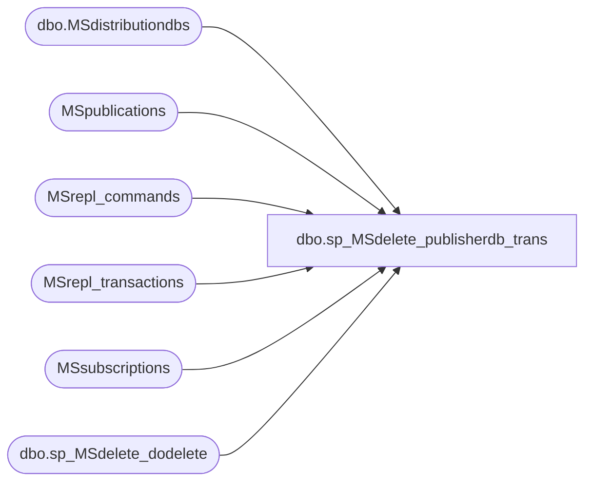

# dbo.sp_MSdelete_publisherdb_trans

**Database:** CRDM_Distributor  
**Server:** bedrockdb01  

## Architecture Diagram



## Table Dependencies

| Referenced Table |
|---|
| dbo.MSdistributiondbs |
| MSpublications |
| MSrepl_commands |
| MSrepl_transactions |
| MSsubscriptions |
| dbo.sp_MSdelete_dodelete |

## Stored Procedure Code

```sql
CREATE PROCEDURE sp_MSdelete_publisherdb_trans
    @publisher_database_id int,
    @max_xact_seqno varbinary(16),
	@max_cutoff_time datetime,
    @num_transactions int OUTPUT,
    @num_commands int OUTPUT
    as

	set nocount on
    
	declare @dynamicCommandBatchSize bit		= 0, 
		@dynamicTransactionBatchSize bit		= 0, 
		@deleteBeginTime datetime, 
		@deleteEndTime datetime, 
		@deleteLoopBeginTime datetime,
		@deleteLoopEndTime datetime,
		@executionTime int						= NULL,
		@rowsDeletedPerMSecond int				= NULL,
		@rowsDeletedPerMSecondAvg int			= NULL,
		@executionTimeCumulative int			= 0,
		@deletebatchsize_transactions int,
		@deletebatchsize_commands int,
		@deltaDecreaseInDeletePerf float		= 0.8,	-- 20% decrease
		@deltaIncreaseInDeletePerf float		= 1.5,	-- 50% increase
		@deltaDecreaseInDeleteBatchSize float	= 0.5,	-- 50% decrease
		@deltaIncreaseInDeleteBatchSize float	= 1.2,	-- 20% increase
		@deleteCommandBatchSizeMin int			= 2000, -- Minimum value to be used in case of Auto Batch Size
		@deleteCommandBatchSizeMax int			= 50000,-- Maximum value to be used in case of Auto Batch Size
		@deleteTranBatchSizeMin int				= 5000, -- Minimum value to be used in case of Auto Batch Size
		@deleteTranBatchSizeMax int				= 50000 -- Maximum value to be used in case of Auto Batch Size


	select @deletebatchsize_commands = deletebatchsize_cmd, @deletebatchsize_transactions = deletebatchsize_xact from msdb.dbo.MSdistributiondbs where name = DB_NAME()

	if (ISNULL(@deletebatchsize_commands,0) = 0)
		select @deletebatchsize_commands = @deleteCommandBatchSizeMin, @dynamicCommandBatchSize = 1

	if (ISNULL(@deletebatchsize_transactions,0) = 0)
		select @deletebatchsize_transactions = @deleteTranBatchSizeMin, @dynamicTransactionBatchSize = 1

	-- Check for invalid delete batchsize
	if ((@deletebatchsize_transactions <= 0) 
			OR (@deletebatchsize_commands <= 0))
	begin
		raiserror(22120,16,-1)
		return (1)
	end
    
	declare @snapshot_bit int
	declare @replpost_bit int
    declare @directory_type int
    declare @alt_directory_type int
    declare @scriptexec_type int
    declare @last_xact_seqno varbinary(16)
    declare @last_log_xact_seqno varbinary(16)
    declare @max_immediate_sync_seqno varbinary(16)
    declare @dir nvarchar(512)
    declare @row_count int
    declare @batchsize int
    declare @retcode int            /* Return value of xp_cmdshell */
	declare @has_immediate_sync bit
	declare @xact_seqno varbinary(16)
	declare @command_id int
	declare @type int
	declare @directory nvarchar(1024)
	declare @syncinit int
	declare @syncdone int

    select @snapshot_bit = 0x80000000
	select @replpost_bit = 0x40000000
    select @directory_type = 7
    select @alt_directory_type = 25
	select @scriptexec_type = 46
	select @syncinit = 37
	select @syncdone = 38
    select @num_transactions = 0
    select @num_commands = 0

       -- Being as this is a cleanup process it is our prefered victim
       SET DEADLOCK_PRIORITY LOW

	-- If transactions for immediate_sync publications will not be cleanup up until
	-- they are older than max retention, except for snapshot transactions.
	-- Snapshot transactions for immediate_sync publication will be cleanup up if it is
	-- not used by any subscriptions (including virtual and virtual immediate_syncymous
	-- subscriptions. Both will be reset by snapshot agent every time if the 
	-- publication is snapshot type.) The special logic for snapshot transactions
	-- is mostly for snapshot publications. It is to cleaup up the snapshot files 
	-- ASAP and not to wait for max retention.
	-- We don't need to do this for non-immediate_syncymous publications since the snapshot
	-- trans for them will be removed as soon as they are distributed and min '
	-- retention is reached.

	-- Detect if there are immediate_syncymous publications in this publishing db.
	if exists (select * from MSsubscriptions where
			publisher_database_id = @publisher_database_id and
			subscriber_id < 0)
		select @has_immediate_sync = 1
	else
		select @has_immediate_sync = 0

	if @has_immediate_sync = 1
	begin
		-- if @max_immediate_sync_seqno is null, no row will be deleted based on that.
		select @max_immediate_sync_seqno = max(xact_seqno) 
			from MSrepl_transactions with (nolock)
			where publisher_database_id = @publisher_database_id 
				and entry_time <= @max_cutoff_time
	end

	-- table to store all of the snapshot command seqno that will 
	-- need to be deleted from MSrepl_commands after dir removal
	declare @snapshot_xact_seqno table (snap_xact_seqno varbinary(16))

    -- Note delete commands first since transaction table will be used for
    -- geting @max_xact_seqno (see sp_MSmaximum_cleanup_seqno).
    -- Delete all directories stored in directory command.
	if @has_immediate_sync = 0
		declare  hCdirs  CURSOR LOCAL FAST_FORWARD FOR select CONVERT(nvarchar(512), command),
			xact_seqno, command_id, type
			from MSrepl_commands with (nolock) where
			publisher_database_id = @publisher_database_id and
			xact_seqno <= @max_xact_seqno and   
			((type & ~@snapshot_bit) = @directory_type or
            (type & ~@snapshot_bit) = @alt_directory_type or
            (type & ~@replpost_bit) = @scriptexec_type)
		for read only
	else
		declare  hCdirs  CURSOR LOCAL FAST_FORWARD FOR select CONVERT(nvarchar(512), command),
			xact_seqno, command_id, type
			from MSrepl_commands c with (nolock) where
			publisher_database_id = @publisher_database_id and
			xact_seqno <= @max_xact_seqno and  
			(
				-- In this section we skip over script exec because they should only be
				-- removed when they are out of retention (no subscriptions will ever
				-- point to the script exec commands so if we didn't exclude them here they
				-- would always be removed... even when they are needed by subscribers).
				(
					(type & ~@snapshot_bit) in (@directory_type, @alt_directory_type)
				 	and (
						-- Select the row if it is older than max retention.
						xact_seqno <= @max_immediate_sync_seqno or 
						-- Select the row if it is not used by any subscriptions.
						not exists (select * from MSsubscriptions s where 
									s.publisher_database_id = @publisher_database_id and 
									s.subscription_seqno = c.xact_seqno) OR
						-- Select the row if it is not for immediate_sync publications
						-- Note: directory command have article id 0 so it is not useful
						not exists (select * from MSpublications p where
								p.publication_id = (select top 1 s.publication_id 
									from MSsubscriptions s where
									s.publisher_database_id = @publisher_database_id and
									s.subscription_seqno = c.xact_seqno) and
								p.immediate_sync = 1)
					)
				)
				-- For script exec only select the row if it is out of retention
				or ((type & ~@replpost_bit) = @scriptexec_type
						and xact_seqno <= @max_immediate_sync_seqno)
			)

		for read only

    open hCdirs
    fetch hCdirs into @dir, @xact_seqno, @command_id, @type
    while (@@fetch_status <> -1)
    begin
    	-- script exec command, need to map to the directory path and remove leading 0 or 1
		if((@type & ~@replpost_bit) = @scriptexec_type)
		begin
			select @dir = left(@dir,len(@dir) - charindex(N'\', reverse(@dir)))
			
			if left(@dir, 1) in (N'0', N'1')
			begin
				select @dir = right(@dir, len(@dir) - 1)
			end
		end
		
		-- Need to map unc to local drive for access problem
        exec @retcode = sys.sp_MSreplremoveuncdir @dir
        /* Abort the operation if the delete fails */
        if (@retcode <> 0 or @@error <> 0)
            return (1)

		-- build up a list of snapshot commands that will be deleted below
		-- this list is built because we must cleanup scripts, alt snap paths
		-- and regular snapshots prior to removing the commands for them...
		insert into @snapshot_xact_seqno(snap_xact_seqno) values (@xact_seqno)

	    fetch hCdirs into @dir, @xact_seqno, @command_id, @type
    end
    close hCdirs
    deallocate hCdirs

	-- delete all of the snapshot commands related to directories that were 
	-- cleaned up. SYNCINIT and SYNCDONE tokens for concurrent snapshot will 
	-- be cleaned up by retention period in the next section below... We do
	-- not attempt to remove the SYNCINIT or SYNCDONE tokens earlier because
	-- we have no safe way of associating them with a particular snapshot.
	-- Also, we can't tell if the tokens are needed by an existing snapshot.
	SELECT @deleteLoopBeginTime=GETDATE()
	WHILE 1 = 1
    BEGIN
		SELECT @deleteBeginTime=GETDATE() 
		DELETE TOP(@deletebatchsize_commands) MSrepl_commands WITH (PAGLOCK) from MSrepl_commands with (INDEX(ucMSrepl_commands))
			WHERE publisher_database_id = @publisher_database_id 
				AND xact_seqno IN (SELECT DISTINCT snap_xact_seqno 
									FROM @snapshot_xact_seqno)
			OPTION (MAXDOP 1)

		SELECT @row_count = @@rowcount
		SELECT @deleteEndTime=GETDATE()

		-- Update output parameter
    	SELECT @num_commands = @num_commands + @row_count
    
        SELECT @executionTime = DATEDIFF(ms,@deleteBeginTime,@deleteEndTime) 
		if @executionTime = 0
			Select @executionTime = 1
		SELECT @rowsDeletedPerMSecond = @row_count/@executionTime, @executionTimeCumulative = @executionTimeCumulative + @executionTime

		IF @row_count < @deletebatchsize_commands -- passed the result set.  We're done
            BREAK

		if (@dynamicCommandBatchSize = 1)
		Begin
			SELECT @rowsDeletedPerMSecondAvg = @num_commands/@executionTimeCumulative
			if (@rowsDeletedPerMSecond < (@rowsDeletedPerMSecondAvg * @deltaDecreaseInDeletePerf)) -- if performance goes down by 20% of Average, reduce the batch size
				Select @deletebatchsize_commands = Case When (@deletebatchsize_commands * @deltaDecreaseInDeleteBatchSize) > @deleteCommandBatchSizeMin Then (@deletebatchsize_commands * @deltaDecreaseInDeleteBatchSize) Else @deleteCommandBatchSizeMin End
			else if (@rowsDeletedPerMSecond > (@rowsDeletedPerMSecondAvg * @deltaIncreaseInDeletePerf)) -- if performance goes up by 50% of Average, increase the batch size
				Select @deletebatchsize_commands = Case When (@deletebatchsize_commands * @deltaIncreaseInDeleteBatchSize) < @deleteCommandBatchSizeMax Then  (@deletebatchsize_commands * @deltaIncreaseInDeleteBatchSize) Else @deleteCommandBatchSizeMax End
		End
	END
	--This is needed to adjust the batch size for the last iteration in the above while loop
	if (@dynamicCommandBatchSize = 1)
	Begin
		SELECT @rowsDeletedPerMSecondAvg = @num_commands/@executionTimeCumulative
		if (@rowsDeletedPerMSecond < (@rowsDeletedPerMSecondAvg * @deltaDecreaseInDeletePerf)) -- if performance goes down by 20% of Average, reduce the batch size
			Select @deletebatchsize_commands = Case When (@deletebatchsize_commands * @deltaDecreaseInDeleteBatchSize) > @deleteCommandBatchSizeMin Then (@deletebatchsize_commands * @deltaDecreaseInDeleteBatchSize) Else @deleteCommandBatchSizeMin End
		else if (@rowsDeletedPerMSecond > (@rowsDeletedPerMSecondAvg * @deltaIncreaseInDeletePerf)) -- if performance goes up by 50% of Average, increase the batch size
			Select @deletebatchsize_commands = Case When (@deletebatchsize_commands * @deltaIncreaseInDeleteBatchSize) < @deleteCommandBatchSizeMax Then  (@deletebatchsize_commands * @deltaIncreaseInDeleteBatchSize) Else @deleteCommandBatchSizeMax End
	End
    -- Since we're cleaning up, we set the lock timeout to immediate
    --  this way we shouldn't interfere with the other agents using the table.

    -- Holding off for some testing on this
    --SET LOCK_TIMEOUT 1

    -- Delete all commans less than or equal to the @max_xact_seqno
    -- Delete in batch to reduce the transaction size

    WHILE 1 = 1
    BEGIN
		SELECT @deleteBeginTime=GETDATE() 
		if @has_immediate_sync = 0
			DELETE TOP(@deletebatchsize_commands) MSrepl_commands WITH (PAGLOCK) from MSrepl_commands with (INDEX(ucMSrepl_commands)) where
				publisher_database_id = @publisher_database_id and
				xact_seqno <= @max_xact_seqno and
				(type & ~@snapshot_bit) not in (@directory_type, @alt_directory_type) and
				(type & ~@replpost_bit) <> @scriptexec_type
				OPTION (MAXDOP 1)
		else
			-- Use nolock hint on subscription table to avoid deadlock
			-- with snapshot agent.
			DELETE TOP(@deletebatchsize_commands) MSrepl_commands WITH (PAGLOCK) from MSrepl_commands with (INDEX(ucMSrepl_commands)) where
				publisher_database_id = @publisher_database_id and
				xact_seqno <= @max_xact_seqno and
				-- do not delete directory, alt directory or script exec commands. they are deleted 
				-- above. We have to do this because we use a (nolock) hint and we have to make sure we 
				-- don't delete dir commands when the file has not been cleaned up in the code above. It's
				-- ok to delete snap commands that are out of retention and perform lazy delete of dir
				(type & ~@snapshot_bit) not in (@directory_type, @alt_directory_type) and
				(type & ~@replpost_bit) <> @scriptexec_type and
				(
					-- Select the row if it is older than max retention.
					xact_seqno <= @max_immediate_sync_seqno or 
					-- Select the snap cmd if it is not for immediate_sync article
					-- We know the command is for immediate_sync publication if
					-- the snapshot tran include articles that has virtual
					-- subscritptions. (use subscritpion table to avoid join with
					-- article and publication table). We skip sync tokens because 
					-- they are never pointed to by subscriptions...
					(
						(type & @snapshot_bit) <> 0 and
						(type & ~@snapshot_bit) not in (@syncinit, @syncdone) and
						not exists (select * from MSsubscriptions s with (nolock) where
							s.publisher_database_id = @publisher_database_id and
							s.article_id = MSrepl_commands.article_id and
							s.subscriber_id < 0)
					)
				)
				OPTION (MAXDOP 1)

		select @row_count = @@rowcount
		SELECT @deleteEndTime=GETDATE()

        -- Update output parameter
        select @num_commands = @num_commands + @row_count
    
        SELECT @executionTime = DATEDIFF(ms,@deleteBeginTime,@deleteEndTime) 
		if @executionTime = 0
			Select @executionTime = 1
		SELECT @rowsDeletedPerMSecond = @row_count/@executionTime, @executionTimeCumulative = @executionTimeCumulative + @executionTime
		
		IF @row_count < @deletebatchsize_commands -- passed the result set.  We're done
            BREAK
		
		if (@dynamicCommandBatchSize = 1)
		Begin
			SELECT @rowsDeletedPerMSecondAvg = @num_commands/@executionTimeCumulative
			if (@rowsDeletedPerMSecond < (@rowsDeletedPerMSecondAvg * @deltaDecreaseInDeletePerf)) -- if performance goes down by 20% of Average, reduce the batch size
				Select @deletebatchsize_commands = Case When (@deletebatchsize_commands * @deltaDecreaseInDeleteBatchSize) > @deleteCommandBatchSizeMin Then (@deletebatchsize_commands * @deltaDecreaseInDeleteBatchSize) Else @deleteCommandBatchSizeMin End
			else if (@rowsDeletedPerMSecond > (@rowsDeletedPerMSecondAvg * @deltaIncreaseInDeletePerf)) -- if performance goes up by 50% of Average, increase the batch size
				Select @deletebatchsize_commands = Case When (@deletebatchsize_commands * @deltaIncreaseInDeleteBatchSize) < @deleteCommandBatchSizeMax Then  (@deletebatchsize_commands * @deltaIncreaseInDeleteBatchSize) Else @deleteCommandBatchSizeMax End
		End
    END
    
    SELECT @deleteLoopEndTime=GETDATE()
	SELECT @executionTime = DATEDIFF(ms,@deleteLoopBeginTime,@deleteLoopEndTime) 
	if @executionTime = 0
		Select @executionTime = 1
	SELECT @rowsDeletedPerMSecond = @num_commands/@executionTime
	RAISERROR(22121, 0, 1, @rowsDeletedPerMSecond, 'MSrepl_commands') WITH NOWAIT
    -- get the max transaction row
    select @last_log_xact_seqno = max(xact_seqno) from MSrepl_transactions
		where publisher_database_id = @publisher_database_id 
        	and xact_id <> 0x0  -- not initial sync transaction

    select @last_xact_seqno = max(xact_seqno) from MSrepl_transactions
		where publisher_database_id = @publisher_database_id

    -- Remove all transactions less than or equal to the @max_xact_seqno and leave the 
    -- last transaction row
    -- Note @max_xact_seqno might be null, in this case don't do any thing.
    -- Delete in batchs to reduce the transaction size

    -- Delete all commans less than or equal to the @max_xact_seqno
    -- Delete  rows to reduce the transaction size
    SELECT @executionTime = NULL, @executionTimeCumulative = 0
	SELECT @deleteLoopBeginTime=GETDATE() 
    WHILE 1 = 1
    BEGIN
		SELECT @deleteBeginTime=GETDATE() 
		exec dbo.sp_MSdelete_dodelete @publisher_database_id, 
										@max_xact_seqno, 
										@last_xact_seqno, 
										@last_log_xact_seqno,
										@has_immediate_sync,
										@deletebatchsize_transactions
        select @row_count = @@rowcount
		SELECT @deleteEndTime=GETDATE()

        -- Update output parameter
        select @num_transactions = @num_transactions + @row_count
        
		SELECT @executionTime = DATEDIFF(ms,@deleteBeginTime,@deleteEndTime) 
		if @executionTime = 0
			Select @executionTime = 1
		SELECT @rowsDeletedPerMSecond = @row_count/@executionTime, @executionTimeCumulative = @executionTimeCumulative + @executionTime

		if @row_count < @deletebatchsize_transactions
            BREAK

		if (@dynamicTransactionBatchSize = 1)
		Begin
			SELECT @rowsDeletedPerMSecondAvg = @num_transactions/@executionTimeCumulative
			if (@rowsDeletedPerMSecond < (@rowsDeletedPerMSecondAvg * @deltaDecreaseInDeletePerf)) -- if performance goes down by 20% of Average, reduce the batch size
				Select @deletebatchsize_transactions = Case When (@deletebatchsize_transactions * @deltaDecreaseInDeleteBatchSize) > @deleteTranBatchSizeMin Then (@deletebatchsize_transactions * @deltaDecreaseInDeleteBatchSize) Else @deleteTranBatchSizeMin End
			else if (@rowsDeletedPerMSecond > (@rowsDeletedPerMSecondAvg * @deltaIncreaseInDeletePerf)) -- if performance goes up by 50% of Average, increase the batch size
				Select @deletebatchsize_transactions = Case When (@deletebatchsize_transactions * @deltaIncreaseInDeleteBatchSize) < @deleteTranBatchSizeMax Then (@deletebatchsize_transactions * @deltaIncreaseInDeleteBatchSize) Else @deleteTranBatchSizeMax End
		End
    END
	SELECT @deleteLoopEndTime=GETDATE()
	SELECT @executionTime = DATEDIFF(ms,@deleteLoopBeginTime,@deleteLoopEndTime) 
	if @executionTime = 0
		Select @executionTime = 1
	SELECT @rowsDeletedPerMSecond = @num_transactions/@executionTime
	RAISERROR(22121, 0, 1, @rowsDeletedPerMSecond, 'MSrepl_transactions') WITH NOWAIT
```

