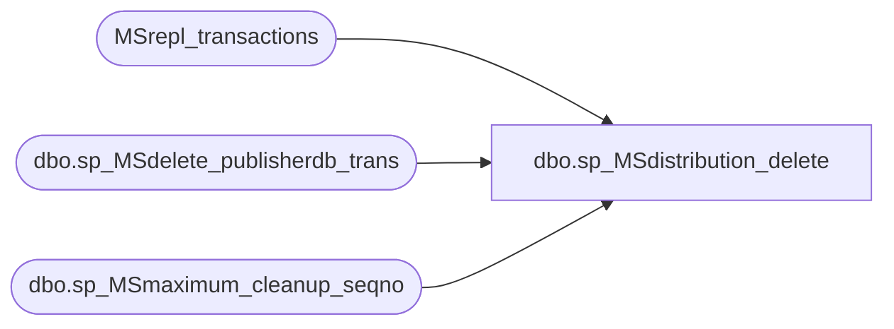

# dbo.sp_MSdistribution_delete

**Database:** CRDM_Distributor  
**Server:** bedrockdb01  

## Architecture Diagram



## Table Dependencies

| Referenced Table |
|---|
| MSrepl_transactions |
| dbo.sp_MSdelete_publisherdb_trans |
| dbo.sp_MSmaximum_cleanup_seqno |

## Stored Procedure Code

```sql
CREATE PROCEDURE sp_MSdistribution_delete
    @retention int = 0,
	-- Used for anon publications.
	@max_cutoff_time datetime
    as
    declare @min_cutoff_time datetime
    declare @subscriber sysname
    declare @subscriber_db sysname
    declare @max_cleanup_xact_seqno varbinary(16)   
    declare @num_transactions int
    declare @num_commands int
    declare @start_time datetime
    declare @num_milliseconds int
    declare @rate int
    declare @retcode int
    declare @publisher_database_id int
	declare @numtransactions_cumulative int = 0
	declare @numcommands_cumulative int = 0

    set nocount on

    select @num_transactions = 0
    select @num_commands = 0

    select @start_time = getdate()
    select @min_cutoff_time = dateadd(hour, -@retention, getdate())

    -- For each publisher/publisherdb pair do cleanup
    declare hC CURSOR LOCAL FAST_FORWARD FOR select distinct publisher_database_id
        from MSrepl_transactions
        for read only
    -- With ANSI Defaults ON, the cursor will automatically
    -- be closed on commit.   Since this proc gets called recursively, 
    -- this can happen.  So check before opening. 
    IF CURSOR_STATUS('local','hC') = -1
    open hC

    fetch hC into @publisher_database_id 
    while (@@fetch_status <> -1)
    begin

        -- Find the maximum transaction to delete
        exec @retcode = dbo.sp_MSmaximum_cleanup_seqno @publisher_database_id, @min_cutoff_time, @max_cleanup_xact_seqno OUTPUT
        if @retcode <> 0
            goto FAIL           

        -- Delete transactions and commands
        exec @retcode = dbo.sp_MSdelete_publisherdb_trans @publisher_database_id, 
			@max_cleanup_xact_seqno, @max_cutoff_time,
            @num_transactions OUTPUT, @num_commands OUTPUT
        if @retcode <> 0
            goto FAIL
		select @numtransactions_cumulative = @numtransactions_cumulative + @num_transactions, @numcommands_cumulative = @numcommands_cumulative + @num_commands

        IF CURSOR_STATUS('local','hC') = -1
            open hC
        
        fetch hC into @publisher_database_id 
    end
    close hC
    deallocate hC

    select @num_milliseconds = datediff(ms, @start_time, getdate())
	if @num_milliseconds = 0 
		set @num_milliseconds = 1
	select @rate = (@numtransactions_cumulative+@numcommands_cumulative)/@num_milliseconds
   RAISERROR(21010, 10, -1, @numtransactions_cumulative, @numcommands_cumulative, @num_milliseconds, @rate)

   return 0

FAIL:
   close hC
   deallocate hC
   return 1
```

