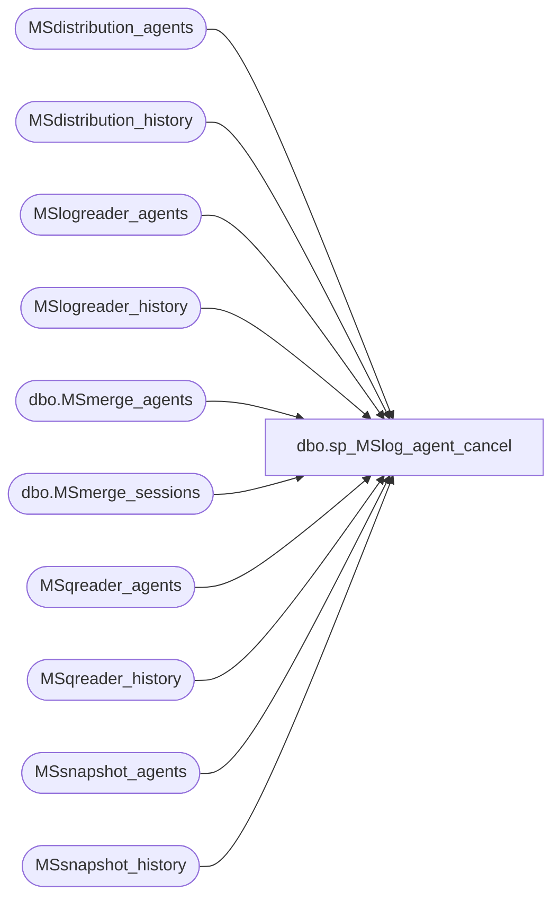

# dbo.sp_MSlog_agent_cancel

**Database:** CRDM_Distributor  
**Server:** bedrockdb01  

## Architecture Diagram



## Table Dependencies

| Referenced Table |
|---|
| MSdistribution_agents |
| MSdistribution_history |
| MSlogreader_agents |
| MSlogreader_history |
| dbo.MSmerge_agents |
| dbo.MSmerge_sessions |
| MSqreader_agents |
| MSqreader_history |
| MSsnapshot_agents |
| MSsnapshot_history |

## Stored Procedure Code

```sql
create procedure sp_MSlog_agent_cancel
@job_id binary(16),
@category_id int,
@message nvarchar(1024)
as
	-- This stored procedure is called by msdb proc, sp_sqlagent_log_jobhistory to
	-- log a agent cancel message to repl monitor (agent history tables) when the
	-- agent fails to log a complete message to repl monitor directly. 
	-- sp_MSdetect_nonlogged_shutdown would not help in this case, because that step
	-- will not be executed because the job is canceled before the step.
	declare @agent_id int

    if @category_id = 15
    begin
		-- Get agent_id
        select @agent_id = id from MSsnapshot_agents where job_id = @job_id
        if exists (select runstatus from MSsnapshot_history where 
            agent_id = @agent_id and
            runstatus <> 2 and 
			runstatus <> 5 and 
            runstatus <> 6 and
            timestamp = (select max(timestamp) from MSsnapshot_history where agent_id = @agent_id))
        begin
			-- Log error message.
			exec sys.sp_MSadd_snapshot_history @agent_id = @agent_id, @runstatus = 6,
					@comments = @message
        end
    end
    else if @category_id = 13
    begin
		-- Get agent_id
        select @agent_id = id from MSlogreader_agents where job_id = @job_id
        if exists (select runstatus from MSlogreader_history where 
            agent_id = @agent_id and
            runstatus <> 2 and 
			runstatus <> 5 and 
            runstatus <> 6 and
            timestamp = (select max(timestamp) from MSlogreader_history where agent_id = @agent_id))
            begin
				-- Log success message.
				exec sys.sp_MSadd_logreader_history @agent_id = @agent_id, @runstatus = 2,
						@comments = @message
            end
    end
    else if @category_id = 10
    begin
		-- Get agent_id
        select @agent_id = id from MSdistribution_agents where job_id = @job_id
        if exists (select runstatus from MSdistribution_history where 
            agent_id = @agent_id and
            runstatus <> 2 and 
			runstatus <> 5 and 
            runstatus <> 6 and
            timestamp = (select max(timestamp) from MSdistribution_history where agent_id = @agent_id))
            begin
				-- Log success message.
				exec sys.sp_MSadd_distribution_history @agent_id = @agent_id, @runstatus = 2,
						@comments = @message
            end
    end
    else if @category_id = 14
    begin
		-- Get agent_id
        select @agent_id = id from dbo.MSmerge_agents where job_id = @job_id
        if exists (select runstatus from dbo.MSmerge_sessions where 
            agent_id = @agent_id and
            runstatus <> 2 and 
			runstatus <> 5 and 
            runstatus <> 6 and
            session_id = (select top 1 session_id from dbo.MSmerge_sessions where agent_id = @agent_id order by session_id desc))
            begin
				declare @merge_session_id int
                               
                select top 1 @merge_session_id = session_id from dbo.MSmerge_sessions 
				where agent_id = @agent_id 
				order by session_id desc
            
				-- Log success message.
				exec sys.sp_MSadd_merge_history @agent_id = @agent_id, @runstatus = 2,
						@comments = @message, @session_id_override = @merge_session_id
            end
    end
    else if @category_id = 19
    begin
		-- Get agent_id
        select @agent_id = id from MSqreader_agents where job_id = @job_id
        if exists (select runstatus from MSqreader_history where 
            agent_id = @agent_id and
            runstatus <> 2 and 
			runstatus <> 5 and 
            runstatus <> 6 and
            timestamp = (select max(timestamp) from MSqreader_history where agent_id = @agent_id))
            begin
				-- Log success message.
				exec sys.sp_MSadd_qreader_history @agent_id = @agent_id, @runstatus = 2,
						@comments = @message
            end
    end
```

