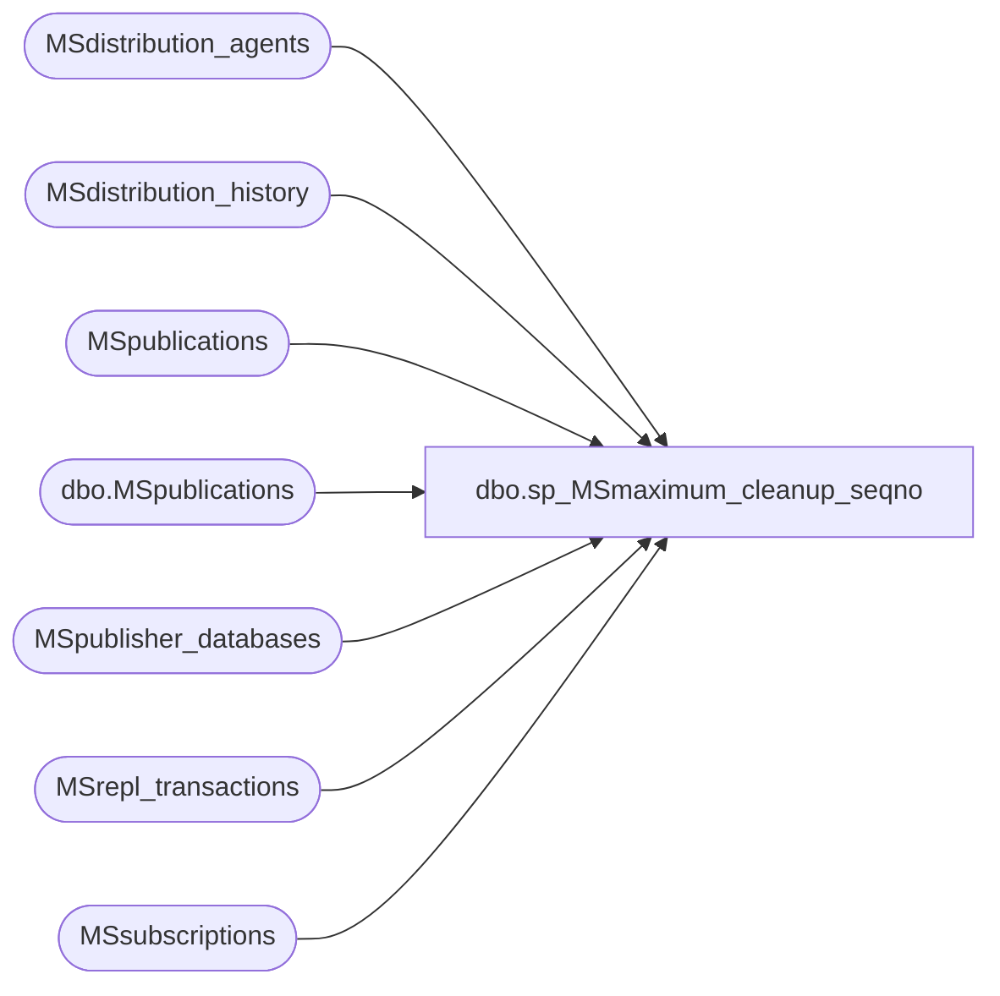

# dbo.sp_MSmaximum_cleanup_seqno

**Database:** CRDM_Distributor  
**Server:** bedrockdb01  

## Architecture Diagram



## Table Dependencies

| Referenced Table |
|---|
| MSdistribution_agents |
| MSdistribution_history |
| MSpublications |
| dbo.MSpublications |
| MSpublisher_databases |
| MSrepl_transactions |
| MSsubscriptions |

## Stored Procedure Code

```sql
CREATE PROCEDURE sp_MSmaximum_cleanup_seqno
	@publisher_database_id int,
	@min_cutoff_time datetime,
	@max_cleanup_xact_seqno varbinary(16) OUTPUT
	as

	declare @min_agent_sub_xact_seqno varbinary(16)
				,@max_agent_hist_xact_seqno varbinary(16)
				,@active int
				,@initiated int
				,@agent_id int
				,@min_xact_seqno varbinary(16)
                

	-- set @min_xact_seqno to NULL and reset it with the first prospect of min_seqno we found later
	select @min_xact_seqno = NULL

	set nocount on

	select @active = 2
	select @initiated = 3

	--
	-- cursor through each agent with it's smallest sub xact seqno
	--
	declare #tmpAgentSubSeqno cursor local forward_only  for
	select a.id, min(s2.subscription_seqno) from
                        MSsubscriptions s2 
                        join MSdistribution_agents a
                        on (a.id = s2.agent_id) 
                        where
	                        s2.status in( @active, @initiated ) and
	                        /* Note must filter out virtual anonymous agents !!!
                                      a.subscriber_id <> @virtual_anonymous and */
                            -- filter out subscriptions to immediate_sync publications
                            not exists (select * from MSpublications p where
                                        s2.publication_id = p.publication_id and
                                        p.immediate_sync = 1) and
	                        a.publisher_database_id = @publisher_database_id
	                        group by a.id
	open #tmpAgentSubSeqno 
	fetch #tmpAgentSubSeqno into @agent_id, @min_agent_sub_xact_seqno 
	
    if (@@fetch_status = -1) -- rowcount = 0 (no subscriptions)
    begin
        -- If we have a publication which allows for init from backup with a min_autonosync_lsn set
        --   we don't want this proc to signal cleanup of all commands
        -- Note that if we filter out immediate_sync publications here as they will already have the
        --   desired outcome.  The difference is that those with min_autonosync_lsn set have a watermark
        --   at which to begin blocking cleanup.
		if not exists (select * from dbo.MSpublications msp
                join MSpublisher_databases mspd ON mspd.publisher_id = msp.publisher_id 
                    and mspd.publisher_db = msp.publisher_db
                where mspd.id = @publisher_database_id and msp.immediate_sync = 1)
		begin
            select top(1) @min_xact_seqno = msp.min_autonosync_lsn from dbo.MSpublications msp
                    join MSpublisher_databases mspd ON mspd.publisher_id = msp.publisher_id 
                        and mspd.publisher_db = msp.publisher_db
                    where mspd.id = @publisher_database_id 
                        and msp.allow_initialize_from_backup <> 0
                        and msp.min_autonosync_lsn is not null
                        and msp.immediate_sync = 0
					order by msp.min_autonosync_lsn asc
		end
    end
    
    while (@@fetch_status <> -1)
	begin
	    --
	    --always clear the local variable, next query may not return any resultset
	    --
	    set @max_agent_hist_xact_seqno = NULL

	    --
	    --find last history entry for current agent, if no history then the query below should leave @max_agent_xact_seqno as NULL
	    --
	    select top 1 @max_agent_hist_xact_seqno = xact_seqno from MSdistribution_history where agent_id = @agent_id 
	             order by timestamp desc

	    --
	    --now find the last xact_seqno this agent has delivered:
	    --if last history was written after initsync, use histry xact_seqno otherwise use initsync xact_seqno        
	    --
	    if isnull(@max_agent_hist_xact_seqno, @min_agent_sub_xact_seqno) <= @min_agent_sub_xact_seqno 
	    begin
	         set @max_agent_hist_xact_seqno = @min_agent_sub_xact_seqno
	    end
	    --@min_xact_seqno was set to NULL to start with, the first time we get here, it'll gets set to a non-NULL value
	    --then we graduately move to the smallest hist/sub seqno
	    if ((@min_xact_seqno is null) or (@min_xact_seqno > @max_agent_hist_xact_seqno))
	    begin 
	        set @min_xact_seqno = @max_agent_hist_xact_seqno 
	    end
	    fetch #tmpAgentSubSeqno into @agent_id, @min_agent_sub_xact_seqno 
	end
	close #tmpAgentSubSeqno
	deallocate #tmpAgentSubSeqno

	/* 
	** Optimized query to get the maximum cleanup xact_seqno
	*/
	/* 
	** If the query below returns nothing, nothing can be deleted.
	** Reset @max_cleanup_xact_seqno to 0.
	*/
	select @max_cleanup_xact_seqno = 0x00
	-- Use top 1 to avoid warning message of "Null in aggregate..." which will make
	-- sqlserver agent job having failing status

	select top 1 @max_cleanup_xact_seqno = xact_seqno
	    from MSrepl_transactions with (nolock)
	    where
	        publisher_database_id = @publisher_database_id and
	        (xact_seqno < @min_xact_seqno
	        	or @min_xact_seqno IS NULL) and
	        entry_time <= @min_cutoff_time
	        order by xact_seqno desc
```

