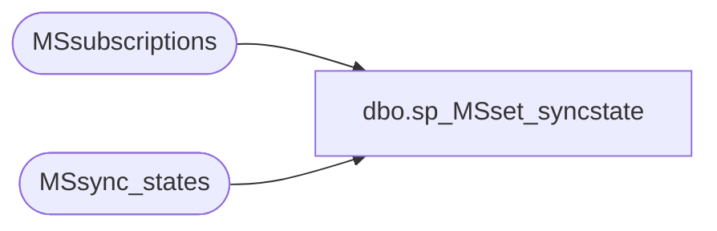

# dbo.sp_MSset_syncstate

**Database:** CRDM_Distributor  
**Server:** bedrockdb01  

## Architecture Diagram



## Table Dependencies

| Referenced Table |
|---|
| MSsubscriptions |
| MSsync_states |

## Stored Procedure Code

```sql
create procedure sp_MSset_syncstate
@publisher_id smallint, 
@publisher_db sysname, 
@article_id int, 
@sync_state int,  
@xact_seqno varbinary(16)
as
set nocount on 
declare @publication_id int

select top 1 @publication_id = s.publication_id 
from MSsubscriptions s
where 
s.publisher_id = @publisher_id and
s.publisher_db = @publisher_db and
s.article_id = @article_id     and
s.subscription_seqno < @xact_seqno


if @publication_id is not null
begin
	if( @sync_state = 1 )
	begin
		if not exists( select * from MSsync_states 
		               where publisher_id = @publisher_id and
					   publisher_db = @publisher_db and
					   publication_id = @publication_id )
		begin
			insert into MSsync_states( publisher_id, publisher_db, publication_id )
			values( @publisher_id, @publisher_db, @publication_id )
		end
	end
	else if @sync_state = 0 
	begin
		
		delete MSsync_states 
		where 
		publisher_id = @publisher_id and
		publisher_db = @publisher_db and
		publication_id = @publication_id 

		-- activate the subscription(s) so the distribution agent can start processing
		declare @automatic int
		declare @active int	
		declare @initiated int

		select @automatic = 1
		select @active = 2
		select @initiated = 3

		-- set status to active, ss_cplt_seqno = commit LSN of xact containing
		-- syncdone token.  
		--
		-- VERY IMPORTANT:  We can only do this because we know that the publisher
		-- tables are locked in the same transaction that writes the SYNCDONE token.
		-- If the tables were NOT locked, we could get into a situation where data
		-- in the table was changed and committed between the time the SYNCDONE token was
		-- written and the time the SYNCDONE xact was committed.  This would cause the
		-- logreader to replicate the xact with no compensation records, but the advance
		-- of the ss_cplt_seqno would cause the dist to skip that command since only commands
		-- with the snapshot bit set will be processed if they are <= ss_cplt_seqno.
		--
		update MSsubscriptions 
		set status = @active,
			subscription_time = getdate(),
			ss_cplt_seqno = @xact_seqno		
		where
			publisher_id = @publisher_id and
			publisher_db = @publisher_db and
			publication_id = @publication_id and
			sync_type = @automatic and
			status in( @initiated ) and
			ss_cplt_seqno <= @xact_seqno	
	end
end
```

