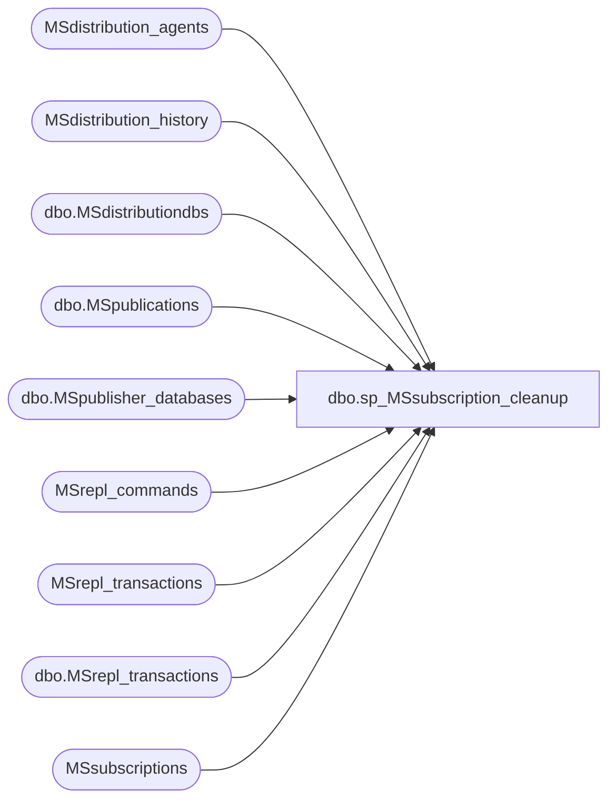

# dbo.sp_MSsubscription_cleanup

**Database:** CRDM_Distributor  
**Server:** bedrockdb01  

## Architecture Diagram



## Table Dependencies

| Referenced Table |
|---|
| MSdistribution_agents |
| MSdistribution_history |
| dbo.MSdistributiondbs |
| dbo.MSpublications |
| dbo.MSpublisher_databases |
| MSrepl_commands |
| MSrepl_transactions |
| dbo.MSrepl_transactions |
| MSsubscriptions |

## Stored Procedure Code

```sql
CREATE PROCEDURE sp_MSsubscription_cleanup
    @cutoff_time datetime = null
as
begin
    set nocount on
	
	declare @ACTIVE 		tinyint,
    		@INACTIVE 		tinyint,
    		@SUBSCRIBED 	tinyint,
    		@VIRTUAL 		smallint,
			@SNAPSHOT_BIT 	int

    declare @retcode 		int,
			@max_time 		datetime,
			@agent_id 		int,
			@num_dropped 	int

    declare @pub_db_id      int,
            @min_autonosync_lsn varbinary(16),
            @new_autonosync_lsn varbinary(16),
            @low_autonosync_lsn binary(8),
            @high_autonosync_lsn binary(8),
            @publication_id int

	if (@cutoff_time is null)
        SELECT @cutoff_time = dateadd(hour, -max_distretention, getdate()) from msdb.dbo.MSdistributiondbs where name=DB_NAME() collate database_default

	select @ACTIVE 			= 2,
			@INACTIVE 		= 0,
    		@SUBSCRIBED 	= 1,
    		@VIRTUAL 		= -1,
			@SNAPSHOT_BIT 	= 0x80000000

    select @max_time = dateadd(hour, 1, getdate())

    -- Refer to sp_MSmaximun_cleanup_xact_seqno to understand the logic
    -- in this sp. If you change the logic here, you may need to change
    -- that sp as well.

    -- Deactivate real subscriptions for agents that are working on 
    -- transactions that are older than @retention
    -- update all the subscriptions for those agents, including
    -- subscriptions that are in subscribed state!
    update MSsubscriptions  
		set status = @INACTIVE 
			where agent_id in (
							select derivedInfo.agent_id 
								from (
										-- Here we are retrieving the agent id, publisher database id, 
										-- min subscription sequence number, and the transaction seqno 
										-- related to the max timestamp row in the history table. this is
										-- important since the tran seqno can go back to lower values in 
										-- the case of reinit with immediate sync.
										select s.agent_id as agent_id,
											s.publisher_database_id as publisher_database_id,
											min(s.subscription_seqno) as subscription_seqno,
											isnull(h.xact_seqno, 0x0) as xact_seqno
										from MSsubscriptions s
											left join (MSdistribution_history h with (REPEATABLEREAD)
													join (select agent_id, 
																max(timestamp) as timestamp
															from MSdistribution_history with (REPEATABLEREAD)
															group by agent_id) as h2 
														on h.agent_id = h2.agent_id 
															and h.timestamp = h2.timestamp)
												on s.agent_id = h.agent_id
										where s.status = @ACTIVE                       
											and s.subscriber_id >= 0 	-- Only well-known agent
										group by s.agent_id,            -- agent and pubdbid as a pair can never be differnt
											s.publisher_database_id,      
											isnull(h.xact_seqno, 0x0)	-- because of join above we can include this
									) derivedInfo
								where @cutoff_time >= (
													-- get the entry_time of the first transaction that cannot be
													-- cleaned up normally because of this agent.
													-- use history if it exists and is larger
													case when derivedInfo.xact_seqno >= derivedInfo.subscription_seqno
													then
														-- join with commands table to filter out transactions that do not have commands
														isnull((select top 1 entry_time 
																	from MSrepl_transactions t, 
																			MSrepl_commands c, 
																			MSsubscriptions sss
																	where sss.agent_id = derivedInfo.agent_id 
																		and t.publisher_database_id = derivedInfo.publisher_database_id 
																		and c.publisher_database_id = derivedInfo.publisher_database_id 
																		and c.xact_seqno = t.xact_seqno
																		-- filter out snapshot transactions not for this subscription 
																		-- because they do not represent significant data changes
																		and ((c.type & @SNAPSHOT_BIT) <> @SNAPSHOT_BIT 
																				or (c.xact_seqno >= sss.subscription_seqno 
																					and c.xact_seqno <= sss.ss_cplt_seqno)) 
																		-- filter out non-subscription articles for independent agents
																		and c.article_id = sss.article_id 
																		-- history xact_seqno can be cleaned up
																		and t.xact_seqno > isnull( derivedInfo.xact_seqno, 0x0 ) 
																		and c.xact_seqno > isnull( derivedInfo.xact_seqno, 0x0 )
																	order by t.xact_seqno asc), @max_time)
													else
														isnull((select top 1 entry_time 
																	from MSrepl_transactions t, 
																			MSrepl_commands c, 
																			MSsubscriptions sss
																	where sss.agent_id = derivedInfo.agent_id 
																		and t.publisher_database_id = derivedInfo.publisher_database_id 
																		and c.publisher_database_id = derivedInfo.publisher_database_id
																		and c.xact_seqno = t.xact_seqno
																		-- filter out snapshot transactions not for this subscription 
																		-- because they do not represent significant data changes
																		and ((c.type & @SNAPSHOT_BIT ) <> @SNAPSHOT_BIT 
																				or (c.xact_seqno >= sss.subscription_seqno 
																					and c.xact_seqno <= sss.ss_cplt_seqno))
																		-- filter out non-subscription articles for independent agents
																		and c.article_id = sss.article_id
																		-- sub xact_seqno cannot be cleaned up
																		and t.xact_seqno >= derivedInfo.subscription_seqno
																		and c.xact_seqno >= derivedInfo.subscription_seqno
																	order by t.xact_seqno asc), @max_time)
													end))
	if @@rowcount <> 0
		RAISERROR(21011, 10, -1)

	-- Dropping all the aonymous agents that are working on
    -- transactions that are older than @retention
    -- No message raised.
	-- Don't drop agents that do not have history (true for new agents).
    -- For each publisher/publisherdb pair do cleanup
    declare hC CURSOR LOCAL FAST_FORWARD FOR 
		select distinct derivedInfo.agent_id 
			from (
					-- Here we are retrieving the agent id, publisher database id, 
					-- min subscription sequence number, and the transaction seqno 
					-- related to the max timestamp row in the history table. this is
					-- important since the tran seqno can go back to lower values in 
					-- the case of reinit with immediate sync.
					select msda.id as agent_id,
							msda.publisher_database_id as publisher_database_id,
							min(s.subscription_seqno) as subscription_seqno, 
							h.xact_seqno as xact_seqno
						from MSsubscriptions s 
							join MSdistribution_agents msda
								on s.agent_id = msda.virtual_agent_id 
							join (MSdistribution_history h with (REPEATABLEREAD)
									join (select agent_id,
												max(timestamp) as timestamp
											from MSdistribution_history with (REPEATABLEREAD)
											group by agent_id) as h2
										on h.agent_id = h2.agent_id
											and h.timestamp = h2.timestamp)
								on msda.id = h.agent_id
						where s.status = @ACTIVE                			
						group by msda.id, 						-- agent and pubdbid as a pair can never be differnt
							msda.publisher_database_id, 
							h.xact_seqno
				) derivedInfo
       		where @cutoff_time >= (
				                -- Get the entry_time of the first tran that cannot be
				                -- cleaned up normally because of this agent.
				                -- use history if it exists and is larger
				                case  when derivedInfo.xact_seqno > 0x00
				                then
									-- does not have commands will not be picked up by sp_MSget_repl_commands
									isnull((select top 1 entry_time 
												from MSrepl_transactions t, 
														MSrepl_commands c, 
														MSsubscriptions sss
												where sss.agent_id = derivedInfo.agent_id 
													and t.publisher_database_id = derivedInfo.publisher_database_id
													and c.publisher_database_id = derivedInfo.publisher_database_id 
													and c.xact_seqno = t.xact_seqno
													-- filter out snapshot transactions not for this subscription 
													-- because they do not represent significant data changes
													and ((c.type & @SNAPSHOT_BIT) <> @SNAPSHOT_BIT 
															or (c.xact_seqno >= sss.subscription_seqno 
																and c.xact_seqno <= sss.ss_cplt_seqno))
													-- filter out non-subscription articles for independent agents
													and c.article_id = sss.article_id
													-- history xact_seqno can be cleaned up
													and t.xact_seqno > derivedInfo.xact_seqno
													and c.xact_seqno > derivedInfo.xact_seqno
												order by t.xact_seqno asc), @max_time)
				                else
				                    isnull((select top 1 entry_time 
												from MSrepl_transactions t, 
														MSrepl_commands c, 
														MSsubscriptions sss
												where sss.agent_id = derivedInfo.agent_id
													and t.publisher_database_id = derivedInfo.publisher_database_id
													and c.publisher_database_id = derivedInfo.publisher_database_id
													and c.xact_seqno = t.xact_seqno
							                        -- filter out snapshot transactions not for this subscription 
							                        -- because they do not represent significant data changes
													and ((c.type & @SNAPSHOT_BIT ) <> @SNAPSHOT_BIT 
														or (c.xact_seqno >= sss.subscription_seqno 
															and c.xact_seqno <= sss.ss_cplt_seqno)) 
													-- filter out non-subscription articles for independent agents
													and c.article_id = sss.article_id
													-- sub xact_seqno cannot be cleaned up
													and t.xact_seqno >= isnull(derivedInfo.subscription_seqno, 0x0)
													and c.xact_seqno >= isnull(derivedInfo.subscription_seqno, 0x0)
				                        		order by t.xact_seqno asc), @max_time)
				                  end)
	for read only
	select @num_dropped = 0
    open hC
    fetch hC into @agent_id
    while (@@fetch_status <> -1)
    begin
		exec @retcode = sys.sp_MSdrop_distribution_agentid_dbowner_proxy @agent_id
		if @retcode <> 0 or @@error <> 0
			return (1)
			
		select @num_dropped = @num_dropped + 1
	    fetch hC into @agent_id
	end
	if @num_dropped > 0
        RAISERROR(20597, 10, -1, @num_dropped) 

    -- Deactivating virtual subscriptions that are older then @retention.
    update MSsubscriptions  
		set status = @SUBSCRIBED
		-- Only change active subscriptions!
		where status = @ACTIVE 					
			and subscriber_id = @VIRTUAL 
			-- Get the entry_time of the first tran that cannot be
			-- cleaned up normally because of this subscription.
			and @cutoff_time >= isnull((select top 1 entry_time 
										from MSrepl_transactions t 
										where t.publisher_database_id = MSsubscriptions.publisher_database_id 
											and xact_seqno >= MSsubscriptions.subscription_seqno
			                			order by t.xact_seqno asc), @max_time)

    if @@rowcount <> 0
		RAISERROR(21077, 10, -1)
    
    -- Clear the min_noautosync_lsn value in MSpublications, if it specifies a time older than the retention period
    --  This only applies to publications which are allowed for init from backup when there are no subscribers present.

    -- We first find all publications enabled for init from backup with a min_autonosync_lsn specified
    declare #pubC CURSOR FOR
        select msp.publication_id, mspd.id, msp.min_autonosync_lsn from dbo.MSpublications msp 
            join dbo.MSpublisher_databases mspd on msp.publisher_id = mspd.publisher_id
                 and msp.publisher_db = mspd.publisher_db
            where msp.allow_initialize_from_backup <> 0
                 and msp.min_autonosync_lsn is not null
                 and not exists(
                    select publisher_id from MSsubscriptions mss where
                        publisher_database_id = mspd.id) 
    for update of msp.publication_id

    open #pubC
    fetch next from #pubC into @publication_id, @pub_db_id, @min_autonosync_lsn

    while (@@fetch_status <> -1)
    begin
        select @new_autonosync_lsn = null

        -- Find the largest xact_seqno, that's outside of the retention period
        select top 1 @new_autonosync_lsn = xact_seqno from dbo.MSrepl_transactions
            where publisher_database_id = @pub_db_id 
                and xact_seqno >= @min_autonosync_lsn
                and entry_time <= @cutoff_time
            order by xact_seqno desc

        if @new_autonosync_lsn is not null
        begin
            -- We have the largest xact_seqno that's outside of the retention period
            --   however, this lsn is itself outside of the retention period, so we increment
            --   the LSN by 1 in order to make sure it gets cleaned up properly
            select @low_autonosync_lsn = substring(@new_autonosync_lsn, 9, 8)
            select @high_autonosync_lsn = substring(@new_autonosync_lsn, 1, 8)
			
            select @low_autonosync_lsn = cast(@low_autonosync_lsn as bigint) + 1
            -- Check for overflow
            if cast(@low_autonosync_lsn as bigint) = 0
               select @high_autonosync_lsn = cast(@high_autonosync_lsn as bigint) + 1

            -- Concat the two parts of the LSN
            select @new_autonosync_lsn = @high_autonosync_lsn + @low_autonosync_lsn 

            -- update the autonosync_lsn to reflect the earliest command we can keep within the 
            --  retention period
            update dbo.MSpublications
                set min_autonosync_lsn = @new_autonosync_lsn
                where publication_id = @publication_id
        end

        fetch next from #pubC into @publication_id, @pub_db_id, @min_autonosync_lsn
    end

    close #pubC
    deallocate #pubC

	return 0
end


dbo,sp_MSdelete_dodelete,-- New delete stored procedure WITH RECOMPILE
-- Note: this function is currently called from sp_MSdelete_publisherdb_trans only
--   and due to the removal of "set rowcount", the TOP(5000) has been added here also,
--   if a change needs to be made, check that proc also
CREATE PROCEDURE sp_MSdelete_dodelete
	@publisher_database_id int,
	@max_xact_seqno varbinary(16),
	@last_xact_seqno varbinary(16),
	@last_log_xact_seqno varbinary(16),
	@has_immediate_sync bit = 1,
	@deletebatchsize_transactions int = 5000
WITH RECOMPILE
as
begin
		declare @second_largest_log_xact_seqno varbinary(16)
		set @second_largest_log_xact_seqno = 0x0

		if @last_log_xact_seqno is not NULL
		begin
			--get the second largest xact_seqno among log entries
			select @second_largest_log_xact_seqno = max(xact_seqno)
			from MSrepl_transactions
			where publisher_database_id = @publisher_database_id
				and xact_id <> 0x0
				and xact_seqno < @last_log_xact_seqno

			if @second_largest_log_xact_seqno is NULL or substring(@second_largest_log_xact_seqno, 1, 10) <> substring(@last_log_xact_seqno, 1, 10)
			begin
				set @second_largest_log_xact_seqno = 0x0
			end
		end

		if (@deletebatchsize_transactions IS NULL OR @deletebatchsize_transactions <= 0)
		Begin
			raiserror(22120,16,-1)
			return (1)
		End
		
		if @has_immediate_sync = 0
			delete TOP(@deletebatchsize_transactions) MSrepl_transactions WITH (PAGLOCK) from MSrepl_transactions with (INDEX(ucMSrepl_transactions)) where
				publisher_database_id = @publisher_database_id and
				xact_seqno <= @max_xact_seqno and
				xact_seqno <> @last_xact_seqno and
				xact_seqno <> @last_log_xact_seqno and
				xact_seqno <> @second_largest_log_xact_seqno --ensure at least two log entries are left, when there existed more than two log entries
				OPTION (MAXDOP 1)
		else
			delete TOP(@deletebatchsize_transactions) MSrepl_transactions WITH (PAGLOCK) from MSrepl_transactions with (INDEX(ucMSrepl_transactions)) where
				publisher_database_id = @publisher_database_id and
				xact_seqno <= @max_xact_seqno and
				xact_seqno <> @last_xact_seqno and
				xact_seqno <> @last_log_xact_seqno and  
				xact_seqno <> @second_largest_log_xact_seqno and --ensure at least two log entries are left, when there existed more than two log entries
				-- use nolock to avoid deadlock
				not exists (select * from MSrepl_commands c with (nolock) where
					c.publisher_database_id = @publisher_database_id and
					c.xact_seqno = MSrepl_transactions.xact_seqno and 
                    c.xact_seqno <= @max_xact_seqno)
			OPTION (MAXDOP 1)
end
```

