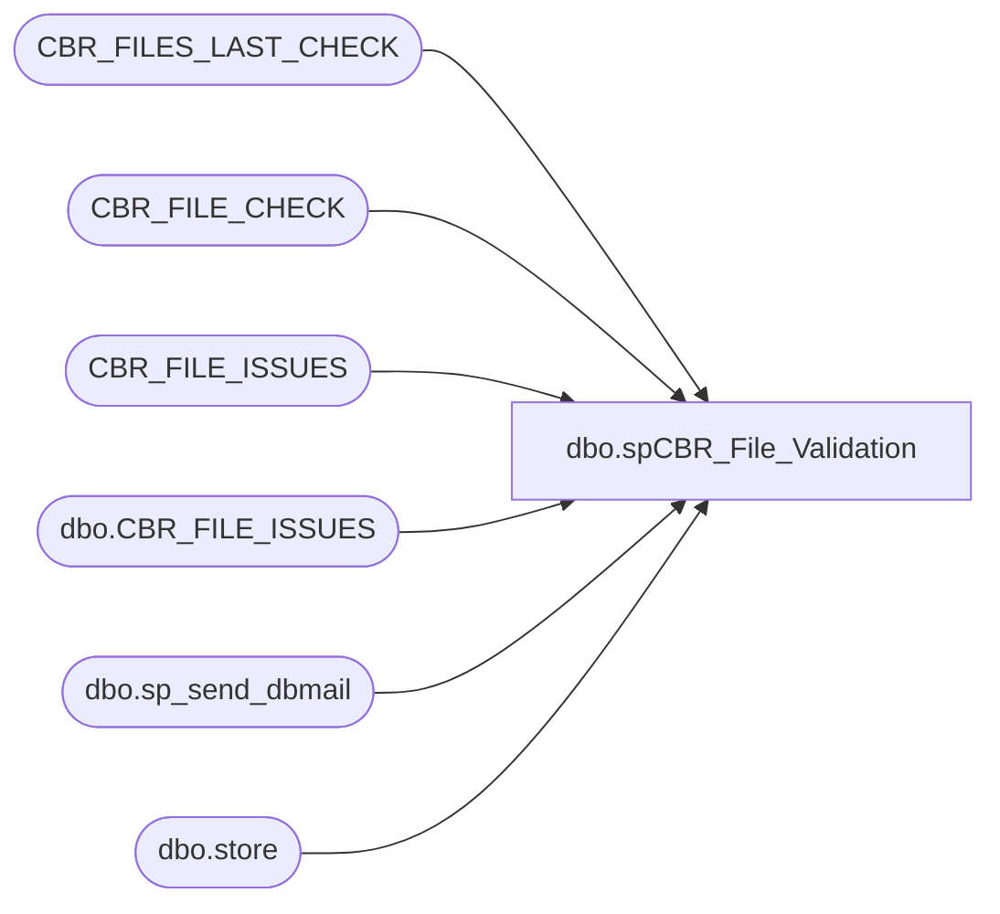

# dbo.spCBR_File_Validation

**Database:** Comm  
**Server:** bedrockdb01  

## Architecture Diagram



## Table Dependencies

| Referenced Table |
|---|
| CBR_FILES_LAST_CHECK |
| CBR_FILE_CHECK |
| CBR_FILE_ISSUES |
| dbo.CBR_FILE_ISSUES |
| dbo.sp_send_dbmail |
| dbo.store |

## Stored Procedure Code

```sql
--DROP PROC [dbo].[spCBR_File_Validation]
--GO

CREATE PROC [dbo].[spCBR_File_Validation]
-- =============================================================================================================
-- Name: [dbo].[spCBR_File_Validation]
--
-- Description:	Checks for outstanding CBR files residing on POSappCOMMS01.  This could be an indication that 
--				something is not running correctly on WMETL01.  If files are found within two or more consecutive
--				executions of this job, notifications via email will be sent out and the Merchadmin team should
--				take action.
--
--
-- Output: N/A
--
-- Dependencies: 
--
-- Revision History
--		Name:			Date:			Comments:
--		Paul Beckman	01/31/2012		Created SP
--		Paul Beckman	02/05/2020		Updated email profile to 'EntSysSupport'
--
-- exec spCBR_File_Validation
-- =============================================================================================================
AS
SET NOCOUNT ON

--####################################################

TRUNCATE TABLE CBR_FILE_CHECK
TRUNCATE TABLE CBR_FILE_ISSUES

IF (Object_ID('tempdb..#storeid') IS NOT NULL) DROP TABLE #storeid
SELECT RIGHT('000' + CAST(store_id as varchar),4) AS STR_NBR
INTO #storeid
FROM Comm.dbo.store
WHERE comp_id = '1'
ORDER by store_id
SELECT * FROM #storeid

--####################################################

SET NOCOUNT ON  
DECLARE @drive VARCHAR(5)  
DECLARE @command VARCHAR(2000)
DECLARE @backupfolder VARCHAR(20)

SET @drive = 'z:'
SET @command = 'net use ' + @drive + ' /d'
EXEC master..xp_cmdshell @command
SET @command = 'net use ' + @drive + ' \\posappcomms01\d$\nsbpolldata'
EXEC master..xp_cmdshell @command


--####################################################
-- Loop through file folders
--declare cursor  
DECLARE @filename VARCHAR(80)
DECLARE @cbrfilename VARCHAR(20)
DECLARE @storeno VARCHAR(4)
DECLARE storeno CURSOR FOR  
SELECT STR_NBR
FROM #storeid
ORDER BY STR_NBR  
  
--open cursor  
OPEN storeno  
  
FETCH next  
 FROM storeno  
 INTO @storeno  

WHILE @@fetch_status = 0  

BEGIN  

SET @command = 'dir /B ' + @drive + '\01' + @storeno + '\cbr\20*.txt'  
INSERT INTO CBR_FILE_CHECK (FL_NM)
EXEC master..xp_cmdshell @command  
DELETE FROM CBR_FILE_CHECK WHERE FL_NM IS NULL OR FL_NM = 'File Not Found' OR FL_NM LIKE '%cannot find%'

UPDATE CBR_FILE_CHECK
SET STR_NBR = @storeno
WHERE STR_NBR IS NULL

UPDATE CBR_FILE_CHECK
SET DT_TM = CONVERT(VARCHAR(19),GETDATE(),120)
WHERE DT_TM IS NULL

FETCH next  
 FROM storeno  
 INTO @storeno  
END  
  
CLOSE storeno  
DEALLOCATE storeno

--####################################################

DELETE FROM CBR_FILES_LAST_CHECK  
WHERE STR_NBR + FL_NM NOT IN (SELECT STR_NBR + FL_NM FROM CBR_FILE_CHECK) 

INSERT INTO CBR_FILES_LAST_CHECK SELECT * FROM CBR_FILE_CHECK

--####################################################

INSERT INTO CBR_FILE_ISSUES (STR_NBR,FL_NM)
SELECT STR_NBR,FL_NM
FROM CBR_FILES_LAST_CHECK
GROUP BY STR_NBR,FL_NM
HAVING COUNT(DT_TM) > 1

--####################################################

IF (SELECT COUNT(STR_NBR) FROM CBR_FILE_ISSUES) = 0
GOTO SKIPERROREMAIL

--####################################################
-- Send Emails

DECLARE @sql VARCHAR(8000)
DECLARE @recipients VARCHAR(4000)
DECLARE @copy_recipients VARCHAR(4000)
DECLARE @Subject VARCHAR(80)
DECLARE @query VARCHAR(8000)
DECLARE @filecount VARCHAR(4)

SET @filecount = (SELECT COUNT(*) FROM Comm.dbo.CBR_FILE_ISSUES)

--SET @recipients = 'paulb@buildabear.com'
SET @recipients = 'EntSysSupport@buildabear.com' --<< Seperate additions by a ;
--SET @copy_recipients = 'posadmin@buildabear.com' --<< Seperate additions by a ;

SET @query = 
'
SET NOCOUNT ON
PRINT ''The following Carton Batch Receiving (CBR) file(s) have been found in the stores cbr folder on POSappCOMMS01 that have not been moved by the Informatica process on WMETL01.''
PRINT ''''
PRINT ''''
SELECT CONVERT(VARCHAR(15),STR_NBR) AS STORE_NUMBER,CONVERT(VARCHAR(20),FL_NM) AS FILE_NAME FROM Comm.dbo.CBR_FILE_ISSUES ORDER BY STR_NBR,FL_NM,DT_TM
PRINT ''''
PRINT ''''
PRINT ''#################################''
PRINT ''''
PRINT ''''
PRINT ''Server:  POSdbs''
PRINT ''Job Name:  CBR_File_Validation''
PRINT ''Stored Proc:  posdbs.Comm.dbo.spCBR_File_Validation''
PRINT ''Created by:  Paul Beckman''
'

SET @Subject = 'ALERT - (' + @filecount + ') CBR files waiting on POSappCOMMS01'
	EXEC msdb.dbo.sp_send_dbmail  
		@recipients = @recipients,
		@copy_recipients = @copy_recipients,
		@subject=@Subject, 
		@query_result_width = 250,
		@query= @query

SKIPERROREMAIL:

--####################################################
-- Delete Mapped drive

SET @command = 'net use ' + @drive + ' /d'
EXEC master..xp_cmdshell @command

--####################################################
FINISH:
```

