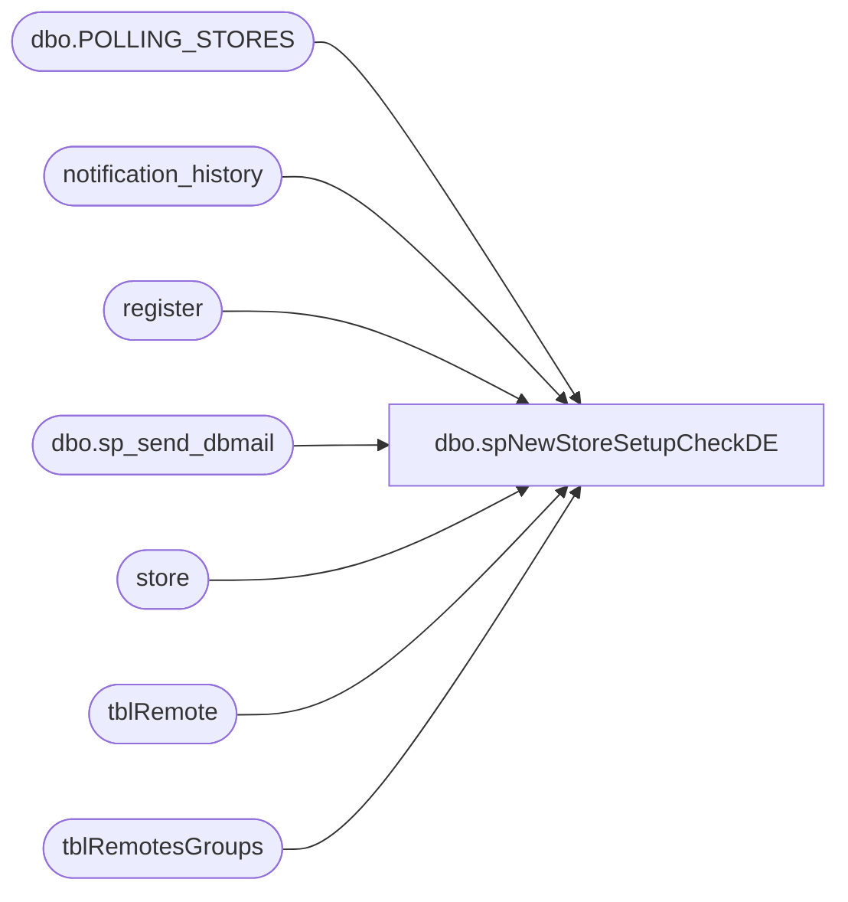

# dbo.spNewStoreSetupCheckDE

**Database:** Comm  
**Server:** bedrockdb01  

## Architecture Diagram



## Table Dependencies

| Referenced Table |
|---|
| dbo.POLLING_STORES |
| notification_history |
| register |
| dbo.sp_send_dbmail |
| store |
| tblRemote |
| tblRemotesGroups |

## Stored Procedure Code

```sql
CREATE   procedure [dbo].[spNewStoreSetupCheckDE]

AS
-- =====================================================================================================
-- Name: spNewStoreSetupCheckDE
--
-- Description:	Performs some checks on store setup and reports to the business user responsible for
--				said setup
--	
--
-- Input:	
--			
--
-- Output: Email
--			
--
-- Schedule: 
--		
--
-- Dependencies: None	
--	
--
-- Revision History
--		Name:			Date:			Comments:
--		Paul Beckman	08/07/2019		Initial setup
--		Paul Beckman	08/08/2019		Updated workstation join location_id to store_id
--		Paul Beckman	10/24/2019		Updated to use notification_hisory table
--		Paul Beckman	02/05/2020		Updated email profile to 'EntSysSupport'
--		Enjoli Simpson  09/14/2023      Removed check for ValueLink MID 
-- 
-- exec spNewStoreSetupCheckDE
-- 
-- =====================================================================================================


--####################################
-- Create Temp Table
--####################################

IF (Object_ID('tempdb..##NewStoreList') IS NOT NULL) DROP TABLE ##NewStoreList
CREATE TABLE ##NewStoreList (StoreNum numeric(4,0)
	,OpenDate date
	,MerchCategory varchar(5)
	,Workstations varchar(5)
	--,ValueLinkMID varchar(15)
	,PollingGroup varchar(5)
	)


--####################################
-- Declare script variables
--####################################

DECLARE @SQL VARCHAR(8000)
DECLARE @CMD VARCHAR(4000)
DECLARE @Recipients VARCHAR(4000)
DECLARE @Copy_Recipients VARCHAR(4000)
DECLARE @Subject VARCHAR(80)
DECLARE @Query VARCHAR(8000)
DECLARE @Text nvarchar(max)
DECLARE @StoreCount AS INT
DECLARE @DateCount AS INT


--####################################
-- Set variables
--####################################

SET @DateCount = 30  --<< Days prior to Stores [OPEN_DATE] in [auditworks].[dbo].[POLLING_STORES]

--SET @Recipients = 'paulb@buildabear.com'
SET @Recipients = 'EntSysSupport@buildabear.com'
SET @Copy_Recipients = 'JenM@buildabear.com'


--####################################
-- Insert Stores into Temp Table
--####################################

INSERT INTO ##NewStoreList
SELECT STORE_NUM
	,OPEN_DATE
	,CASE WHEN COUNTRY = 'USA' THEN '840'
		WHEN COUNTRY = 'CAN' THEN '124'
		WHEN COUNTRY = 'GBR' THEN '826'
		WHEN COUNTRY = 'IRL' THEN '978'
		WHEN COUNTRY = 'DNK' THEN '208'
		WHEN COUNTRY = 'CHN' THEN '156'
		END AS MerchCategory
	,NULL
	/*,CASE WHEN COUNTRY = 'USA' THEN '97020300000'
		WHEN COUNTRY = 'CAN' THEN '97032000002'
		WHEN COUNTRY = 'GBR' THEN '97088700000'
		WHEN COUNTRY = 'IRL' THEN '97483640005'
		WHEN COUNTRY = 'DNK' THEN '99086429999'
		WHEN COUNTRY = 'CHN' THEN '00000000000'
		END AS ValueLinkMID*/
	,NULL
FROM auditworks.dbo.POLLING_STORES
WHERE CLOSED_DATE IS NULL
AND STORE_NUM NOT IN (470)
AND STORE_BRAND IN ('Workshop')
AND OPEN_DATE <= DATEADD(day,+@DateCount,GETDATE())
AND OPEN_DATE >= DATEADD(day,-30,GETDATE())


--####################################
-- Setup Checks
--####################################

---------------- Merchant Category -----------------
UPDATE ##NewStoreList
SET MerchCategory = 'X'
WHERE StoreNum IN (
SELECT a.STORE_NUM
FROM auditworks.dbo.POLLING_STORES a
WHERE a.STORE_NUM NOT IN (SELECT a.StoreNum FROM ##NewStoreList a
LEFT JOIN store b ON a.StoreNum = b.store_id
WHERE b.comp_id IN (1)
AND b.merchant_category = a.MerchCategory
)
AND a.CLOSED_DATE IS NULL
AND a.STORE_NUM NOT IN (470)
AND a.STORE_BRAND IN ('Workshop')
AND a.OPEN_DATE <= DATEADD(day,+@DateCount,GETDATE())
)


------------------ Workstations --------------------
UPDATE ##NewStoreList
SET Workstations = 'X'
WHERE StoreNum IN (
SELECT a.STORE_NUM
FROM auditworks.dbo.POLLING_STORES a
WHERE a.STORE_NUM NOT IN (SELECT a.STORE_NUM FROM auditworks.dbo.POLLING_STORES a
LEFT JOIN store b ON a.STORE_NUM = b.store_id
JOIN register c ON b.location_id = c.location_id
WHERE b.comp_id=1
AND c.register_id IN (1,2,3,21)
GROUP BY a.STORE_NUM --b.store_id
HAVING COUNT(c.register_id) = 4
)
AND a.CLOSED_DATE IS NULL
AND a.STORE_NUM NOT IN (470)
AND a.STORE_BRAND IN ('Workshop')
AND a.OPEN_DATE <= DATEADD(day,+@DateCount,GETDATE())
)

-- No longer needed as this is configured within Jumpmind POS 
-------------- ValueLink Merchant ID --------------
/*UPDATE ##NewStoreList
SET ValueLinkMID = 'X'
WHERE StoreNum IN (
SELECT a.STORE_NUM
FROM auditworks.dbo.POLLING_STORES a
WHERE a.STORE_NUM NOT IN (SELECT a.StoreNum FROM ##NewStoreList a
LEFT JOIN store b ON a.StoreNum = b.store_id
JOIN client_application ca ON b.location_id = ca.location_id
JOIN transaction_type tt ON tt.tran_type_id = ca.tran_type_id
JOIN device d ON b.location_id = d.location_id
WHERE tt.tran_type_id IN (17)
AND ca.merchant_id_1 = a.ValueLinkMID
GROUP BY a.StoreNum,ca.merchant_id_1
)
AND a.CLOSED_DATE IS NULL
AND a.STORE_NUM NOT IN (470)
AND a.STORE_BRAND IN ('Workshop')
AND a.OPEN_DATE <= DATEADD(day,+@DateCount,GETDATE())
)*/


------------------ Polling Group -------------------
UPDATE ##NewStoreList
SET PollingGroup = 'X'
WHERE StoreNum IN (
SELECT a.STORE_NUM
FROM auditworks.dbo.POLLING_STORES a
WHERE a.STORE_NUM NOT IN (SELECT a.STORE_NUM FROM auditworks.dbo.POLLING_STORES a
LEFT JOIN tblRemote b ON a.STORE_NUM = RIGHT(b.RemoteNumber,4)
JOIN tblRemotesGroups c ON b.RemoteNumber = c.RemoteNumber
WHERE c.GroupID = 15
)
AND a.CLOSED_DATE IS NULL
AND a.STORE_NUM NOT IN (470)
AND a.STORE_BRAND IN ('Workshop')
AND a.COUNTRY = 'USA'
AND a.OPEN_DATE < DATEADD(day,+@DateCount,GETDATE())
AND a.OPEN_DATE > DATEADD(day,-0,GETDATE())
)

UPDATE ##NewStoreList
SET MerchCategory = NULL
WHERE MerchCategory != 'X'

/*UPDATE ##NewStoreList
SET ValueLinkMID = NULL
WHERE ValueLinkMID != 'X'*/

--####################################
-- Send Email id applicable
--####################################

--SET @StoreCount = (SELECT COUNT(*) FROM ##NewStoreList WHERE CONCAT(MerchCategory, Workstations, ValueLinkMID, PollingGroup) LIKE '%X%')
SET @StoreCount = (SELECT COUNT(*) FROM ##NewStoreList WHERE CONCAT(MerchCategory, Workstations, PollingGroup) LIKE '%X%')

IF @StoreCount = 0
GOTO FINISH

SET @Text = 
		'<font face =arial size = 2 color="Red">' +
		N'<H3>** ACTION REQUIRED **</H3>' +
		'(' + CONVERT(VARCHAR(5),@StoreCount) + ') Stores found that are opening within the next ' + CONVERT(VARCHAR(5),@DateCount) + ' days and require setup completion in Data Exchange on DEAPP01. <br>' +
		'The below items identified by store and marked with "X" require setup and/or correction. <br>' +
		'<br>' +
		'<br>' +
		'<font face =arial size = 2 color="Black">' +
		(SELECT CASE WHEN COUNT(MerchCategory) = 0 THEN '<font color="#D3D3D3">' ELSE '<font color="#000080">' END FROM ##NewStoreList) +
		'&nbsp;&nbsp;&nbsp;&nbsp;&nbsp;<b>- Merchant Category:</b>&nbsp;&nbsp;<i>Not Defined or does not match for the country</i><br>' +
		'&nbsp;&nbsp;&nbsp;&nbsp;&nbsp;&nbsp;&nbsp;&nbsp;&nbsp;&nbsp;&nbsp;<b>- USA</b> = &nbsp;&nbsp;<i>840</i><br>' +
		'&nbsp;&nbsp;&nbsp;&nbsp;&nbsp;&nbsp;&nbsp;&nbsp;&nbsp;&nbsp;&nbsp;<b>- CAN</b> = &nbsp;&nbsp;<i>124</i><br>' +
		'&nbsp;&nbsp;&nbsp;&nbsp;&nbsp;&nbsp;&nbsp;&nbsp;&nbsp;&nbsp;&nbsp;<b>- GBR</b> = &nbsp;&nbsp;<i>826</i><br>' +
		'&nbsp;&nbsp;&nbsp;&nbsp;&nbsp;&nbsp;&nbsp;&nbsp;&nbsp;&nbsp;&nbsp;<b>- IRL</b> = &nbsp;&nbsp;<i>978</i><br>' +
		'&nbsp;&nbsp;&nbsp;&nbsp;&nbsp;&nbsp;&nbsp;&nbsp;&nbsp;&nbsp;&nbsp;<b>- DNK</b> = &nbsp;&nbsp;<i>208</i><br>' +
		'&nbsp;&nbsp;&nbsp;&nbsp;&nbsp;&nbsp;&nbsp;&nbsp;&nbsp;&nbsp;&nbsp;<b>- CHN</b> = &nbsp;&nbsp;<i>156</i><br>' +
		(SELECT CASE WHEN COUNT(Workstations) = 0 THEN '<font color="#D3D3D3">' ELSE '<font color="#000080">' END FROM ##NewStoreList) +
		'&nbsp;&nbsp;&nbsp;&nbsp;&nbsp;<b>- Workstations:</b>&nbsp;&nbsp;<i>Workstations 1,2,3,21 (at minimum) not all setup</i><br>' +
		--(SELECT CASE WHEN COUNT(ValueLinkMID) = 0 THEN '<font color="#D3D3D3">' ELSE '<font color="#000080">' END FROM ##NewStoreList) +
		--'&nbsp;&nbsp;&nbsp;&nbsp;&nbsp;<b>- ValueLink MID:</b>&nbsp;&nbsp;<i>A ValueLink MID for Gift Card authorizations is not assigned or correct</i><br>' +
		(SELECT CASE WHEN COUNT(PollingGroup) = 0 THEN '<font color="#D3D3D3">' ELSE '<font color="#000080">' END FROM ##NewStoreList) +
		'&nbsp;&nbsp;&nbsp;&nbsp;&nbsp;<b>- Polling Group Assigned:</b>&nbsp;&nbsp;<i>Store is not assigned to the "Pre-Live Stores" polling group</i><br>' +
		'<br>' + 
		'<table border="1">' + 
		'<font face =arial size = 2 color="Black">' +
		'<tr bgcolor=#D5D5F7><th>Store Num</th><th>Open Date</th><th>Merchant Category</th><th>Workstations</th><th>ValueLink MID</th><th>Polling Group Assigned</th></tr>' +
		CAST ( ( SELECT [td/@align]='left',
						td = StoreNum, '',
						[td/@align]='left',
						td = CONVERT(VARCHAR(19),OpenDate,101), '',
						[td/@align]='center',
						td = CASE WHEN MerchCategory NOT LIKE '%X%' THEN '' ELSE MerchCategory END, '',
						[td/@align]='center',
						td = CASE WHEN Workstations NOT LIKE '%X%' THEN '' ELSE Workstations END, '',
						--[td/@align]='center',
						--td = CASE WHEN ValueLinkMID NOT LIKE '%X%' THEN '' ELSE ValueLinkMID END, '',
						[td/@align]='center',
						td = CASE WHEN PollingGroup NOT LIKE '%X%' THEN '' ELSE PollingGroup END, ''
				FROM ##NewStoreList
				--WHERE CONCAT(MerchCategory, Workstations, ValueLinkMID, PollingGroup) LIKE '%X%'
				WHERE CONCAT(MerchCategory, Workstations, PollingGroup) LIKE '%X%'
				ORDER BY OpenDate,StoreNum
				FOR xml path ('tr'), type
		) AS NVARCHAR(MAX) ) +
		'</table>' +
		'<font face =arial size = 1 color="#C0C0C0">' +
		'<br><br><br><br>' +
		'Server:  BEDROCKDB01 <br>' +
		'Job Name:  New_Store_Setup_Check <br>' +
		'Stored Proc:  BEDROCKDB01.Comm.dbo.spNewStoreSetupCheckDE <br>' +
		'Created by:  Paul Beckman <br>' +
		'Team Ownership:  Enterprise Systems <br>'

SET @Subject = 'ALERT - Data Exchange New Store setup required'
	EXEC msdb.dbo.sp_send_dbmail  
	@profile_name = 'EntSysSupport',
	@recipients = @Recipients,
	@copy_recipients = @Copy_Recipients,
	@subject=@Subject, 
	@body = @Text,
	@body_format = 'HTML'

	INSERT INTO notification_history
	(stored_proc_name,
	record_logged_datetime,
	issues_found,
	action_required,
	notification_sent,
	email_type,
	email_to,
	email_cc,
	email_subject,
	comment
	)
	VALUES (
	'spNewStoreSetupCheckDE', --<< Stored Proc name
	GETDATE(),
	'Yes', --<< Issues found - Yes / No
	'Yes', --<< Action required - Yes / No
	'Yes', --<< Notification sent - Yes / No
	'Alert', --<< Email type - Notification Only / Alert / Warning
	@Recipients, --<< Email TO
	@Copy_Recipients, --<< Email CC
	@Subject, --<< Email Subject
	'Data Exchange setup items identified that need completion for stores opening soon' --<< Comment
	)


FINISH:
--####################################
-- Temp Table Cleanup
--####################################

IF (Object_ID('tempdb..##NewStoreList') IS NOT NULL) DROP TABLE ##NewStoreList


--####################################


/*

SELECT * FROM ##NewStoreList

*/
dbo,dt_generateansiname,/* 
**	Generate an ansi name that is unique in the dtproperties.value column 
*/ 
create procedure dbo.dt_generateansiname(@name varchar(255) output) 
as 
	declare @prologue varchar(20) 
	declare @indexstring varchar(20) 
	declare @index integer 
 
	set @prologue = 'MSDT-A-' 
	set @index = 1 
 
	while 1 = 1 
	begin 
		set @indexstring = cast(@index as varchar(20)) 
		set @name = @prologue + @indexstring 
		if not exists (select value from dtproperties where value = @name) 
			break 
		 
		set @index = @index + 1 
 
		if (@index = 10000) 
			goto TooMany 
	end 
 
Leave: 
 
	return 
 
TooMany: 
 
	set @name = 'DIAGRAM' 
	goto Leave 

dbo,dt_adduserobject,/*
**	Add an object to the dtproperties table
*/
create procedure dbo.dt_adduserobject
as
	set nocount on
	/*
	** Create the user object if it does not exist already
	*/
	begin transaction
		insert dbo.dtproperties (property) VALUES ('DtgSchemaOBJECT')
		update dbo.dtproperties set objectid=@@identity 
			where id=@@identity and property='DtgSchemaOBJECT'
	commit
	return @@identity

dbo,dt_setpropertybyid,/*
**	If the property already exists, reset the value; otherwise add property
**		id -- the id in sysobjects of the object
**		property -- the name of the property
**		value -- the text value of the property
**		lvalue -- the binary value of the property (image)
*/
create procedure dbo.dt_setpropertybyid
	@id int,
	@property varchar(64),
	@value varchar(255),
	@lvalue image
as
	set nocount on
	declare @uvalue nvarchar(255) 
	set @uvalue = convert(nvarchar(255), @value) 
	if exists (select * from dbo.dtproperties 
			where objectid=@id and property=@property)
	begin
		--
		-- bump the version count for this row as we update it
		--
		update dbo.dtproperties set value=@value, uvalue=@uvalue, lvalue=@lvalue, version=version+1
			where objectid=@id and property=@property
	end
	else
	begin
		--
		-- version count is auto-set to 0 on initial insert
		--
		insert dbo.dtproperties (property, objectid, value, uvalue, lvalue)
			values (@property, @id, @value, @uvalue, @lvalue)
	end


dbo,dt_getobjwithprop,/*
**	Retrieve the owner object(s) of a given property
*/
create procedure dbo.dt_getobjwithprop
	@property varchar(30),
	@value varchar(255)
as
	set nocount on

	if (@property is null) or (@property = '')
	begin
		raiserror('Must specify a property name.',-1,-1)
		return (1)
	end

	if (@value is null)
		select objectid id from dbo.dtproperties
			where property=@property

	else
		select objectid id from dbo.dtproperties
			where property=@property and value=@value

dbo,dt_getpropertiesbyid,/*
**	Retrieve properties by id's
**
**	dt_getproperties objid, null or '' -- retrieve all properties of the object itself
**	dt_getproperties objid, property -- retrieve the property specified
*/
create procedure dbo.dt_getpropertiesbyid
	@id int,
	@property varchar(64)
as
	set nocount on

	if (@property is null) or (@property = '')
		select property, version, value, lvalue
			from dbo.dtproperties
			where  @id=objectid
	else
		select property, version, value, lvalue
			from dbo.dtproperties
			where  @id=objectid and @property=property

dbo,dt_setpropertybyid_u,/*
**	If the property already exists, reset the value; otherwise add property
**		id -- the id in sysobjects of the object
**		property -- the name of the property
**		uvalue -- the text value of the property
**		lvalue -- the binary value of the property (image)
*/
create procedure dbo.dt_setpropertybyid_u
	@id int,
	@property varchar(64),
	@uvalue nvarchar(255),
	@lvalue image
as
	set nocount on
	-- 
	-- If we are writing the name property, find the ansi equivalent. 
	-- If there is no lossless translation, generate an ansi name. 
	-- 
	declare @avalue varchar(255) 
	set @avalue = null 
	if (@uvalue is not null) 
	begin 
		if (convert(nvarchar(255), convert(varchar(255), @uvalue)) = @uvalue) 
		begin 
			set @avalue = convert(varchar(255), @uvalue) 
		end 
		else 
		begin 
			if 'DtgSchemaNAME' = @property 
			begin 
				exec dbo.dt_generateansiname @avalue output 
			end 
		end 
	end 
	if exists (select * from dbo.dtproperties 
			where objectid=@id and property=@property)
	begin
		--
		-- bump the version count for this row as we update it
		--
		update dbo.dtproperties set value=@avalue, uvalue=@uvalue, lvalue=@lvalue, version=version+1
			where objectid=@id and property=@property
	end
	else
	begin
		--
		-- version count is auto-set to 0 on initial insert
		--
		insert dbo.dtproperties (property, objectid, value, uvalue, lvalue)
			values (@property, @id, @avalue, @uvalue, @lvalue)
	end

dbo,dt_getobjwithprop_u,/*
**	Retrieve the owner object(s) of a given property
*/
create procedure dbo.dt_getobjwithprop_u
	@property varchar(30),
	@uvalue nvarchar(255)
as
	set nocount on

	if (@property is null) or (@property = '')
	begin
		raiserror('Must specify a property name.',-1,-1)
		return (1)
	end

	if (@uvalue is null)
		select objectid id from dbo.dtproperties
			where property=@property

	else
		select objectid id from dbo.dtproperties
			where property=@property and uvalue=@uvalue

dbo,dt_getpropertiesbyid_u,/*
**	Retrieve properties by id's
**
**	dt_getproperties objid, null or '' -- retrieve all properties of the object itself
**	dt_getproperties objid, property -- retrieve the property specified
*/
create procedure dbo.dt_getpropertiesbyid_u
	@id int,
	@property varchar(64)
as
	set nocount on

	if (@property is null) or (@property = '')
		select property, version, uvalue, lvalue
			from dbo.dtproperties
			where  @id=objectid
	else
		select property, version, uvalue, lvalue
			from dbo.dtproperties
			where  @id=objectid and @property=property

dbo,dt_dropuserobjectbyid,/*
**	Drop an object from the dbo.dtproperties table
*/
create procedure dbo.dt_dropuserobjectbyid
	@id int
as
	set nocount on
	delete from dbo.dtproperties where objectid=@id

dbo,dt_droppropertiesbyid,/*
**	Drop one or all the associated properties of an object or an attribute 
**
**	dt_dropproperties objid, null or '' -- drop all properties of the object itself
**	dt_dropproperties objid, property -- drop the property
*/
create procedure dbo.dt_droppropertiesbyid
	@id int,
	@property varchar(64)
as
	set nocount on

	if (@property is null) or (@property = '')
		delete from dbo.dtproperties where objectid=@id
	else
		delete from dbo.dtproperties 
			where objectid=@id and property=@property


dbo,dt_verstamp006,/*
**	This procedure returns the version number of the stored
**    procedures used by legacy versions of the Microsoft
**	Visual Database Tools.  Version is 7.0.00.
*/
create procedure dbo.dt_verstamp006
as
	select 7000

dbo,dt_verstamp007,/*
**	This procedure returns the version number of the stored
**    procedures used by the the Microsoft Visual Database Tools.
**	Version is 7.0.05.
*/
create procedure dbo.dt_verstamp007
as
	select 7005
```

