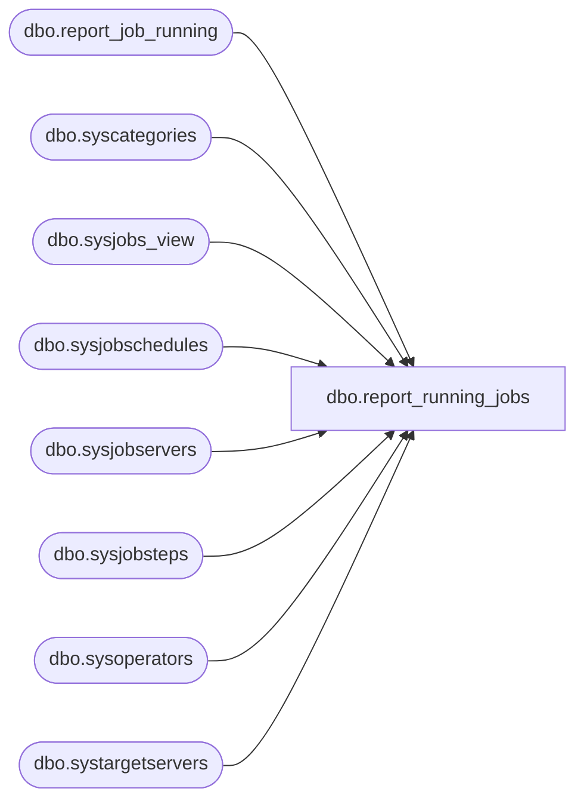

# dbo.report_running_jobs

**Database:** DBAUtility  
**Server:** bedrockdb01  

## Architecture Diagram



## Table Dependencies

| Referenced Table |
|---|
| dbo.report_job_running |
| dbo.syscategories |
| dbo.sysjobs_view |
| dbo.sysjobschedules |
| dbo.sysjobservers |
| dbo.sysjobsteps |
| dbo.sysoperators |
| dbo.systargetservers |

## Stored Procedure Code

```sql
CREATE Proc [dbo].[report_running_jobs]
AS 
BEGIN

DECLARE  @job_id             UNIQUEIDENTIFIER 
DECLARE  @job_type           VARCHAR(12)     
DECLARE  @owner_login_name   sysname         
DECLARE  @subsystem          NVARCHAR(40)     
DECLARE  @category_id        INT              
DECLARE  @enabled            TINYINT          
DECLARE  @execution_status   INT              
DECLARE  @date_comparator    CHAR(1)          
DECLARE  @date_created       DATETIME         
DECLARE  @date_last_modified DATETIME        
DECLARE  @description        NVARCHAR(512)   
DECLARE @is_sysadmin        INT
DECLARE @job_owner          sysname

  SET NOCOUNT ON

SET  @job_id              = NULL
SET  @job_type            = NULL  -- LOCAL or MULTI-SERVER
SET  @owner_login_name    = NULL
SET  @subsystem           = NULL
SET  @category_id         = NULL
SET  @enabled             = NULL
SET  @execution_status    = NULL --1  -- 0 = Not idle or suspended 1 = Executing 2 = Waiting For Thread 3 = Between Retries 4 = Idle 5 = Suspended [6 = WaitingForStepToFinish] 7 = PerformingCompletionActions
SET  @date_comparator     = NULL  -- > < or =
SET  @date_created        = NULL
SET  @date_last_modified  = NULL
SET  @description        = NULL 

  -- By 'composite' we mean a combination of sysjobs and xp_sqlagent_enum_jobs data.
  -- This proc should only ever be called by sp_help_job, so we don't verify the
  -- parameters (sp_help_job has already done this).

  -- Step 1: Create intermediate work tables
  CREATE TABLE #job_execution_state (job_id                  UNIQUEIDENTIFIER NOT NULL,
                                     date_started            INT              NOT NULL,
                                     time_started            INT              NOT NULL,
                                     execution_job_status    INT              NOT NULL,
                                     execution_step_id       INT              NULL,
                                     execution_step_name     sysname          COLLATE database_default NULL,
                                     execution_retry_attempt INT              NOT NULL,
                                     next_run_date           INT              NOT NULL,
                                     next_run_time           INT              NOT NULL,
                                     next_run_schedule_id    INT              NOT NULL)
  CREATE TABLE #filtered_jobs (job_id                   UNIQUEIDENTIFIER NOT NULL,
                               date_created             DATETIME         NOT NULL,
                               date_last_modified       DATETIME         NOT NULL,
                               current_execution_status INT              NULL,
                               current_execution_step   sysname          COLLATE database_default NULL,
                               current_retry_attempt    INT              NULL,
                               last_run_date            INT              NOT NULL,
                               last_run_time            INT              NOT NULL,
                               last_run_outcome         INT              NOT NULL,
                               next_run_date            INT              NULL,
                               next_run_time            INT              NULL,
                               next_run_schedule_id     INT              NULL,
                               type                     INT              NOT NULL)
  CREATE TABLE #xp_results (job_id                UNIQUEIDENTIFIER NOT NULL,
                            last_run_date         INT              NOT NULL,
                            last_run_time         INT              NOT NULL,
                            next_run_date         INT              NOT NULL,
                            next_run_time         INT              NOT NULL,
                            next_run_schedule_id  INT              NOT NULL,
                            requested_to_run      INT              NOT NULL, -- BOOL
                            request_source        INT              NOT NULL,
                            request_source_id     sysname          COLLATE database_default NULL,
                            running               INT              NOT NULL, -- BOOL
                            current_step          INT              NOT NULL,
                            current_retry_attempt INT              NOT NULL,
                            job_state             INT              NOT NULL)

  -- Step 2: Capture job execution information (for local jobs only since that's all SQLServerAgent caches)
  SELECT @is_sysadmin = ISNULL(IS_SRVROLEMEMBER(N'sysadmin'), 0)
  SELECT @job_owner = SUSER_SNAME()
 
    INSERT INTO #xp_results
    EXECUTE master.dbo.xp_sqlagent_enum_jobs @is_sysadmin, @job_owner, @job_id
 
  INSERT INTO #job_execution_state
  SELECT xpr.job_id,
         xpr.last_run_date,
         xpr.last_run_time,
         xpr.job_state,
         sjs.step_id,
         sjs.step_name,
         xpr.current_retry_attempt,
         xpr.next_run_date,
         xpr.next_run_time,
         xpr.next_run_schedule_id
  FROM #xp_results                          xpr
       LEFT OUTER JOIN msdb.dbo.sysjobsteps sjs ON ((xpr.job_id = sjs.job_id) AND (xpr.current_step = sjs.step_id)),
       msdb.dbo.sysjobs_view                sjv
  WHERE (sjv.job_id = xpr.job_id)

  -- Step 3: Filter on everything but dates and job_type
  IF ((@subsystem        IS NULL) AND
      (@owner_login_name IS NULL) AND
      (@enabled          IS NULL) AND
      (@category_id      IS NULL) AND
      (@execution_status IS NULL) AND
      (@description      IS NULL) AND
      (@job_id           IS NULL))
  BEGIN
    -- Optimize for the frequently used case...
    INSERT INTO #filtered_jobs
    SELECT sjv.job_id,
           sjv.date_created,
           sjv.date_modified,
           ISNULL(jes.execution_job_status, 4), -- Will be NULL if the job is non-local or is not in #job_execution_state (NOTE: 4 = STATE_IDLE)
           CASE ISNULL(jes.execution_step_id, 0)
             WHEN 0 THEN NULL                   -- Will be NULL if the job is non-local or is not in #job_execution_state
             ELSE CONVERT(NVARCHAR, jes.execution_step_id) + N' (' + jes.execution_step_name + N')'
           END,
           jes.execution_retry_attempt,         -- Will be NULL if the job is non-local or is not in #job_execution_state
           0,  -- last_run_date placeholder    (we'll fix it up in step 3.3)
           0,  -- last_run_time placeholder    (we'll fix it up in step 3.3)
           5,  -- last_run_outcome placeholder (we'll fix it up in step 3.3 - NOTE: We use 5 just in case there are no jobservers for the job)
           jes.next_run_date,                   -- Will be NULL if the job is non-local or is not in #job_execution_state
           jes.next_run_time,                   -- Will be NULL if the job is non-local or is not in #job_execution_state
           jes.next_run_schedule_id,            -- Will be NULL if the job is non-local or is not in #job_execution_state
           0   -- type placeholder             (we'll fix it up in step 3.4)
    FROM msdb.dbo.sysjobs_view                sjv
         LEFT OUTER JOIN #job_execution_state jes ON (sjv.job_id = jes.job_id)
  END
  ELSE
  BEGIN
    INSERT INTO #filtered_jobs
    SELECT DISTINCT
           sjv.job_id,
           sjv.date_created,
           sjv.date_modified,
           ISNULL(jes.execution_job_status, 4), -- Will be NULL if the job is non-local or is not in #job_execution_state (NOTE: 4 = STATE_IDLE)
           CASE ISNULL(jes.execution_step_id, 0)
             WHEN 0 THEN NULL                   -- Will be NULL if the job is non-local or is not in #job_execution_state
             ELSE CONVERT(NVARCHAR, jes.execution_step_id) + N' (' + jes.execution_step_name + N')'
           END,
           jes.execution_retry_attempt,         -- Will be NULL if the job is non-local or is not in #job_execution_state
           0,  -- last_run_date placeholder    (we'll fix it up in step 3.3)
           0,  -- last_run_time placeholder    (we'll fix it up in step 3.3)
           5,  -- last_run_outcome placeholder (we'll fix it up in step 3.3 - NOTE: We use 5 just in case there are no jobservers for the job)
           jes.next_run_date,                   -- Will be NULL if the job is non-local or is not in #job_execution_state
           jes.next_run_time,                   -- Will be NULL if the job is non-local or is not in #job_execution_state
           jes.next_run_schedule_id,            -- Will be NULL if the job is non-local or is not in #job_execution_state
           0   -- type placeholder             (we'll fix it up in step 3.4)
    FROM msdb.dbo.sysjobs_view                sjv
         LEFT OUTER JOIN #job_execution_state jes ON (sjv.job_id = jes.job_id)
         LEFT OUTER JOIN msdb.dbo.sysjobsteps sjs ON (sjv.job_id = sjs.job_id)
    WHERE ((@subsystem        IS NULL) OR (sjs.subsystem            = @subsystem))
      AND ((@owner_login_name IS NULL) OR (sjv.owner_sid            = SUSER_SID(@owner_login_name)))
      AND ((@enabled          IS NULL) OR (sjv.enabled              = @enabled))
      AND ((@category_id      IS NULL) OR (sjv.category_id          = @category_id))
      AND ((@execution_status IS NULL) OR ((@execution_status > 0) AND (jes.execution_job_status = @execution_status))
                                       OR ((@execution_status = 0) AND (jes.execution_job_status <> 4) AND (jes.execution_job_status <> 5)))
      AND ((@description      IS NULL) OR (sjv.description       LIKE @description))
      AND ((@job_id           IS NULL) OR (sjv.job_id               = @job_id))
  END

  -- Step 3.1: Change the execution status of non-local jobs from 'Idle' to 'Unknown'
  UPDATE #filtered_jobs
  SET current_execution_status = NULL
  WHERE (current_execution_status = 4)
    AND (job_id IN (SELECT job_id
                    FROM msdb.dbo.sysjobservers
                    WHERE (server_id <> 0)))

  -- Step 3.2: Check that if the user asked to see idle jobs that we still have some.
  --           If we don't have any then the query should return no rows.
  IF (@execution_status = 4) AND
     (NOT EXISTS (SELECT *
                  FROM #filtered_jobs
                  WHERE (current_execution_status = 4)))
  BEGIN
    TRUNCATE TABLE #filtered_jobs
  END

  -- Step 3.3: Populate the last run date/time/outcome [this is a little tricky since for
  --           multi-server jobs there are multiple last run details in sysjobservers, so
  --           we simply choose the most recent].
  IF (EXISTS (SELECT *
              FROM msdb.dbo.systargetservers))
  BEGIN
    UPDATE #filtered_jobs
    SET last_run_date = sjs.last_run_date,
        last_run_time = sjs.last_run_time,
        last_run_outcome = sjs.last_run_outcome
    FROM #filtered_jobs         fj,
         msdb.dbo.sysjobservers sjs
    WHERE (CONVERT(FLOAT, sjs.last_run_date) * 1000000) + sjs.last_run_time =
           (SELECT MAX((CONVERT(FLOAT, last_run_date) * 1000000) + last_run_time)
            FROM msdb.dbo.sysjobservers
            WHERE (job_id = sjs.job_id))
      AND (fj.job_id = sjs.job_id)
  END
  ELSE
  BEGIN
    UPDATE #filtered_jobs
    SET last_run_date = sjs.last_run_date,
        last_run_time = sjs.last_run_time,
        last_run_outcome = sjs.last_run_outcome
    FROM #filtered_jobs         fj,
         msdb.dbo.sysjobservers sjs
    WHERE (fj.job_id = sjs.job_id)
  END

  -- Step 3.4 : Set the type of the job to local (1) or multi-server (2)
  --            NOTE: If the job has no jobservers then it wil have a type of 0 meaning
  --                  unknown.  This is marginally inconsistent with the behaviour of
  --                  defaulting the category of a new job to [Uncategorized (Local)], but
  --                  prevents incompletely defined jobs from erroneously showing up as valid
  --                  local jobs.
  UPDATE #filtered_jobs
  SET type = 1 -- LOCAL
  FROM #filtered_jobs         fj,
       msdb.dbo.sysjobservers sjs
  WHERE (fj.job_id = sjs.job_id)
    AND (server_id = 0)
  UPDATE #filtered_jobs
  SET type = 2 -- MULTI-SERVER
  FROM #filtered_jobs         fj,
       msdb.dbo.sysjobservers sjs
  WHERE (fj.job_id = sjs.job_id)
    AND (server_id <> 0)

  -- Step 4: Filter on job_type
  IF (@job_type IS NOT NULL)
  BEGIN
    IF (UPPER(@job_type) = 'LOCAL')
      DELETE FROM #filtered_jobs
      WHERE (type <> 1) -- IE. Delete all the non-local jobs
    IF (UPPER(@job_type) = 'MULTI-SERVER')
      DELETE FROM #filtered_jobs
      WHERE (type <> 2) -- IE. Delete all the non-multi-server jobs
  END

  -- Step 5: Filter on dates
  IF (@date_comparator IS NOT NULL)
  BEGIN
    IF (@date_created IS NOT NULL)
    BEGIN
      IF (@date_comparator = '=')
        DELETE FROM #filtered_jobs WHERE (date_created <> @date_created)
      IF (@date_comparator = '>')
        DELETE FROM #filtered_jobs WHERE (date_created <= @date_created)
      IF (@date_comparator = '<')
        DELETE FROM #filtered_jobs WHERE (date_created >= @date_created)
    END
    IF (@date_last_modified IS NOT NULL)
    BEGIN
      IF (@date_comparator = '=')
        DELETE FROM #filtered_jobs WHERE (date_last_modified <> @date_last_modified)
      IF (@date_comparator = '>')
        DELETE FROM #filtered_jobs WHERE (date_last_modified <= @date_last_modified)
      IF (@date_comparator = '<')
        DELETE FROM #filtered_jobs WHERE (date_last_modified >= @date_last_modified)
    END
  END

  -- Return the result set (NOTE: No filtering occurs here)
INSERT INTO DBAUtility.dbo.report_job_running
  SELECT sjv.job_id,
         sjv.originating_server,
         sjv.name,
         sjv.enabled,
         sjv.description,
         sjv.start_step_id,
         category = ISNULL(sc.name, FORMATMESSAGE(14205)),
         owner = SUSER_SNAME(sjv.owner_sid),
         sjv.notify_level_eventlog,
         sjv.notify_level_email,
         sjv.notify_level_netsend,
         sjv.notify_level_page,
         notify_email_operator   = ISNULL(so1.name, FORMATMESSAGE(14205)),
         notify_netsend_operator = ISNULL(so2.name, FORMATMESSAGE(14205)),
         notify_page_operator    = ISNULL(so3.name, FORMATMESSAGE(14205)),
         sjv.delete_level,
         sjv.date_created,
         sjv.date_modified,
         sjv.version_number,
         fj.last_run_date,
         fj.last_run_time,
         fj.last_run_outcome,
         next_run_date = ISNULL(fj.next_run_date, 0),                                 -- This column will be NULL if the job is non-local
         next_run_time = ISNULL(fj.next_run_time, 0),                                 -- This column will be NULL if the job is non-local
         next_run_schedule_id = ISNULL(fj.next_run_schedule_id, 0),                   -- This column will be NULL if the job is non-local
         current_execution_status = ISNULL(fj.current_execution_status, 0),           -- This column will be NULL if the job is non-local
         current_execution_step = ISNULL(fj.current_execution_step, N'0 ' + FORMATMESSAGE(14205)), -- This column will be NULL if the job is non-local
         current_retry_attempt = ISNULL(fj.current_retry_attempt, 0),                 -- This column will be NULL if the job is non-local
         has_step = (SELECT COUNT(*)
                     FROM msdb.dbo.sysjobsteps sjst
                     WHERE (sjst.job_id = sjv.job_id)),
         has_schedule = (SELECT COUNT(*)
                         FROM msdb.dbo.sysjobschedules sjsch
                         WHERE (sjsch.job_id = sjv.job_id)),
         has_target = (SELECT COUNT(*)
                       FROM msdb.dbo.sysjobservers sjs
                       WHERE (sjs.job_id = sjv.job_id)),
         type = fj.type,
getdate() report_date
  FROM #filtered_jobs                         fj
       LEFT OUTER JOIN msdb.dbo.sysjobs_view  sjv ON (fj.job_id = sjv.job_id)
       LEFT OUTER JOIN msdb.dbo.sysoperators  so1 ON (sjv.notify_email_operator_id = so1.id)
       LEFT OUTER JOIN msdb.dbo.sysoperators  so2 ON (sjv.notify_netsend_operator_id = so2.id)
       LEFT OUTER JOIN msdb.dbo.sysoperators  so3 ON (sjv.notify_page_operator_id = so3.id)
       LEFT OUTER JOIN msdb.dbo.syscategories sc  ON (sjv.category_id = sc.category_id)
  ORDER BY sjv.job_id

  -- Clean up
  DROP TABLE #job_execution_state
  DROP TABLE #filtered_jobs
  DROP TABLE #xp_results

END


dbo,spFindReferencesToTable,-- =============================================
-- Author:		Tim Bytnar
-- Create date: 2/2/2018
-- Description:	This stored proc will search all Stored Procedures, Views and Jobs for references to a given table
-- =============================================
CREATE PROCEDURE spFindReferencesToTable
	@TableName varchar(100)
AS
BEGIN

	SET NOCOUNT ON;

    -- Just set the keyword default to what you're looking for
	DECLARE @keyword varchar(250) = @TableName
	DECLARE @jobkeyword varchar(250)
	DECLARE @results table (objectType varchar(32), dbname varchar(64), objectName varchar(64), objectDefinition varchar(MAX))
	SET @keyword = '''%' + @keyword + '%''';
	SET @jobkeyword = '%' + @keyword + '%'

	-- search the jobs for a specific text 
	INSERT INTO @results (objectType, dbname, objectName, objectDefinition)
	SELECT 'Agent Job' as objectType,
		'Agent Jobs' as dbname,
		(j.name + ' - Step ' + CAST(js.step_id as varchar(15))) as objectName,
		js.command as objectDefinition
	FROM	msdb.dbo.sysjobs j
	JOIN	msdb.dbo.sysjobsteps js
		ON	js.job_id = j.job_id 
	WHERE	js.command LIKE @jobkeyword

	-- search all stored procs and views in all databases for a specific keyword
	DECLARE @dbname nvarchar(123)
	, @id int
	, @max int
	, @cmdSearch nvarchar(max)

	IF OBJECT_ID('tempdb..#db_list') IS NOT NULL
		DROP TABLE #db_list

	CREATE TABLE #db_list
	(
		id int identity (1,1)
		, dbname nvarchar(123)
	);

	IF OBJECT_ID('tempdb..#dbs_storedprocs') IS NOT NULL
		DROP TABLE #dbs_storedprocs
	IF OBJECT_ID('tempdb..#dbs_views') IS NOT NULL
		DROP TABLE #dbs_views

	CREATE TABLE #dbs_storedprocs
	(
		dbname nvarchar(123),
		storedproc_name nvarchar(250),
		storeproc_definition nvarchar(max)
	);

	CREATE TABLE #dbs_views
	(
		dbname nvarchar(123),
		view_name nvarchar(250),
		view_definition nvarchar(max)
	);

	INSERT INTO #db_list
	SELECT db.name
	FROM sys.databases db
	WHERE db.state = 0;

	SELECT @id = 1, @max = max(id)
	FROM #db_list

	WHILE (@id <= @max)
	BEGIN
		SELECT @dbname = dbname
		FROM #db_list
		WHERE id = @id;

		SET @cmdSearch = 'USE ' +@dbname+
			' SELECT DB_NAME(), 
					OBJECT_NAME(object_id), 
					OBJECT_DEFINITION(object_id) 
			 FROM sys.procedures
			 WHERE OBJECT_DEFINITION(object_id) LIKE ' + @keyword;

		INSERT INTO #dbs_storedprocs
		EXEC (@cmdSearch);

		SET @cmdSearch = 'SELECT TABLE_CATALOG,
							  TABLE_NAME,
							  VIEW_DEFINITION						
						  FROM INFORMATION_SCHEMA.VIEWS WHERE VIEW_DEFINITION like ' + @keyword;
		INSERT INTO #dbs_views
		EXEC (@cmdSearch);

		SET @id = @id + 1;
	END

	INSERT INTO @results (objectType, dbname, objectName, objectDefinition)
	SELECT 'StoredProc' as objectType,
		dbname  AS dbname,
		storedproc_name  AS objectName,
		storeproc_definition AS objectDefinition
	FROM #dbs_storedprocs 

	INSERT INTO @results (objectType, dbname, objectName, objectDefinition)
	SELECT 'View' as objectType,
		dbname  AS dbname,
		view_name  AS objectName,
		view_definition AS objectDefinition
	FROM #dbs_views 

	IF EXISTS (SELECT * FROM @results)
		BEGIN
			INSERT INTO COREDB01_MAINT.GDPRTracking.dbo.PIIConnections
			SELECT @@SERVERNAME,
				   dbname,
				   @TableName,
				   objectType,
				   objectName,
				   objectDefinition
			 FROM @results
		END
	ELSE
		BEGIN
			INSERT INTO COREDB01_MAINT.GDPRTracking.dbo.PIIConnections
			SELECT @@SERVERNAME,
				   NULL,
				   @TableName,
				   'NONE',
				   'NONE',
				   'NONE'
		END
END
```

