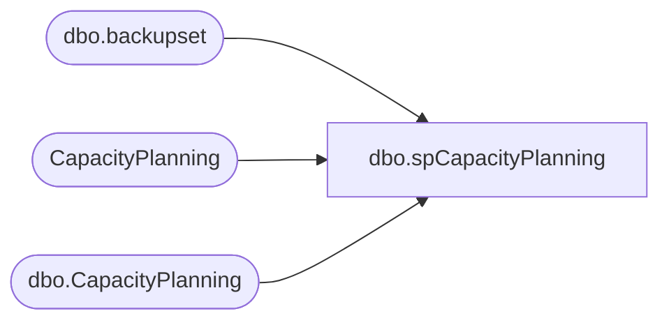

# dbo.spCapacityPlanning

**Database:** DBAUtility  
**Server:** bedrockdb01  

## Architecture Diagram



## Table Dependencies

| Referenced Table |
|---|
| dbo.backupset |
| CapacityPlanning |
| dbo.CapacityPlanning |

## Stored Procedure Code

```sql
CREATE PROCEDURE [dbo].[spCapacityPlanning] AS

/*
----------------------------------------------------------------------------
-- Object Name: spCapacityPlanning
-- Project: Capacity Planning
-- Business Process: Capacity Planning
-- Purpose: Calculate the capacity planning for 1, 2 and 3 years for the database and transaction log
-- Detailed Description: Capture static information and write infromation to the 
-- dbo.CapacityPlanning table for the database and transaction log calculations
-- Database: TBD
-- Dependent Objects: 
-- - Master.dbo.sysdatabases
- MSDB.dbo.backupset
- TBD.dbo.CapacityPlanning 
-- Called By: TBD
-- Upstream Systems: N\A
-- Downstream Systems: N\A

-- 
--------------------------------------------------------------------------------------
-- Rev | CMR | Date Modified | Developer | Change Summary
--------------------------------------------------------------------------------------
-- 001 | N\A | 06.15.2007 | Edgewood | Original code
--
*/

SET NOCOUNT ON

-- Step 1 - Preliminary Information
SELECT @@SERVERNAME AS 'Server Name'
SELECT GETDATE() AS 'Execution Timestamp'
PRINT '--------------------------------------------------------'
PRINT '********************************************************'
PRINT ''
SELECT 'Disk Space Availablity'
PRINT ''
PRINT '********************************************************'
PRINT '--------------------------------------------------------'
PRINT ''
PRINT ''
EXEC Master.dbo.xp_fixeddrives


-- Step 2 - Declare the cursor variables
--Prepatory Variables
DECLARE @DatabaseName VARCHAR(50)
DECLARE @ExecutionDateTime DateTime
DECLARE @NewDatabaseSize Decimal
DECLARE @OldDatabaseSize Decimal
DECLARE @NewCreationDate DateTime
DECLARE @OldCreationDate DateTime
DECLARE @VarDiff Decimal
DECLARE @PercentGrowth Decimal
DECLARE @AvgGrowth Decimal
DECLARE @DateDiff Decimal

-- 1 Year Variables
DECLARE @Yr1DBProjections Decimal
DECLARE @Yr1LogProjections Decimal
DECLARE @Yr1DBProjections15Percent Decimal
DECLARE @Yr1LogProjections15Percent Decimal

-- 2 Year Variables
DECLARE @Yr2DBProjections Decimal
DECLARE @Yr2LogProjections Decimal
DECLARE @Yr2DBProjections15Percent Decimal
DECLARE @Yr2LogProjections15Percent Decimal

-- 3 Year Variables
DECLARE @Yr3DBProjections Decimal
DECLARE @Yr3LogProjections Decimal
DECLARE @Yr3DBProjections15Percent Decimal
DECLARE @Yr3LogProjections15Percent Decimal

-- Total Historical Variables
DECLARE @TotalRecentDatabaseSize Decimal
DECLARE @TotalOldDatabaseSize Decimal
DECLARE @TotalDiffDatabaseSize Decimal
DECLARE @TotalPercentageGrowth Decimal
DECLARE @AvgPercentageGrowth Decimal
DECLARE @AvgDateDiff Decimal
DECLARE @TotalNumberofDatabases Decimal
DECLARE @TotalDateDiff Decimal 

-- Total Projection Variables
DECLARE @Total1YrDBProj Decimal
DECLARE @Total1YrLogProj Decimal
DECLARE @Total1YrDBProj15Percent Decimal
DECLARE @Total1YrLogProj15Percent Decimal
DECLARE @Total1YrProj Decimal -- Database and Log
DECLARE @Total1YrProj15Percent Decimal -- Database and Log

DECLARE @Total2YrDBProj Decimal
DECLARE @Total2YrLogProj Decimal
DECLARE @Total2YrDBProj15Percent Decimal
DECLARE @Total2YrLogProj15Percent Decimal
DECLARE @Total2YrProj Decimal -- Database and Log
DECLARE @Total2YrProj15Percent Decimal -- Database and Log

DECLARE @Total3YrDBProj Decimal
DECLARE @Total3YrLogProj Decimal
DECLARE @Total3YrDBProj15Percent Decimal
DECLARE @Total3YrLogProj15Percent Decimal
DECLARE @Total3YrProj Decimal -- Database and Log
DECLARE @Total3YrProj15Percent Decimal -- Database and Log

-- Initialize Historical Variables 
SELECT @ExecutionDateTime = GETDATE()
SELECT @TotalNumberofDatabases = 0
SELECT @TotalRecentDatabaseSize = 0
SELECT @TotalOldDatabaseSize = 0
SELECT @TotalDiffDatabaseSize = 0
SELECT @TotalPercentageGrowth = 0
SELECT @AvgPercentageGrowth = 0
SELECT @AvgDateDiff = 0
SELECT @TotalDateDiff = 0

SELECT @Total1YrDBProj = 0
SELECT @Total1YrLogProj = 0
SELECT @Total1YrDBProj15Percent = 0
SELECT @Total1YrLogProj15Percent = 0
SELECT @Total1YrProj = 0 -- Database and Log
SELECT @Total1YrProj15Percent = 0-- Database and Log

SELECT @Total2YrDBProj = 0
SELECT @Total2YrLogProj = 0
SELECT @Total2YrDBProj15Percent = 0
SELECT @Total2YrLogProj15Percent = 0
SELECT @Total2YrProj = 0 -- Database and Log
SELECT @Total2YrProj15Percent = 0 -- Database and Log

SELECT @Total3YrDBProj = 0
SELECT @Total3YrLogProj = 0
SELECT @Total3YrDBProj15Percent = 0
SELECT @Total3YrLogProj15Percent = 0
SELECT @Total3YrProj = 0 -- Database and Log
SELECT @Total3YrProj15Percent = 0 -- Database and Log

-- Step 3 - Begin Cursor Processing
DECLARE CapPlanCursor CURSOR FOR

SELECT Name
FROM master.dbo.sysdatabases
ORDER BY Name

OPEN CapPlanCursor

FETCH NEXT FROM CapPlanCursor INTO @DatabaseName

WHILE @@FETCH_STATUS = 0

BEGIN
-- Prepatory Calculations

SELECT @NewDatabaseSize = ((backup_size)/1024/1024), @NewCreationDate = (backup_start_date) 
FROM MSDB.dbo.backupset
WHERE database_name = @DatabaseName
AND TYPE = 'D'
ORDER BY backup_set_id 

SELECT @OldDatabaseSize = ((backup_size)/1024/1024), @OldCreationDate = (backup_start_date)
FROM MSDB.dbo.backupset 
WHERE database_name = @DatabaseName
AND TYPE = 'D'
ORDER BY backup_set_id DESC

SELECT @VarDiff = (@NewDatabaseSize - @OldDatabaseSize)

SELECT @PercentGrowth = (((@NewDatabaseSize/@OldDatabaseSize)-1)* 100)

SELECT @DateDiff = DATEDIFF(dd, @OldCreationDate, @NewCreationDate) 

SELECT @AvgGrowth = (@VarDiff/@DateDiff)

-- Year 1 Figures 
SELECT @Yr1DBProjections = ((@AvgGrowth * 365) + @NewDatabaseSize)
SELECT @Yr1DBProjections15Percent = ((@Yr1DBProjections * .15) + @Yr1DBProjections)
SELECT @Yr1LogProjections = (@Yr1DBProjections/4)
SELECT @Yr1LogProjections15Percent = ((@Yr1LogProjections * .15) + @Yr1LogProjections)

-- Year 2 Figures
SELECT @Yr2DBProjections = ((@AvgGrowth * 730) + @NewDatabaseSize)
SELECT @Yr2DBProjections15Percent = ((@Yr2DBProjections * .15) + @Yr2DBProjections)
SELECT @Yr2LogProjections = (@Yr2DBProjections/4)
SELECT @Yr2LogProjections15Percent = ((@Yr2LogProjections * .15) + @Yr2LogProjections)

-- Year 3 Figures
SELECT @Yr3DBProjections = ((@AvgGrowth * 1095) + @NewDatabaseSize)
SELECT @Yr3DBProjections15Percent = ((@Yr3DBProjections * .15) + @Yr3DBProjections)
SELECT @Yr3LogProjections = (@Yr3DBProjections/4)
SELECT @Yr3LogProjections15Percent = ((@Yr3LogProjections * .15) + @Yr3LogProjections)

-- Calculation Totals 
SELECT @TotalRecentDatabaseSize = @TotalRecentDatabaseSize + @NewDatabaseSize
SELECT @TotalOldDatabaseSize = @TotalOldDatabaseSize + @OldDatabaseSize
SELECT @TotalDiffDatabaseSize = @TotalDiffDatabaseSize + @VarDiff
SELECT @TotalNumberofDatabases = @TotalNumberofDatabases + 1
SELECT @TotalPercentageGrowth = @TotalPercentageGrowth + @AvgGrowth 
SELECT @TotalDateDiff = @TotalDateDiff + @DateDiff 

-- Year 1 Projection Totals
SELECT @Total1YrDBProj = @Yr1DBProjections + @Total1YrDBProj
SELECT @Total1YrLogProj = @Yr1LogProjections + @Total1YrLogProj
SELECT @Total1YrDBProj15Percent = @Yr1DBProjections15Percent + @Total1YrDBProj15Percent
SELECT @Total1YrLogProj15Percent = @Yr1LogProjections15Percent + @Total1YrLogProj15Percent

-- Year 2 Projection Totals
SELECT @Total2YrDBProj = @Yr2DBProjections + @Total2YrDBProj
SELECT @Total2YrLogProj = @Yr2LogProjections + @Total2YrLogProj
SELECT @Total2YrDBProj15Percent = @Yr2DBProjections15Percent + @Total2YrDBProj15Percent
SELECT @Total2YrLogProj15Percent = @Yr2LogProjections15Percent + @Total2YrLogProj15Percent

-- Year 3 Projection Totals
SELECT @Total3YrDBProj = @Yr3DBProjections + @Total3YrDBProj
SELECT @Total3YrLogProj = @Yr3LogProjections + @Total3YrLogProj
SELECT @Total3YrDBProj15Percent = @Yr3DBProjections15Percent + @Total3YrDBProj15Percent
SELECT @Total3YrLogProj15Percent = @Yr3LogProjections15Percent + @Total3YrLogProj15Percent

-- Insert values into the dbo.CapacityPlanning table
INSERT INTO dbo.CapacityPlanning 
( 
ServerName 
,DatabaseName 
,ExecutionDateTime 
,NewDatabaseSize 
,OldDatabaseSize 
,NewCreationDate 
,OldCreationDate 
,VarDiff 
,PercentGrowth 
,AvgGrowth 
,DateDiff 
,Yr1DBProjections 
,Yr1LogProjections 
,Yr1DBProjections15Percent 
,Yr1LogProjections15Percent 
,Yr2DBProjections 
,Yr2LogProjections 
,Yr2DBProjections15Percent 
,Yr2LogProjections15Percent 
,Yr3DBProjections 
,Yr3LogProjections 
,Yr3DBProjections15Percent 
,Yr3LogProjections15Percent 
)
VALUES
(
@@ServerName 
,@DatabaseName 
,@ExecutionDateTime 
,@NewDatabaseSize 
,@OldDatabaseSize 
,@NewCreationDate 
,@OldCreationDate 
,@VarDiff 
,@PercentGrowth 
,@AvgGrowth 
,@DateDiff 
,@Yr1DBProjections 
,@Yr1LogProjections 
,@Yr1DBProjections15Percent 
,@Yr1LogProjections15Percent 
,@Yr2DBProjections 
,@Yr2LogProjections 
,@Yr2DBProjections15Percent 
,@Yr2LogProjections15Percent 
,@Yr3DBProjections 
,@Yr3LogProjections 
,@Yr3DBProjections15Percent 
,@Yr3LogProjections15Percent 
)

FETCH NEXT FROM CapPlanCursor INTO @DatabaseName 

END

-- Step 4 - Calculate Aggregates
-- Historical Totals
SELECT @AvgPercentageGrowth = (@TotalPercentageGrowth/@TotalNumberofDatabases)
SELECT @AvgDateDiff = (@TotalDateDiff/@TotalNumberofDatabases) 

-- Year 1 Totals
SELECT @Total1YrProj = @Total1YrDBProj + @Total1YrLogProj -- Database and Log
SELECT @Total1YrProj15Percent = @Total1YrDBProj15Percent + @Total1YrLogProj15Percent -- Database and Log

-- Year 2 Totals
SELECT @Total2YrProj = @Total2YrDBProj + @Total2YrLogProj -- Database and Log
SELECT @Total2YrProj15Percent = @Total2YrDBProj15Percent + @Total2YrLogProj15Percent -- Database and Log

-- Year 3 Totals
SELECT @Total3YrProj = @Total3YrDBProj + @Total3YrLogProj -- Database and Log
SELECT @Total3YrProj15Percent = @Total3YrDBProj15Percent + @Total3YrLogProj15Percent -- Database and Log

-- Step 5 - Insert Into Capacity Planning Table
INSERT INTO CapacityPlanning
(ServerName
,DatabaseName
,ExecutionDateTime
,NewDatabaseSize
,OldDatabaseSize
,NewCreationDate
,OldCreationDate
,VarDiff
,PercentGrowth
,AvgGrowth
,DateDiff
,Yr1DBProjections
,Yr1LogProjections
,Yr1DBProjections15Percent
,Yr1LogProjections15Percent
,Total1YrProj
,Total1YrProj15Percent
,Yr2DBProjections
,Yr2LogProjections
,Yr2DBProjections15Percent
,Yr2LogProjections15Percent
,Total2YrProj
,Total2YrProj15Percent
,Yr3DBProjections
,Yr3LogProjections
,Yr3DBProjections15Percent
,Yr3LogProjections15Percent
,Total3YrProj
,Total3YrProj15Percent
,TotalNumberofDatabases
)
VALUES
(
@@ServerName 
,'Total Calculations' 
,@ExecutionDateTime 
,@TotalRecentDatabaseSize 
,@TotalOldDatabaseSize 
,NULL
,NULL
,@TotalDiffDatabaseSize 
,NULL -- @AvgPercentageGrowth 
,@TotalPercentageGrowth 
,@AvgDateDiff 
,@Total1YrDBProj 
,@Total1YrLogProj
,@Total1YrDBProj15Percent 
,@Total1YrLogProj15Percent 
,@Total1YrProj
,@Total1YrProj15Percent 
,@Total2YrDBProj
,@Total2YrLogProj
,@Total2YrDBProj15Percent 
,@Total2YrLogProj15Percent 
,@Total2YrProj
,@Total2YrProj15Percent 
,@Total3YrDBProj
,@Total3YrLogProj
,@Total3YrDBProj15Percent 
,@Total3YrLogProj15Percent 
,@Total3YrProj
,@Total3YrProj15Percent
,@TotalNumberofDatabases 
)

-- Step 6 - Generate Report 
SELECT *
FROM CapacityPlanning
WHERE ExecutionDateTime = @ExecutionDateTime 

CLOSE CapPlanCursor

DEALLOCATE CapPlanCursor

SET NOCOUNT OFF
```

