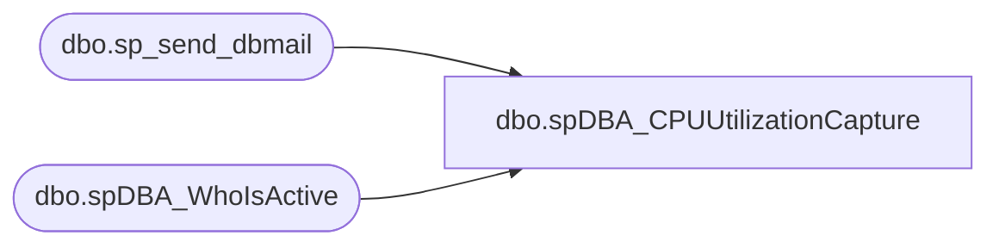

# dbo.spDBA_CPUUtilizationCapture

**Database:** DBAUtility  
**Server:** bedrockdb01  

## Architecture Diagram



## Table Dependencies

| Referenced Table |
|---|
| dbo.sp_send_dbmail |
| dbo.spDBA_WhoIsActive |

## Stored Procedure Code

```sql
CREATE PROC [dbo].[spDBA_CPUUtilizationCapture]
	@Action VARCHAR(100) = 'Process'
AS

-- =============================================================================================================
-- Name: spDBA_CPUUtilizationCapture
--
-- Description:	Process called by IderaDM to grab OS and SQL CPU and RAM utilitzation and email to databears.
--
-- Output: email
--
-- Available actions: Process or ReturnVersion of stored procedure
--	
-- Dependencies: 
--	master.dbo.xp_cmdshell enabled  
--
-- Revision History
--		Name:			Date:			Comments:
--		Mike Pelikan	06/21/2012		Initial Release 
--		Mike Pelikan	06/29/2012		Added logic for computer name on 2000 boxes, added logic for xml type
--										Consolidated to one email
--		Mike Pelikan	07/02/2012		Changed @ComputerName to @@SERVERNAME at end of BCP parameters to work on clusters
--		Mike Pelikan	07/03/2012		Comments updated
--
DECLARE @Revision DATETIME
SET @Revision = '07/03/2012'
-- =============================================================================================================

----------------------------------------------------------------------------------------------------
--DECLARE @Action VARCHAR(100) 
--SET @Action = 'Process'
----------------------------------------------------------------------------------------------------

----------------------------------------------------------------------------------------------------
--// SET options		                                                                    //--
----------------------------------------------------------------------------------------------------
SET NOCOUNT ON

----------------------------------------------------------------------------------------------------
--// Revision Return		                                                                    //--
----------------------------------------------------------------------------------------------------
IF @Action = 'ReturnVersion' GOTO Logging

----------------------------------------------------------------------------------------------------
DECLARE @EmailRecipients VARCHAR(1000)
DECLARE @ComputerName VARCHAR(100), @OSversion  Numeric(4,2)
DECLARE @sql varchar(8000)

DECLARE @strSubject VARCHAR(1000)
DECLARE @strMessage VARCHAR(2000)
	
SELECT @strSubject = @@SERVERNAME + ' CPU Utilitzation Report'

SET @EmailRecipients  = 'databears@buildabear.com'
SET @strMessage = ''
--get computer name
IF CAST(LEFT(CAST(SERVERPROPERTY('ProductVersion') AS VARCHAR),4) AS NUMERIC(6,4))<9 --SQL 2000
BEGIN
	CREATE TABLE #tblComputerName (Label VARCHAR(100), CompName VARCHAR(200))
	INSERT INTO #tblComputerName
	exec master..xp_regread 'HKEY_LOCAL_Machine',
	 'SYSTEM\CurrentControlSet\Control\ComputerName\ComputerName\',
	 'ComputerName'
	SELECT @ComputerName = CompName FROM #tblComputerName
	DROP TABLE #tblComputerName
END
ELSE
BEGIN
	--2005 and above
	SELECT @ComputerName = CAST(serverproperty('ComputerNamePhysicalNetBIOS') AS VARCHAR)
END

IF OBJECT_ID('tempdb..##tblOutput_sp_who2') IS NOT NULL
BEGIN
	DROP TABLE ##tblOutput_sp_who2 
END

CREATE TABLE ##tblOutput_sp_who2 (SPID INT, Status varchar(50), login varchar(100), HostName VARCHAR(100), BlkBy VARCHAR(15), 
DBName VARCHAR(200), Command VARCHAR(200), CPUTime BIGINT, DiskIO BIGINT, 
LastBatch VARCHAR(100), ProgramName VARCHAR(200), SPID2 INT, REQUESTID INT)
IF CAST(LEFT(CAST(SERVERPROPERTY('ProductVersion') AS VARCHAR),4) AS NUMERIC(6,4))<9 --SQL 2000
BEGIN
	INSERT INTO ##tblOutput_sp_who2 (SPID, Status, login, HostName, BlkBy, DBName, Command, CPUTime, DiskIO, LastBatch, ProgramName, SPID2 )
	EXEC master.dbo.sp_who2
END
ELSE
BEGIN
	INSERT INTO ##tblOutput_sp_who2 (SPID, Status, login, HostName, BlkBy, DBName, Command, CPUTime, DiskIO, LastBatch, ProgramName, SPID2, REQUESTID)
	EXEC master.dbo.sp_who2
END
--column headers
SELECT @sql = 'bcp "SELECT ''SPID'', ''Status'', ''login'', ''HostName'', ''BlkBy'', ''DBName'', ''Command'', ''CPUTime'', ''DiskIO'', ''LastBatch'', ''ProgramName''" queryout c:\temp\' + REPLACE(@@SERVERNAME, '\', '_') + 'sp_who21.c -c -t, -T -S ' + @@SERVERNAME
print @sql 
EXEC master.dbo.xp_cmdshell @sql
--data
SELECT @sql = 'bcp "SELECT SPID, Status, login, HostName, BlkBy, DBName, Command, CPUTime, DiskIO, LastBatch, ProgramName FROM ##tblOutput_sp_who2" queryout c:\temp\' + REPLACE(@@SERVERNAME, '\', '_') + 'sp_who22.c -c -t, -T -S ' + @@SERVERNAME
EXEC master.dbo.xp_cmdshell @sql
--concatenate
SELECT @sql = 'COPY c:\temp\' + REPLACE(@@SERVERNAME, '\', '_') + 'sp_who21.c + c:\temp\' + REPLACE(@@SERVERNAME, '\', '_') + 'sp_who22.c c:\temp\' + REPLACE(@@SERVERNAME, '\', '_') + 'sp_who2.csv'
EXEC master.dbo.xp_cmdshell @sql


SELECT @strMessage =  '\\' + @ComputerName + '\c$\temp\' + REPLACE(@@SERVERNAME, '\', '_') + 'sp_who2.txt' + CHAR(13)  


CREATE TABLE #tblWinVer (ID INT, Name VARCHAR(50), InternalValue INT, CharVal VARCHAR(20))
INSERT INTO #tblWinVer 
EXEC master.dbo.xp_msver 'WindowsVersion'

SELECT @OSversion = CAST(LEFT(CharVal, CHARINDEX(' ',CharVal )) AS NUMERIC(6,2))  from #tblWinVer
DROP TABLE #tblWinVer

IF @OSversion > 5.1 --Server 2003 and above try powershell
BEGIN
	CREATE TABLE #PSExists (PSExists VARCHAR(100))
	INSERT INTO #PSExists
	exec master..xp_regread 'HKEY_LOCAL_Machine',
	 'Software\Microsoft\PowerShell'
	 
	IF (SELECT COUNT(*) FROM #PSExists WHERE PSExists = 1) = 1
	BEGIN

	--check to see if powershell is installed
	--HKLM\Software\Microsoft\PowerShell\1 Install ( = 1 )

		--Create powershell script file
		EXEC master.dbo.xp_cmdshell 'mkdir C:\temp'	--make sure temp directory exists

		SELECT @sql = 'bcp "select Script from DBAUtility.dbo.tblDBA_PowerShellScripts WHERE ScriptName = ''Get-CPUHogs''" queryout c:\temp\filename.ps1 -c -t, -T -S ' + @@SERVERNAME

		exec master.dbo.xp_cmdshell @sql
		IF OBJECT_ID('tempdb..##PSoutput') IS NOT NULL
		BEGIN
			DROP TABLE ##PSoutput 
		END

		CREATE TABLE ##PSoutput 
		(line varchar(255)) 

		--inserting disk name, total space and free space value in to temporary table 
		INSERT ##PSoutput 
		EXEC master.dbo.xp_cmdshell 'powershell.exe c:\temp\filename.ps1'

		DELETE FROM ##PSoutput WHERE line IS NULL

		
		SELECT @sql = 'bcp "SELECT line FROM ##PSoutput " queryout c:\temp\' + REPLACE(@@SERVERNAME, '\', '_') + 'OS_CPU_Memory.csv -c -t, -T -S ' + @@SERVERNAME
		EXEC master.dbo.xp_cmdshell @sql

		SELECT @strMessage = @strMessage + '\\' + @ComputerName + '\c$\temp\' + REPLACE(@@SERVERNAME, '\', '_') + 'OS_CPU_Memory.csv' + CHAR(13)  
	END
	ELSE
	BEGIN
		SELECT @strMessage = @strMessage + 'Powershell is not installed on ' + @@SERVERNAME + CHAR(13)  
	END
	DROP TABLE #PSExists 
END

IF NOT EXISTS (SELECT name FROM sysobjects WHERE name = 'spDBA_WhoIsActive')
GOTO WIADoesNotExisit

IF CAST(LEFT(CAST(SERVERPROPERTY('ProductVersion') AS VARCHAR),3) AS NUMERIC) < 9
GOTO WIADoesNotExisit

IF OBJECT_ID('tempdb..##WIAoutput') IS NOT NULL
BEGIN
	DROP TABLE ##WIAoutput 
END
EXEC ('CREATE TABLE ##WIAoutput ( [dd hh:mm:ss.mss] varchar(8000) NULL, [session_id] varchar(30) NOT NULL,[sql_text] xml NULL,[login_name] nvarchar(128) NOT NULL,[wait_info] nvarchar(4000) NULL,[CPU] varchar(30) NULL,[tempdb_allocations] varchar(30) NULL,[tempdb_current] varchar(30) NULL, [blocking_session_id] varchar(30) NULL,[reads] varchar(30) NULL,[writes] varchar(30) NULL,[physical_reads] varchar(30) NULL,[used_memory] varchar(30) NULL,[status] varchar(30) NOT NULL,[open_tran_count] varchar(30) NULL,[percent_complete] varchar(30) NULL,[host_name] nvarchar(128) NULL,[database_name] nvarchar(128) NULL,[program_name] nvarchar(128) NULL,[start_time] datetime NOT NULL,[login_time] datetime NULL,[request_id] int NULL,[collection_time] datetime NOT NULL)')

EXEC DBAUtility.dbo.spDBA_WhoIsActive @destination_table = ##WIAoutput
ALTER TABLE ##WIAoutput ADD SQLText VARCHAR(8000) NULL

UPDATE ##WIAoutput 
SET SQLText = '"' + CAST(sql_text AS VARCHAR(8000))+ '"'

--header
SELECT @sql = 'bcp "SELECT ''[dd hh:mm:ss.mss]'', ''[session_id], ''[SQLText]'', [login_name]'', ''[wait_info]'', ''[CPU]'', ''[tempdb_allocations]'', ''[tempdb_current]'', ''[blocking_session_id]'', ''[reads]'', ''[writes]'', ''[physical_reads]'', ''[used_memory]'', ''[status]'', ''[open_tran_count]'', ''[percent_complete]'', ''[host_name]'', ''[database_name]'', ''[program_name]'', ''[start_time]'', ''[login_time]'', ''[request_id]'', ''[collection_time]''" queryout c:\temp\' + REPLACE(@@SERVERNAME, '\', '_') + 'WhoIsActiveFULL1.c -c -t, -T -S ' + @@SERVERNAME
exec master.dbo.xp_cmdshell @sql
--data
SELECT @sql = 'bcp "SELECT [dd hh:mm:ss.mss], [session_id],[SQLText],[login_name], [wait_info], [CPU], [tempdb_allocations], [tempdb_current],[blocking_session_id],[reads],[writes], [physical_reads] ,[used_memory] ,[status] ,[open_tran_count] ,[percent_complete] ,[host_name],[database_name],[program_name] ,[start_time] ,[login_time] ,[request_id] ,[collection_time]  FROM ##WIAoutput " queryout c:\temp\' + REPLACE(@@SERVERNAME, '\', '_') + 'WhoIsActiveFULL2.c -c -t, -T -S ' + @@SERVERNAME
exec master.dbo.xp_cmdshell @sql
--concatenate
SELECT @sql = 'COPY c:\temp\' + REPLACE(@@SERVERNAME, '\', '_') + 'WhoIsActiveFULL1.c + c:\temp\' + REPLACE(@@SERVERNAME, '\', '_') + 'WhoIsActiveFULL2.c c:\temp\' + REPLACE(@@SERVERNAME, '\', '_') + 'WhoIsActiveFULL.csv'
EXEC master.dbo.xp_cmdshell @sql

--header
SELECT @sql = 'bcp "SELECT ''[dd hh:mm:ss.mss]'', ''[session_id]'',''[login_name]'', ''[wait_info]'', ''[CPU]'', ''[tempdb_allocations]'', ''[tempdb_current]'', ''[blocking_session_id]'', ''[reads]'', ''[writes]'', ''[physical_reads]'', ''[used_memory]'', ''[status]'', ''[open_tran_count]'', ''[percent_complete]'', ''[host_name]'', ''[database_name]'', ''[program_name]'', ''[start_time]'', ''[login_time]'', ''[request_id]'', ''[collection_time]''" queryout c:\temp\' + REPLACE(@@SERVERNAME, '\', '_') + 'WhoIsActive1.c -c -t, -T -S ' + @@SERVERNAME
exec master.dbo.xp_cmdshell @sql
--data
SELECT @sql = 'bcp "SELECT [dd hh:mm:ss.mss], [session_id],[login_name], [wait_info], [CPU], [tempdb_allocations], [tempdb_current],[blocking_session_id],[reads],[writes], [physical_reads] ,[used_memory] ,[status] ,[open_tran_count] ,[percent_complete] ,[host_name],[database_name],[program_name] ,[start_time] ,[login_time] ,[request_id] ,[collection_time]  FROM ##WIAoutput " queryout c:\temp\' + REPLACE(@@SERVERNAME, '\', '_') + 'WhoIsActive2.c -c -t, -T -S ' + @@SERVERNAME
exec master.dbo.xp_cmdshell @sql
--concatenate
SELECT @sql = 'COPY c:\temp\' + REPLACE(@@SERVERNAME, '\', '_') + 'WhoIsActive1.c + c:\temp\' + REPLACE(@@SERVERNAME, '\', '_') + 'WhoIsActive2.c c:\temp\' + REPLACE(@@SERVERNAME, '\', '_') + 'WhoIsActive.csv'
EXEC master.dbo.xp_cmdshell @sql


SELECT @strMessage =  @strMessage + 
'\\' + @ComputerName + '\c$\temp\' + REPLACE(@@SERVERNAME, '\', '_') + 'WhoIsActive.csv' + CHAR(13) + 
'\\' + @ComputerName + '\c$\temp\' + REPLACE(@@SERVERNAME, '\', '_') + 'WhoIsActiveFULL.csv' + CHAR(13) + CHAR(13) 
	
WIADoesNotExisit:
SELECT @strSubject = @@SERVERNAME + ': CPU/RAM Utilitzation Report'

SELECT @strMessage =  
'The threshold for the Memory\Available MBytes or High CPU utilization performance counter has been exceeded. If this is expected, please ignore this warning. ' 
	+ CHAR(13) + CHAR(13) + 
@strMessage 
	+ CHAR(13) + CHAR(13) + 
'Sent from ' + @@SERVERNAME + 'DBAUtility.dbo.spDBA_CPUUtilizationCapture'

IF EXISTS(SELECT name from msdb.dbo.sysobjects where name = 'sp_send_dbmail') 
BEGIN
	EXEC msdb.dbo.sp_send_dbmail @recipients = @EmailRecipients, @subject = @strSubject, @body = @strMessage
END
ELSE
BEGIN
	EXEC master.dbo.xp_sendmail @recipients = @EmailRecipients, @subject = @strSubject, @message = @strMessage
END

--cleanup
SELECT @sql = 'DEL c:\temp\' + REPLACE(@@SERVERNAME, '\', '_') + '*.c '
EXEC master.dbo.xp_cmdshell @sql

Logging:
IF @Action = 'ReturnVersion'
BEGIN
	SELECT @Revision 
END
```

