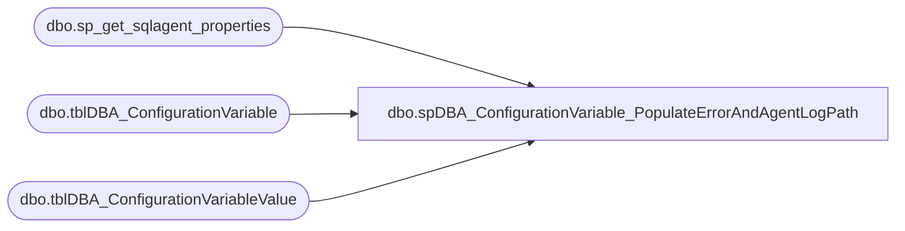

# dbo.spDBA_ConfigurationVariable_PopulateErrorAndAgentLogPath

**Database:** DBAUtility  
**Server:** bedrockdb01  

## Architecture Diagram



## Table Dependencies

| Referenced Table |
|---|
| dbo.sp_get_sqlagent_properties |
| dbo.tblDBA_ConfigurationVariable |
| dbo.tblDBA_ConfigurationVariableValue |

## Stored Procedure Code

```sql
CREATE PROC [dbo].[spDBA_ConfigurationVariable_PopulateErrorAndAgentLogPath] 
@Action VARCHAR(20) = 'Populate'
AS
-- =============================================================================================================
-- Name: spDBA_ConfigurationVariable_PopulateErrorAndAgentLog
--
-- Description:	Checks to see if DBA Configuration Variables Exist, for SQLErrorLogPath and SQLAgentLogPath
--
-- Output: None.
-- 
-- Available actions:
--1.  Populate tblDBA_ConfigurationVariableValue variables: SQLErrorLogPath and SQLAgentLogPath
--2.  Return Version Number by putting 'ReturnVersion' in  @ReturnVersion
--
-- Dependencies: 
--	COREDB01_MAINT.DBAMaintMaster.dbo.tblDBA_ConfigurationVariableValue
-- Revision History
--		Name:			Date:			Comments:
--		Mike Pelikan	2012/05/29		Initial Release
--		Mike Pelikan	2012/07/10		Corrected bug - added @@ServerName to where clauses.
--		Mike Pelikan	2012/07/12		Added logic for new server - @VariableID = to defaults
--
DECLARE @Revision DATETIME
SET @Revision = '07/12/2012'

-- =============================================================================================================
IF @Action = 'ReturnVersion'
BEGIN
	SELECT @Revision
	GOTO EndHere
END

SET NOCOUNT ON 

DECLARE @LogPath VARCHAR(1000), @VariableID INT, @cmd VARCHAR(1000)
DECLARE @ProductVersion	NVARCHAR(20)

CREATE TABLE #logF (
      ArchiveNumber     INT,
      LogDate           DATETIME,
      LogSize           INT
)
CREATE TABLE #TLog (
	  LogDate     DATETIME,
      ProcessInfo NVARCHAR(50),
      LogText NVARCHAR(2000),
	 )

SET @ProductVersion =  CAST(SERVERPROPERTY('productversion') AS VARCHAR)

SELECT @LogPath = cvv.VariableValue, @VariableID = cv.VariableID
FROM COREDB01_MAINT.DBAUtilityMaster.dbo.tblDBA_ConfigurationVariableValue cvv
RIGHT JOIN COREDB01_MAINT.DBAUtilityMaster.dbo.tblDBA_ConfigurationVariable cv ON cvv.VariableID = cv.VariableID
WHERE cv.VariableName = 'SQLErrorLogPath' AND InstanceName = @@SERVERNAME

IF @LogPath IS NULL OR @Action = 'Update'
BEGIN
	SET @VariableID = ISNULL(@VariableID ,1)
	IF SUBSTRING(@ProductVersion, 1, 1) = '8'   
	BEGIN
		INSERT INTO #TLog(  LogText, ProcessInfo)
		EXEC sp_readerrorlog --0, 1, N'Logging SQL Server messages in file' --, NULL, NULL, N'asc' 
		DELETE FROM #TLog WHERE LogText NOT LIKE '%Logging SQL Server messages in file%'
		UPDATE #TLog
		SET LogText = LTRIM(SUBSTRING(LogText,30,2000))
	END
	ELSE
	BEGIN 
	    INSERT INTO #TLog( LogDate, ProcessInfo, LogText)
		EXEC sp_readerrorlog 0, 1, N'Logging SQL Server messages in file' --, NULL, NULL, N'asc' 
    END

	DELETE FROM COREDB01_MAINT.DBAUtilityMaster.dbo.tblDBA_ConfigurationVariableValue WHERE InstanceName = @@SERVERNAME AND VariableID = @VariableID 
	
	INSERT INTO COREDB01_MAINT.DBAUtilityMaster.dbo.tblDBA_ConfigurationVariableValue (InstanceName, VariableID, VariableValue)
	SELECT @@SERVERNAME, @VariableID, REPLACE(REPLACE(LogText, 'Logging SQL Server messages in file ', ''), '''', '')
	FROM #TLog

	SELECT @LogPath = NULL, @VariableID = 0
END

--Agent
SELECT @LogPath = cvv.VariableValue, @VariableID = cv.VariableID
FROM COREDB01_MAINT.DBAUtilityMaster.dbo.tblDBA_ConfigurationVariableValue cvv
RIGHT JOIN COREDB01_MAINT.DBAUtilityMaster.dbo.tblDBA_ConfigurationVariable cv ON cvv.VariableID = cv.VariableID
WHERE cv.VariableName = 'SQLAgentLogPath' AND InstanceName = @@SERVERNAME

IF @LogPath IS NULL OR @Action = 'Update'
BEGIN 
	IF @VariableID = 0 SET @VariableID = 2
	
	DELETE FROM COREDB01_MAINT.DBAUtilityMaster.dbo.tblDBA_ConfigurationVariableValue WHERE InstanceName = @@SERVERNAME AND VariableID = @VariableID 

	IF SUBSTRING(@ProductVersion, 1, 1) = '8'   
	BEGIN
		IF object_id('tempdb..#AgentProperties2000','u')  IS NOT NULL
			DROP TABLE #AgentProperties2000
				
		CREATE TABLE #AgentProperties2000
		( auto_start INT ,msx_server_name sysname NULL,  sqlagent_type INT, startup_account NVARCHAR(100), sqlserver_restart INT,
		jobhistory_max_rows INT, jobhistory_max_rows_per_job INT, errorlog_file NVARCHAR(255), errorlogging_level INT, error_recipient NVARCHAR(30), 
		monitor_autostart INT, local_host_server sysname NULL, job_shutdown_timeout INT, cmdexec_account VARBINARY(64), 
		regular_connections INT, host_login_name sysname NULL, host_login_password VARBINARY(512) NULL, login_timeout INT, idle_cpu_percent INT, idle_cpu_duration INT, 
		oem_errolog BIT, sysadmin_only BIT, email_profile NVARCHAR(100), email_save_in_sent_folder BIT, cpu_poller_enabled BIT
		)
		
		INSERT INTO #AgentProperties2000
		EXEC msdb.dbo.sp_get_sqlagent_properties 
			
		INSERT INTO COREDB01_MAINT.DBAUtilityMaster.dbo.tblDBA_ConfigurationVariableValue (InstanceName, VariableID, VariableValue)
		SELECT @@SERVERNAME, @VariableID, errorlog_file
		FROM #AgentProperties2000	
			
	END
	ELSE
	BEGIN 
		IF object_id('tempdb..#AgentProperties','u')  IS NOT NULL
			DROP TABLE #AgentProperties
		
		CREATE TABLE #AgentProperties
		( auto_start INT ,msx_server_name sysname NULL,  sqlagent_type INT, startup_account NVARCHAR(100), sqlserver_restart INT,
		jobhistory_max_rows INT, jobhistory_max_rows_per_job INT, errorlog_file NVARCHAR(255), errorlogging_level INT, error_recipient NVARCHAR(30), 
		monitor_autostart INT, local_host_server sysname NULL, job_shutdown_timeout INT, cmdexec_account VARBINARY(64), 
		regular_connections INT, host_login_name sysname NULL, host_login_password VARBINARY(512) NULL, login_timeout INT, idle_cpu_percent INT, idle_cpu_duration INT, 
		oem_errolog BIT, sysadmin_only BIT, email_profile NVARCHAR(100), email_save_in_sent_folder BIT, cpu_poller_enabled BIT
		, alert_replace_runtime_tokens BIT
		)
		
		INSERT INTO #AgentProperties
		EXEC msdb.dbo.sp_get_sqlagent_properties 
		
		INSERT INTO COREDB01_MAINT.DBAUtilityMaster.dbo.tblDBA_ConfigurationVariableValue (InstanceName, VariableID, VariableValue)
		SELECT @@SERVERNAME, @VariableID, errorlog_file
		FROM #AgentProperties	
	END
END

EndHere:
```

