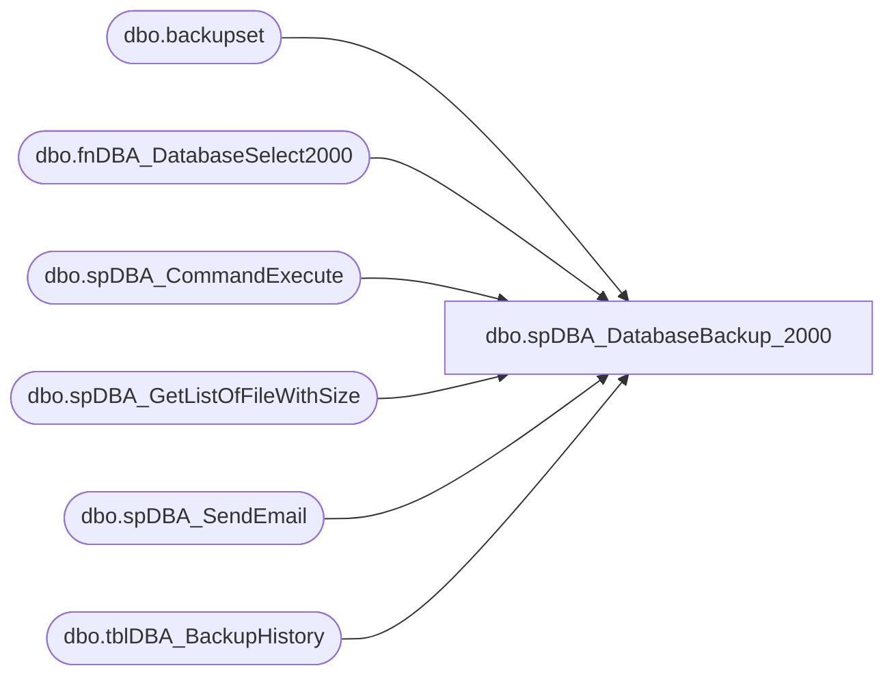

# dbo.spDBA_DatabaseBackup_2000

**Database:** DBAUtility  
**Server:** bedrockdb01  

## Architecture Diagram



## Table Dependencies

| Referenced Table |
|---|
| dbo.backupset |
| dbo.fnDBA_DatabaseSelect2000 |
| dbo.spDBA_CommandExecute |
| dbo.spDBA_GetListOfFileWithSize |
| dbo.spDBA_SendEmail |
| dbo.tblDBA_BackupHistory |

## Stored Procedure Code

```sql
CREATE PROCEDURE [dbo].[spDBA_DatabaseBackup_2000] 
	@Databases varchar(1000),
	@Directory varchar(1000) = NULL,
	@BackupType varchar(10) = 'FULL',
	@Verify varchar(1) = 'N',
	@BlockSize int = NULL,
	@NumberOfFiles int = 1,
	@Description nvarchar(1000) = NULL,
	@LogToTable nvarchar(1) = 'N',
	@Execute nvarchar(1) = 'Y',
	@SecondaryDirectory varchar(1000) = NULL,
	@CleanupTime int = NULL
AS
-- =============================================================================================================
-- Name: spDBA_DatabaseBackup_2000
--
-- Description:	Performs backups, verification, and delete old files.
--  Works on the SQL Server 2000
-- Output: Optional error logging.
-- Input:
--	@Databases:
--		'ReturnVersion' = Does not do backup, just returns revision of backup script
--		'USER_DATABASES'  = all user databases
--		'SYSTEM_ DATABASES' = all system databases
--		'USER_DATABASES, -Database1, -Database2' = execlude Database1 and Database2.
--		The hyphen (-) character is used to exclude databases, and the percent (%) character is used for wildcard selection. 
--		All of these operations can be combined by using the comma (,) character.
--	@Directory = backup root directory, If no directory is specified, then the SQL Server default backup directory is used.
--		DatabaseBackup creates a directory structure with instance name, database name and backup type under the backup root directory.
--	@BackupType = Full, Diff, or Log
--		FULL = Full backup 
--		DIFF = Differential backup 
--		LOG = Transaction log backup 
--	@Verify  = Y or N for whether the backup should be verified.
--	@BlockSize Specify the physical blocksize in bytes, uses the BLOCKSIZE option in the SQL Server BACKUP command.
--	@NumberOfFiles Specify the number of backup files. The default is one file and the maximum is 64 files. 
--		-1 = Automatic, if the used size of the database is greater than 3 gig (roughly takes a 1 hour to backup 3 gig on Slow server)
--	@Description Enter a description for the backup. uses the DESCRIPTION option in the SQL Server BACKUP command.
--	@LogToTable Log commands to the table DBAUtility.dbo.tblCommandLog & DBAUtility.dbo.tblDBA_BackupHistory
--		Y Log commands to the table. This is the default. 
--		N Do not log commands to the table. 
--	@Execute Execute commands. By default, the commands are executed normally. If this parameter is set to N, the commands are printed only.
--		Y Execute commands. This is the default. 
--		N Only print commands. 
--	@SecondaryDirectory This allows for moving the file from the @Directory path to a new path
--		This is for backing up localy, then copying over the network
--	@CleanupTime  = Specify the time, in hours, after which the backup files are deleted. If no time is specified, then no backup files are deleted.


-- Available actions:
--	
-- Dependencies: 
--	spDBA_CommandExecute
--	fnDBA_DatabaseSelect2000
--  spDBA_GetListOfFileWithSize
--	DBAUtility.dbo.tblCommandLog
--	DBAUtility.dbo.tblDBA_BackupHistory
--

----------------------------------------------------------------------------------------------------
--// Original Source: http://ola.hallengren.com                                                          //--
----------------------------------------------------------------------------------------------------

-- Revision History
--		Name:			Date:			Comments:
--		Gary Derikito	04/20/2009		Created based on SQL Server article http://www.sqlmag.com/Articles/ArticleID/100178/pg/2/2.html
--		Mike Pelikan	03/01/2012		Updated following  
--										Modified to store backup information into central repository database
--										Added Functionality to save to local harddrive, then copy to secondary location
--										Added backup file size to repository database
--										Added automated file split
--		Mike Pelikan	03/07/2012		Corrected sub directory creation , put primary first, then secondary directory
--										Added logic to return version date of backup script if @Databases = 'ReturnVersion'
--										Added logic to remove SIMPLE databases from LOG backups
--		Mike Pelikan	05/30/2012		Added Column to spDBA_GetListOfFileWithSize 
--		Mike Pelikan	06/07/2012		Added Robocopy logic
--		Mike Pelikan	08/27/2012		modified fnDatabaseSelect2000 to fnDBA_DatabaseSelect2000
--		Mike Pelikan	08/29/2012		Modifed While Loop failure email to display server
--		Mike Pelikan	09/04/2012		Changed repository to local collection table
--		Mike Pelikan	01/06/2014		Corrected collation issue
--		Mike Pelikan	01/08/2014		Added @CleanupTime parameter and deletion logic

DECLARE @Revision DATETIME
SET @Revision = '01/08/2014'		
----------------------------------------------------------------------------------------------------
--Testing Variable Declaration/Seting:
--
--DECLARE 		@Databases varchar(1000),
--	@Directory varchar(1000),
--	@BackupType varchar(10),
--	@Verify varchar(1),
--	@BlockSize int,
--	@NumberOfFiles int,
--	@Description nvarchar(1000),
--	@LogToTable nvarchar(1),
--	@Execute nvarchar(1),
--	@SecondaryDirectory varchar(1000)

--SELECT 
--	@Directory  = NULL,
--	@BackupType = 'FULL',
--	@Verify = 'N',
--	@BlockSize = NULL,
--	@NumberOfFiles = 1,
--	@Description  = NULL,
--	@LogToTable  = 'Y',
--	@Execute = 'Y',
--	@SecondaryDirectory = NULL

--SELECT 
--@Databases = 'SYSTEM_DATABASES', 
--@Directory = 'F:\MSSQL\BACKUP',
--@BackupType = 'FULL',
--@Verify = 'N',
--@LogToTable = 'Y',
--@NumberOfFiles = -1,
--@SecondaryDirectory = '\\10.0.0.187\backup\stl\SQL'

---------------------------------------------------------------------------------------------------

-- =============================================================================================================
BEGIN
	SET NOCOUNT ON

	DECLARE @StartMessage varchar(2000)
	DECLARE @EndMessage varchar(2000)
	DECLARE @DatabaseMessage varchar(2000)
	DECLARE @ErrorMessage varchar(2000)

	DECLARE @Version numeric(18,10)

	DECLARE @DefaultDirectory nvarchar(4000)
	DECLARE @CheckDirectory nvarchar(4000)

	DECLARE @CurrentID int
	DECLARE @CurrentDatabaseID int
	DECLARE @CurrentDatabaseName varchar(2000)
	DECLARE @CurrentBackupType varchar(2000)
	DECLARE @CurrentFileExtension varchar(2000)
	DECLARE @CurrentFileNumber int
	DECLARE @CurrentLatestBackup datetime
	DECLARE @CurrentDatabaseNameFS varchar(2000)
	DECLARE @CurrentDirectory varchar(2000)
	DECLARE @CurrentSecondaryDirectory varchar(2000)
	DECLARE @CurrentFilePath varchar(2000)
	DECLARE @CurrentDate datetime	
	DECLARE @CurrentIsDatabaseAccessible bit
	DECLARE @CurrentCleanupDate datetime

	DECLARE @CurrentCommand01 varchar(2000)
	DECLARE @CurrentCommand02 varchar(2000)
	DECLARE @CurrentCommand03 varchar(2000)
	DECLARE @CurrentCommand04 varchar(2000)
	DECLARE @CurrentCommand05 varchar(2000)

	DECLARE @CurrentCommandOutput01 int
	DECLARE @CurrentCommandOutput02 int
	DECLARE @CurrentCommandOutput03 int
	DECLARE @CurrentCommandOutput04 int
	DECLARE @CurrentCommandOutput05 int

	DECLARE @CurrentCommandType01 varchar(2000)
	DECLARE @CurrentCommandType02 varchar(2000)
	DECLARE @CurrentCommandType03 varchar(2000)
	DECLARE @CurrentCommandType04 varchar(2000)
	DECLARE @CurrentCommandType05 varchar(2000)

	DECLARE @RowCnt INT 
	DECLARE @WhichFile VARCHAR(1000)

	DECLARE @RepositoryID INT
	DECLARE @File_Exists int

	IF object_id('tempdb..#DirectoryInfo','u')  IS NOT NULL
		DROP TABLE #DirectoryInfo
	
	CREATE TABLE #DirectoryInfo (FileExists bit,
								FileIsADirectory bit,
								ParentDirectoryExists bit)

	DECLARE @tmpDatabases TABLE (ID int IDENTITY PRIMARY KEY,
							   DatabaseName varchar(2000),
							   Completed bit, UsedSpaceGB DECIMAL(15,4))
	
	DECLARE @CurrentFiles TABLE (CurrentFilePath nvarchar(2000))

	DECLARE @WorkingDirectory varchar(2000)
	DECLARE @WorkingNumberOfFiles INT
	DECLARE @intFileSizeCutOff INT	
	DECLARE @intMaxNumberOfFiles INT

	DECLARE @Error int
	DECLARE @ReturnCode int

	SET @Error = 0
	SET @ReturnCode = 0
	SET @intFileSizeCutOff = 3		--Currently set to 3 gigs, if a file is bigger than 3 gig, cut the backup into multple pieces
	SET @Version = CAST(LEFT(CAST(SERVERPROPERTY('ProductVersion') AS varchar(2000)),CHARINDEX('.',CAST(SERVERPROPERTY('ProductVersion') AS varchar(2000))) - 1) + '.' + REPLACE(RIGHT(CAST(SERVERPROPERTY('ProductVersion') AS varchar(2000)), LEN(CAST(SERVERPROPERTY('ProductVersion') AS varchar(2000))) - CHARINDEX('.',CAST(SERVERPROPERTY('ProductVersion') AS varchar(2000)))),'.','') AS numeric(18,10))

	SET @CurrentCommandOutput01 = 0
	SET @CurrentCommandOutput02 = 0
	SET @CurrentCommandOutput03 = 0
	SET @CurrentCommandOutput04 = 0
	SET @CurrentCommandOutput05 = 0
	
	----------------------------------------------------------------------------------------------------
	--// Revision Return		                                                                    //--
	----------------------------------------------------------------------------------------------------
	IF @Databases = 'ReturnVersion' GOTO Logging

	----------------------------------------------------------------------------------------------------
	--// Log initial information                                                                    //--
	----------------------------------------------------------------------------------------------------

	SET @StartMessage = 'DateTime: ' + CONVERT(nvarchar,GETDATE(),120) + CHAR(13) + CHAR(10)
	SET @StartMessage = @StartMessage + 'Server: ' + CAST(SERVERPROPERTY('ServerName') AS nvarchar) + CHAR(13) + CHAR(10)
	SET @StartMessage = @StartMessage + 'Version: ' + CAST(SERVERPROPERTY('ProductVersion') AS nvarchar) + CHAR(13) + CHAR(10)
	SET @StartMessage = @StartMessage + 'Edition: ' + CAST(SERVERPROPERTY('Edition') AS nvarchar) + CHAR(13) + CHAR(10)
	SET @StartMessage = @StartMessage + 'Procedure: ' + QUOTENAME(DB_NAME(DB_ID())) + '.dbo.' + QUOTENAME(OBJECT_NAME(@@PROCID)) + CHAR(13) + CHAR(10)
	SET @StartMessage = @StartMessage + 'Parameters: @Databases = ' + ISNULL('''' + REPLACE(@Databases,'''','''''') + '''','NULL')
	SET @StartMessage = @StartMessage + ', @Directory = ' + ISNULL('''' + REPLACE(@Directory,'''','''''') + '''','NULL')
	SET @StartMessage = @StartMessage + ', @BackupType = ' + ISNULL('''' + REPLACE(@BackupType,'''','''''') + '''','NULL')
	SET @StartMessage = @StartMessage + ', @Verify = ' + ISNULL('''' + REPLACE(@Verify,'''','''''') + '''','NULL')
	SET @StartMessage = @StartMessage + ', @BlockSize = ' + ISNULL(CAST(@BlockSize AS nvarchar),'NULL')
	SET @StartMessage = @StartMessage + ', @NumberOfFiles = ' + ISNULL(CAST(@NumberOfFiles AS nvarchar),'NULL')
	SET @StartMessage = @StartMessage + ', @Description = ' + ISNULL('''' + REPLACE(@Description,'''','''''') + '''','NULL')
	SET @StartMessage = @StartMessage + ', @LogToTable = ' + ISNULL('''' + REPLACE(@LogToTable,'''','''''') + '''','NULL')
	SET @StartMessage = @StartMessage + ', @Execute = ' + ISNULL('''' + REPLACE(@Execute,'''','''''') + '''','NULL') + CHAR(13) + CHAR(10)
	SET @StartMessage = @StartMessage + ', @CleanupTime = ' + ISNULL(CAST(@CleanupTime AS nvarchar),'NULL')
	SET @StartMessage = @StartMessage + 'Source: http://ola.hallengren.com' + CHAR(13) + CHAR(10) + ' '
	SET @StartMessage = REPLACE(@StartMessage,'%','%%')
	RAISERROR(@StartMessage,10,1) WITH NOWAIT

	----------------------------------------------------------------------------------------------------
	--// Check core requirements                                                                    //--
	----------------------------------------------------------------------------------------------------

	IF SERVERPROPERTY('EngineEdition') = 5
	BEGIN
		SET @ErrorMessage = 'SQL Azure is not supported.' + CHAR(13) + CHAR(10) + ' '
		RAISERROR(@ErrorMessage,16,1) WITH NOWAIT
		SET @Error = @@ERROR
	END

	IF @Error <> 0
	BEGIN
		SET @ReturnCode = @Error
		GOTO Logging
	END

	IF NOT EXISTS (SELECT * FROM sysobjects objects WHERE objects.[type] = 'P' AND objects.[name] = 'spDBA_CommandExecute')
	BEGIN
		SET @ErrorMessage = 'The stored procedure spDBA_CommandExecute is missing. Download http://ola.hallengren.com/scripts/CommandExecute.sql.' + CHAR(13) + CHAR(10) + ' '
		RAISERROR(@ErrorMessage,16,1) WITH NOWAIT
		SET @Error = @@ERROR
	END

	IF NOT EXISTS (SELECT * FROM sysobjects objects WHERE objects.[type] = 'TF' AND objects.[name] = 'fnDBA_DatabaseSelect2000')
	BEGIN
		SET @ErrorMessage = 'The function fnDBA_DatabaseSelect2000 is missing. Download http://ola.hallengren.com/scripts/DatabaseSelect.sql.' + CHAR(13) + CHAR(10) + ' '
		RAISERROR(@ErrorMessage,16,1) WITH NOWAIT
		SET @Error = @@ERROR
	END

	IF @CleanupTime < 0
	BEGIN
		SET @ErrorMessage = 'The value for parameter @CleanupTime is not supported.' + CHAR(13) + CHAR(10) + ' '
		RAISERROR(@ErrorMessage,16,1) WITH NOWAIT
		SET @Error = @@ERROR
	END

	IF @Error <> 0
	BEGIN
		SET @ReturnCode = @Error
		GOTO Logging
	END

  ----------------------------------------------------------------------------------------------------
  --// Select databases                                                                           //--
  ----------------------------------------------------------------------------------------------------

	IF @Databases IS NULL OR @Databases = ''
	BEGIN
		SET @ErrorMessage = 'The value for parameter @Databases is not supported.' + CHAR(13) + CHAR(10) + ' '
		RAISERROR(@ErrorMessage,16,1) WITH NOWAIT
		SET @Error = @@ERROR
	END

	INSERT INTO @tmpDatabases (DatabaseName, Completed, UsedSpaceGB)
	SELECT DatabaseName AS DatabaseName, 0 AS Completed, 0 AS UsedSpaceGB
	FROM dbo.fnDBA_DatabaseSelect2000 (@Databases)
	ORDER BY DatabaseName ASC

	IF @@ERROR <> 0
	BEGIN
		SET @ErrorMessage = 'Error selecting databases.' + CHAR(13) + CHAR(10) + ' '
		RAISERROR(@ErrorMessage,16,1) WITH NOWAIT
		SET @Error = @@ERROR
	END

	SET @ErrorMessage = ''

  ----------------------------------------------------------------------------------------------------
  --// Remove SIMPLE recovery Model DBs                                                           //--
  ----------------------------------------------------------------------------------------------------

	IF @BackupType = 'LOG'
		BEGIN
			DELETE FROM @tmpDatabases WHERE DatabaseName IN 
				( SELECT name FROM master.dbo.sysdatabases WHERE DATABASEPROPERTYEX(name, 'RECOVERY') = 'SIMPLE')
		END

	
	SELECT @ErrorMessage = @ErrorMessage + ' [' + DatabaseName + '], '--QUOTENAME(DatabaseName) + ', '
	FROM @tmpDatabases
	WHERE REPLACE(REPLACE(REPLACE(REPLACE(REPLACE(REPLACE(REPLACE(REPLACE(REPLACE(REPLACE(DatabaseName,'\',''),'/',''),':',''),'*',''),'?',''),'"',''),'<',''),'>',''),'|',''),' ','') = ''
	ORDER BY DatabaseName ASC
	
	IF @@ROWCOUNT > 0
	BEGIN
		SET @ErrorMessage = 'The names of the following databases are not supported; ' + LEFT(@ErrorMessage,LEN(@ErrorMessage)-1) + '.' + CHAR(13) + CHAR(10) + ' '
		RAISERROR(@ErrorMessage,16,1) WITH NOWAIT
		SET @Error = @@ERROR
	END

	SET @ErrorMessage = '';
	
	SELECT @ErrorMessage = @ErrorMessage + ' [' + DatabaseName + '], '--QUOTENAME(DatabaseName) + ', '
	FROM 
	(
		SELECT name COLLATE SQL_Latin1_General_CP1_CI_AS AS DatabaseName,
		UPPER(REPLACE(REPLACE(REPLACE(REPLACE(REPLACE(REPLACE(REPLACE(REPLACE(REPLACE(REPLACE(name,'\',''),'/',''),':',''),'*',''),'?',''),'"',''),'<',''),'>',''),'|',''),' ','')) AS DatabaseNameFS 
		FROM master.dbo.sysdatabases 
	)
	tmpDatabasesCTE
	WHERE DatabaseNameFS IN
	(
	SELECT DatabaseNameFS FROM 
	(SELECT name AS DatabaseName,
		UPPER(REPLACE(REPLACE(REPLACE(REPLACE(REPLACE(REPLACE(REPLACE(REPLACE(REPLACE(REPLACE(name,'\',''),'/',''),':',''),'*',''),'?',''),'"',''),'<',''),'>',''),'|',''),' ','')) AS DatabaseNameFS
		FROM master.dbo.sysdatabases) qry GROUP BY DatabaseNameFS HAVING COUNT(*) > 1)
	AND DatabaseNameFS IN
	(SELECT UPPER(REPLACE(REPLACE(REPLACE(REPLACE(REPLACE(REPLACE(REPLACE(REPLACE(REPLACE(REPLACE(DatabaseName COLLATE DATABASE_DEFAULT,'\',''),'/',''),':',''),'*',''),'?',''),'"',''),'<',''),'>',''),'|',''),' ','')) FROM @tmpDatabases)
	AND DatabaseNameFS <> ''
	ORDER BY DatabaseNameFS ASC, DatabaseName ASC
	
	IF @@ROWCOUNT > 0
	BEGIN
		SET @ErrorMessage = 'The names of the following databases are not unique in the file system; ' + LEFT(@ErrorMessage,LEN(@ErrorMessage)-1) + '.' + CHAR(13) + CHAR(10) + ' '
		RAISERROR(@ErrorMessage,16,1) WITH NOWAIT
		SET @Error = @@ERROR
	END

  ----------------------------------------------------------------------------------------------------
  --// Get default backup directory                                                               //--
  ----------------------------------------------------------------------------------------------------

	IF @Directory IS NULL
	BEGIN
		EXECUTE [master].dbo.xp_instance_regread N'HKEY_LOCAL_MACHINE', N'SOFTWARE\Microsoft\MSSQLServer\MSSQLServer', N'BackupDirectory', @DefaultDirectory OUTPUT
		SET @Directory = @DefaultDirectory
	END

  ----------------------------------------------------------------------------------------------------
  --// Check directory                                                                            //--
  ----------------------------------------------------------------------------------------------------

	IF NOT (@Directory LIKE '_:' OR @Directory LIKE '_:\%' OR @Directory LIKE '\\%\%') OR @Directory IS NULL OR LEFT(@Directory,1) = ' ' OR RIGHT(@Directory,1) = ' '
	BEGIN
		SET @ErrorMessage = 'The value for parameter @Directory is not supported.' + CHAR(13) + CHAR(10) + ' '
		RAISERROR(@ErrorMessage,16,1) WITH NOWAIT
		SET @Error = @@ERROR
	END

	SET @CheckDirectory = @Directory

	INSERT INTO #DirectoryInfo (FileExists, FileIsADirectory, ParentDirectoryExists)
	EXECUTE [master].dbo.xp_fileexist @CheckDirectory

	IF (SELECT COUNT(*) FROM #DirectoryInfo WHERE FileExists = 0 AND FileIsADirectory = 1 AND ParentDirectoryExists = 1)= 0
	BEGIN
		SET @ErrorMessage = 'The directory does not exist.' + CHAR(13) + CHAR(10) + ' '
		RAISERROR(@ErrorMessage,16,1) WITH NOWAIT
		SET @Error = @@ERROR
	END

	IF NOT (@SecondaryDirectory LIKE '_:' OR @SecondaryDirectory LIKE '_:\%' OR @SecondaryDirectory LIKE '\\%\%') 
		OR LEFT(@SecondaryDirectory,1) = ' ' OR RIGHT(@SecondaryDirectory,1) = ' '
	BEGIN
		SET @ErrorMessage = 'The value for parameter @SecondaryDirectory is not supported.' + CHAR(13) + CHAR(10) + ' '
		RAISERROR(@ErrorMessage,16,1) WITH NOWAIT
		SET @Error = @@ERROR
	END

	IF @SecondaryDirectory IS NOT NULL
	BEGIN
		DELETE FROM #DirectoryInfo
		SET @CheckDirectory = @SecondaryDirectory

		INSERT INTO #DirectoryInfo (FileExists, FileIsADirectory, ParentDirectoryExists)
		EXECUTE [master].dbo.xp_fileexist @CheckDirectory

		IF (SELECT COUNT(*) FROM #DirectoryInfo WHERE FileExists = 0 AND FileIsADirectory = 1 AND ParentDirectoryExists = 1)= 0
		BEGIN
			SET @ErrorMessage = 'The secondary directory does not exist.' + CHAR(13) + CHAR(10) + ' '
			RAISERROR(@ErrorMessage,16,1) WITH NOWAIT
			SET @Error = @@ERROR
		END
	END

	----------------------------------------------------------------------------------------------------
	--// Check input parameters                                                                     //--
	----------------------------------------------------------------------------------------------------

	IF @BackupType NOT IN ('FULL','DIFF','LOG') OR @BackupType IS NULL
	BEGIN
		SET @ErrorMessage = 'The value for parameter @BackupType is not supported.' + CHAR(13) + CHAR(10) + ' '
		RAISERROR(@ErrorMessage,16,1) WITH NOWAIT
		SET @Error = @@ERROR
	END

	IF @Verify NOT IN ('Y','N') OR @Verify IS NULL
	BEGIN
		SET @ErrorMessage = 'The value for parameter @Verify is not supported.' + CHAR(13) + CHAR(10) + ' '
		RAISERROR(@ErrorMessage,16,1) WITH NOWAIT
		SET @Error = @@ERROR
	END

	IF @BlockSize NOT IN (512,1024,2048,4096,8192,16384,32768,65536) 
	BEGIN
		SET @ErrorMessage = 'The value for parameter @BlockSize is not supported.' + CHAR(13) + CHAR(10) + ' '
		RAISERROR(@ErrorMessage,16,1) WITH NOWAIT
		SET @Error = @@ERROR
	END

	IF @NumberOfFiles < -1 OR @NumberOfFiles = 0 OR @NumberOfFiles > 64 OR @NumberOfFiles IS NULL
	BEGIN
		SET @ErrorMessage = 'The value for parameter @NumberOfFiles is not supported.' + CHAR(13) + CHAR(10) + ' '
		RAISERROR(@ErrorMessage,16,1) WITH NOWAIT
		SET @Error = @@ERROR
	END

	IF @LogToTable NOT IN('Y','N') OR @LogToTable IS NULL
	BEGIN
		SET @ErrorMessage = 'The value for parameter @LogToTable is not supported.' + CHAR(13) + CHAR(10) + ' '
		RAISERROR(@ErrorMessage,16,1) WITH NOWAIT
		SET @Error = @@ERROR
	END

	IF @Execute NOT IN('Y','N') OR @Execute IS NULL
	BEGIN
		SET @ErrorMessage = 'The value for parameter @Execute is not supported.' + CHAR(13) + CHAR(10) + ' '
		RAISERROR(@ErrorMessage,16,1) WITH NOWAIT
		SET @Error = @@ERROR
	END

	IF @Error <> 0
	BEGIN
		SET @ErrorMessage = 'The documentation is available on http://ola.hallengren.com/Documentation.html.' + CHAR(13) + CHAR(10) + ' '
		RAISERROR(@ErrorMessage,16,1) WITH NOWAIT
		SET @ReturnCode = @Error
		GOTO Logging
	END

  ----------------------------------------------------------------------------------------------------
  --// Update working database table with used space, if NumberOfFiles is set to auto			  //--
  ----------------------------------------------------------------------------------------------------
IF object_id('tempdb..#TempFiles','u')  IS NOT NULL
		DROP TABLE #TempFiles
		
	CREATE TABLE #TempFiles ( DBName [nvarchar](128) NULL, [Name] [nvarchar](128) NULL, [DatabaseID] [int] NULL, 
	[Type] [nvarchar](60) NULL, [State] [nvarchar](60) NULL, [SizeMB] [float] NULL, [SizeUsedMB] [float] NULL, [MaxSizeMB] [float] NULL,
	[AutoGrowSize] [float] NULL, [PercentGrowth] [bit] NULL, [ReadOnly] [bit] NULL, [FilesystemPath] [nvarchar](260) NULL) 

	IF @NumberOfFiles = -1
	BEGIN
		INSERT INTO #TempFiles ( DBName, [Name],[DatabaseID],[Type],[State],[SizeMB],[SizeUsedMB],[MaxSizeMB],[AutoGrowSize],[PercentGrowth],[ReadOnly],[FilesystemPath])
		EXEC sp_MSforeachdb 'USE [?]; SELECT ''?'' DBName, [name],
			DB_ID() as [DatabaseID],
			--[type_desc] as 
			'''' [Type],
			--[state_desc] as 
			'''' [State],
			[size]/128.00 as [SizeMB],
			fileproperty([name],''SpaceUsed'')/128.00 as [SizeUsedMB],
			--CASE WHEN [max_size] = -1 then [max_size] ELSE [max_size]/128.00 END as 
			0 [MaxSizeMB],
			--CASE WHEN [is_percent_growth] = 1 THEN [growth] ELSE [growth]/128.00 END as 
			0 [AutoGrowSize],
			--[is_percent_growth] as 
			0[PercentGrowth],
			--CASE WHEN [is_media_read_only] = 1 OR [is_read_only] = 1 THEN 1 ELSE 0 END as 
			0 [ReadOnly],
			[filename] as [FilesystemPath]
		FROM dbo.sysfiles'

		UPDATE @tmpDatabases
		SET UsedSpaceGB = tf.UsedSpaceGB
		FROM @tmpDatabases t
		INNER JOIN 
		(
			SELECT DBName, [Type], DatabaseID, Sum(SizeUsedMB)/1024 UsedSpaceGB 
			FROM #TempFiles  
			GROUP BY DBName, [Type], DatabaseID
			HAVING Sum(SizeUsedMB)/1024 >= @intFileSizeCutOff
		)tf ON t.DatabaseName = tf.DBName
	END

  ----------------------------------------------------------------------------------------------------
  --// Execute backup commands                                                                    //--
  ----------------------------------------------------------------------------------------------------

	WHILE EXISTS (SELECT * FROM @tmpDatabases WHERE Completed = 0)
	BEGIN
		IF object_id('tempdb..#CurrentFiles','u')  IS NOT NULL
			DROP TABLE #CurrentFiles
		
		CREATE TABLE #CurrentFiles (RowCountID INT IDENTITY(1,1), CurrentFilePath varchar(2000))
		
		SELECT TOP 1 @CurrentID = ID,
		@CurrentDatabaseName = DatabaseName
		FROM @tmpDatabases
		WHERE Completed = 0
		ORDER BY ID ASC

		SET @CurrentDatabaseID = DB_ID(@CurrentDatabaseName)

		SET @CurrentIsDatabaseAccessible = 1

		SET @CurrentBackupType = @BackupType

		IF @CurrentBackupType = 'LOG'
		BEGIN
			SELECT @CurrentLatestBackup = MAX(backup_finish_date)
			FROM msdb.dbo.backupset
			WHERE [type] IN('D','I')
			AND database_name = @CurrentDatabaseName
		END

		-- Set database message
		SET @DatabaseMessage = 'DateTime: ' + CONVERT(nvarchar,GETDATE(),120) + CHAR(13) + CHAR(10)
		SET @DatabaseMessage = @DatabaseMessage + 'Database: ' + QUOTENAME(@CurrentDatabaseName) + CHAR(13) + CHAR(10)
		SET @DatabaseMessage = @DatabaseMessage + 'Status: ' + CAST(DATABASEPROPERTYEX(@CurrentDatabaseName,'Status') AS nvarchar) + CHAR(13) + CHAR(10)
		SET @DatabaseMessage = @DatabaseMessage + 'Standby: ' + CASE WHEN DATABASEPROPERTYEX(@CurrentDatabaseName,'IsInStandBy') = 1 THEN 'Yes' ELSE 'No' END + CHAR(13) + CHAR(10)
		SET @DatabaseMessage = @DatabaseMessage + 'Updateability: ' + CAST(DATABASEPROPERTYEX(@CurrentDatabaseName,'Updateability') AS nvarchar) + CHAR(13) + CHAR(10)
		SET @DatabaseMessage = @DatabaseMessage + 'User access: ' + CAST(DATABASEPROPERTYEX(@CurrentDatabaseName,'UserAccess') AS nvarchar) + CHAR(13) + CHAR(10)
		SET @DatabaseMessage = @DatabaseMessage + 'Is accessible: ' + CASE WHEN @CurrentIsDatabaseAccessible = 1 THEN 'Yes' ELSE 'No' END + CHAR(13) + CHAR(10)
		SET @DatabaseMessage = @DatabaseMessage + 'Recovery model: ' + CAST(DATABASEPROPERTYEX(@CurrentDatabaseName,'Recovery') AS nvarchar) + CHAR(13) + CHAR(10)
		SET @DatabaseMessage = REPLACE(@DatabaseMessage,'%','%%')
		RAISERROR(@DatabaseMessage,10,1) WITH NOWAIT

		IF DATABASEPROPERTYEX(@CurrentDatabaseName,'Status') = 'ONLINE'
		AND NOT (DATABASEPROPERTYEX(@CurrentDatabaseName,'UserAccess') = 'SINGLE_USER' AND @CurrentIsDatabaseAccessible = 0)
		AND DATABASEPROPERTYEX(@CurrentDatabaseName,'IsInStandBy') = 0
		AND NOT (@CurrentBackupType IN('DIFF','LOG') AND @CurrentDatabaseName = 'master')
		BEGIN
			-- Set variables
			SET @CurrentDate = GETDATE()

			IF @CleanupTime IS NULL OR (@CurrentBackupType = 'LOG' AND @CurrentLatestBackup IS NULL)
			BEGIN
				SET @CurrentCleanupDate = NULL
			END
			ELSE
			BEGIN
				IF @CurrentBackupType = 'LOG'
				BEGIN
					SET @CurrentCleanupDate = (SELECT MIN([Date]) FROM(SELECT DATEADD(hh,-(@CleanupTime),@CurrentDate) AS [Date] UNION SELECT @CurrentLatestBackup AS [Date]) Dates)
				END
				ELSE
				BEGIN
					SET @CurrentCleanupDate = DATEADD(hh,-(@CleanupTime),@CurrentDate)
				END

				SET @CurrentDatabaseNameFS = REPLACE(REPLACE(REPLACE(REPLACE(REPLACE(REPLACE(REPLACE(REPLACE(REPLACE(REPLACE(@CurrentDatabaseName,'\',''),'/',''),':',''),'*',''),'?',''),'"',''),'<',''),'>',''),'|',''),' ','')

				SELECT @CurrentFileExtension = 
					CASE @CurrentBackupType WHEN 'FULL' THEN 'bak'
						WHEN 'DIFF' THEN 'bak'
						WHEN 'LOG' THEN 'trn'
					END

				SET @CurrentDirectory = @Directory + CASE WHEN RIGHT(@Directory,1) = '\' THEN '' ELSE '\' END + REPLACE(CAST(SERVERPROPERTY('servername') AS nvarchar),'\','$') + '\' + @CurrentDatabaseNameFS + '\' + UPPER(@CurrentBackupType) END

				SET @CurrentFileNumber = 0
				IF @NumberOfFiles = -1 
				BEGIN
					--Check File Size of Current Database Name to how many
					SET @WorkingNumberOfFiles = 1
					SELECT @WorkingNumberOfFiles = CASE WHEN t.UsedSpaceGB/@intFileSizeCutOff > @intMaxNumberOfFiles THEN @intMaxNumberOfFiles ELSE CEILING(t.UsedSpaceGB/@intFileSizeCutOff) END 
					FROM @tmpDatabases t 
					WHERE t.DatabaseName = @CurrentDatabaseName
					AND t.UsedSpaceGB >= 3
					--PRINT 'WorkingNumberOfFiles: ' + CAST(@WorkingNumberOfFiles AS VARCHAR(2))
				END
				ELSE
					SET @WorkingNumberOfFiles = @NumberOfFiles
					
				WHILE @CurrentFileNumber < @WorkingNumberOfFiles
				BEGIN
					SET @CurrentFileNumber = @CurrentFileNumber + 1

					SET @CurrentFilePath = @CurrentDirectory + '\' + REPLACE(CAST(SERVERPROPERTY('servername') AS nvarchar),'\','$') + '_' + @CurrentDatabaseNameFS + '_' + UPPER(@CurrentBackupType) + '_' + REPLACE(REPLACE(REPLACE((CONVERT(nvarchar,@CurrentDate,120)),'-',''),' ','_'),':','') + CASE WHEN @WorkingNumberOfFiles > 1 AND @WorkingNumberOfFiles <= 9 THEN '_' + CAST(@CurrentFileNumber AS nvarchar) WHEN @WorkingNumberOfFiles >= 10 THEN '_' + RIGHT('0' + CAST(@CurrentFileNumber AS nvarchar),2) ELSE '' END + '.' + @CurrentFileExtension

					IF LEN(@CurrentFilePath) > 259
					BEGIN
						SET @CurrentFilePath = @CurrentDirectory + '\' + REPLACE(CAST(SERVERPROPERTY('servername') AS nvarchar),'\','$') + '_' + LEFT(@CurrentDatabaseNameFS,CASE WHEN (LEN(@CurrentDatabaseNameFS) + 259 - LEN(@CurrentFilePath) - 3) < 20 THEN 20 ELSE (LEN(@CurrentDatabaseNameFS) + 259 - LEN(@CurrentFilePath) - 3) END) + '...' + '_' + UPPER(@CurrentBackupType) + '_' + REPLACE(REPLACE(REPLACE((CONVERT(nvarchar,@CurrentDate,120)),'-',''),' ','_'),':','') + CASE WHEN @WorkingNumberOfFiles > 1 AND @WorkingNumberOfFiles <= 9 THEN '_' + CAST(@CurrentFileNumber AS nvarchar) WHEN @WorkingNumberOfFiles >= 10 THEN '_' + RIGHT('0' + CAST(@CurrentFileNumber AS nvarchar),2) ELSE '' END + '.' + @CurrentFileExtension
					END

					INSERT INTO @CurrentFiles (CurrentFilePath)
					SELECT @CurrentFilePath
				END
			
			BEGIN
				SET @CurrentDatabaseNameFS = REPLACE(REPLACE(REPLACE(REPLACE(REPLACE(REPLACE(REPLACE(REPLACE(REPLACE(REPLACE(@CurrentDatabaseName,'\',''),'/',''),':',''),'*',''),'?',''),'"',''),'<',''),'>',''),'|',''),' ','')

				SELECT @CurrentFileExtension = CASE
					WHEN @CurrentBackupType = 'FULL' THEN 'bak'
					WHEN @CurrentBackupType = 'DIFF' THEN 'bak'
					WHEN @CurrentBackupType = 'LOG' THEN 'trn'
				END

				SET @CurrentDirectory = @Directory + CASE WHEN RIGHT(@Directory,1) = '\' THEN '' ELSE '\' END + REPLACE(CAST(SERVERPROPERTY('servername') AS nvarchar),'\','$') + '\' + @CurrentDatabaseNameFS + '\' + UPPER(@CurrentBackupType) 

				SET @CurrentFileNumber = 0
				IF @NumberOfFiles = -1 
				BEGIN
					--Check File Size of Current Database Name to how many
					SET @WorkingNumberOfFiles = 1
					SELECT @WorkingNumberOfFiles = CASE WHEN t.UsedSpaceGB/@intFileSizeCutOff > 64 THEN 64 ELSE CEILING(t.UsedSpaceGB/@intFileSizeCutOff) END 
					FROM @tmpDatabases t 
					WHERE t.DatabaseName = @CurrentDatabaseName
					AND t.UsedSpaceGB >= 3
					PRINT 'WorkingNumberOfFiles: ' + CAST(@WorkingNumberOfFiles AS VARCHAR(2))
				END
				ELSE
					SET @WorkingNumberOfFiles = @NumberOfFiles
					
				WHILE @CurrentFileNumber < @WorkingNumberOfFiles
				BEGIN
					SET @CurrentFileNumber = @CurrentFileNumber + 1

					SET @CurrentFilePath = @CurrentDirectory + '\' + REPLACE(CAST(SERVERPROPERTY('servername') AS nvarchar),'\','$') + '_' + @CurrentDatabaseNameFS + '_' + UPPER(@CurrentBackupType) + '_' + REPLACE(REPLACE(REPLACE((CONVERT(nvarchar,@CurrentDate,120)),'-',''),' ','_'),':','') + CASE WHEN @WorkingNumberOfFiles > 1 AND @WorkingNumberOfFiles <= 9 THEN '_' + CAST(@CurrentFileNumber AS nvarchar) WHEN @WorkingNumberOfFiles >= 10 THEN '_' + RIGHT('0' + CAST(@CurrentFileNumber AS nvarchar),2) ELSE '' END + '.' + @CurrentFileExtension

					IF LEN(@CurrentFilePath) > 259
					BEGIN
						SET @CurrentFilePath = @CurrentDirectory + '\' + REPLACE(CAST(SERVERPROPERTY('servername') AS nvarchar),'\','$') + '_' + LEFT(@CurrentDatabaseNameFS,CASE WHEN (LEN(@CurrentDatabaseNameFS) + 259 - LEN(@CurrentFilePath) - 3) < 20 THEN 20 ELSE (LEN(@CurrentDatabaseNameFS) + 259 - LEN(@CurrentFilePath) - 3) END) + '...' + '_' + UPPER(@CurrentBackupType) + '_' + REPLACE(REPLACE(REPLACE((CONVERT(nvarchar,@CurrentDate,120)),'-',''),' ','_'),':','') + CASE WHEN @WorkingNumberOfFiles > 1 AND @WorkingNumberOfFiles <= 9 THEN '_' + CAST(@CurrentFileNumber AS nvarchar) WHEN @WorkingNumberOfFiles >= 10 THEN '_' + RIGHT('0' + CAST(@CurrentFileNumber AS nvarchar),2) ELSE '' END + '.' + @CurrentFileExtension
					END

					INSERT INTO #CurrentFiles (CurrentFilePath)
					SELECT @CurrentFilePath
				END
				
				SET @WorkingDirectory = @CurrentDirectory
				
				CREATE TABLE #File_Results (
					File_Exists int,
					File_is_a_Directory int,
					Parent_Directory_Exists int
				)
				INSERT INTO #File_Results
				(File_Exists, File_is_a_Directory, Parent_Directory_Exists)
				EXEC master.dbo.xp_fileexist @WorkingDirectory
				
				
				IF (SELECT COUNT(*) FROM #File_Results WHERE Parent_Directory_Exists = 1 AND File_is_a_Directory = 1) = 0
				BEGIN
					-- Create directory
					SET @CurrentCommandType01 = 'xp_create_subdir'
					SET @CurrentCommand01 = 'DECLARE @ReturnCode int EXECUTE @ReturnCode = [master].dbo.xp_cmdshell ''MKDIR ' + REPLACE(@CurrentDirectory,'''','''''') + ''' IF @ReturnCode <> 0 RAISERROR(''Error creating directory.'', 16, 1)'
					EXECUTE @CurrentCommandOutput01 = [dbo].[spDBA_CommandExecute] @Command = @CurrentCommand01, @CommandType = @CurrentCommandType01, @Mode = 1, @DatabaseName = @CurrentDatabaseName, @LogToTable = @LogToTable, @Execute = @Execute
					SET @Error = @@ERROR
					IF @Error <> 0 SET @CurrentCommandOutput01 = @Error
					IF @CurrentCommandOutput01 <> 0 SET @ReturnCode = @CurrentCommandOutput01
					
					SET @WorkingDirectory = REPLACE(@CurrentDirectory, @Directory, @SecondaryDirectory)
					DELETE FROM #File_Results 
					
					INSERT INTO #File_Results (File_Exists, File_is_a_Directory, Parent_Directory_Exists)
					EXEC master.dbo.xp_fileexist @WorkingDirectory
				END
				
				IF (SELECT COUNT(*) FROM #File_Results WHERE Parent_Directory_Exists = 1 AND File_is_a_Directory = 1) = 0
				BEGIN
					IF @SecondaryDirectory IS NOT NULL AND @CurrentCommandOutput01 = 0
					BEGIN
						-- Create directory
						SET @CurrentCommandType01 = 'xp_create_subdir'
						SET @CurrentCommand01 = 'DECLARE @ReturnCode int EXECUTE @ReturnCode = [master].dbo.xp_cmdshell ''MKDIR ' + REPLACE(REPLACE(@CurrentDirectory, @Directory, @SecondaryDirectory),'''','''''') + ''' IF @ReturnCode <> 0 RAISERROR(''Error creating directory.'', 16, 1)'
						EXECUTE @CurrentCommandOutput01 = [dbo].[spDBA_CommandExecute] @Command = @CurrentCommand01, @CommandType = @CurrentCommandType01, @Mode = 1, @DatabaseName = @CurrentDatabaseName, @LogToTable = @LogToTable, @Execute = @Execute
						SET @Error = @@ERROR
						IF @Error <> 0 SET @CurrentCommandOutput01 = @Error
						IF @CurrentCommandOutput01 <> 0 SET @ReturnCode = @CurrentCommandOutput01
					END
				END
			
				DROP TABLE #File_Results
				-- Perform a backup
				IF @CurrentCommandOutput01 = 0
				BEGIN
					IF @LogToTable = 'Y' AND @Execute = 'Y'
					BEGIN
						INSERT INTO DBAUtility.dbo.tblDBA_BackupHistory (InstanceName, DatabaseName, BackupStarted, BackupType, StatusID, BackupFileLocation)
						SELECT @@SERVERNAME, @CurrentDatabaseName, GETDATE(), @CurrentBackupType, 0, REPLACE (CurrentFilePath, @Directory, ISNULL(@SecondaryDirectory, @Directory))
						FROM #CurrentFiles
					END

					SELECT @CurrentCommandType02 = CASE
						WHEN @CurrentBackupType IN('DIFF','FULL') THEN 'BACKUP_DATABASE'
						WHEN @CurrentBackupType = 'LOG' THEN 'BACKUP_LOG'
					END
				
					SELECT @CurrentCommand02 = CASE
						WHEN @CurrentBackupType IN('DIFF','FULL') THEN 'BACKUP DATABASE ' + QUOTENAME(@CurrentDatabaseName) + ' TO'
						WHEN @CurrentBackupType = 'LOG' THEN 'BACKUP LOG ' + QUOTENAME(@CurrentDatabaseName) + ' TO'
					END

					SELECT @CurrentCommand02 = @CurrentCommand02 + ' DISK = N''' + REPLACE(CurrentFilePath,'''','''''') + '''' + CASE WHEN RowCountID <> @WorkingNumberOfFiles THEN ',' ELSE '' END
					FROM #CurrentFiles
					ORDER BY RowCountID ASC

					SET @CurrentCommand02 = @CurrentCommand02 + ' WITH '
						SET @CurrentCommand02 = @CurrentCommand02 + 'DESCRIPTION = N''' + REPLACE(ISNULL(@Description, 'Database backup'),'''','''''') + ''''
				IF @CurrentBackupType = 'DIFF' SET @CurrentCommand02 = @CurrentCommand02 + ', DIFFERENTIAL'
					IF @BlockSize IS NOT NULL SET @CurrentCommand02 = @CurrentCommand02 + ', BLOCKSIZE = ' + CAST(@BlockSize AS nvarchar)
				END

				EXECUTE @CurrentCommandOutput02 = [dbo].[spDBA_CommandExecute] @Command = @CurrentCommand02, @CommandType = @CurrentCommandType02, @Mode = 1, @DatabaseName = @CurrentDatabaseName, @LogToTable = @LogToTable, @Execute = @Execute
				SET @Error = @@ERROR
				IF @Error <> 0 SET @CurrentCommandOutput02 = @Error
				IF @CurrentCommandOutput02 <> 0 SET @ReturnCode = @CurrentCommandOutput02
			END

			-- Verify the backup
			IF @CurrentCommandOutput02 = 0 AND @Verify = 'Y'
			BEGIN
				SET @CurrentCommandType03 = 'RESTORE_VERIFYONLY'

				SET @CurrentCommand03 = 'RESTORE VERIFYONLY FROM'

				SELECT @CurrentCommand03 = @CurrentCommand03 + ' DISK = N''' + REPLACE(CurrentFilePath,'''','''''') + '''' + CASE WHEN RowCountID <> @WorkingNumberOfFiles THEN ',' ELSE '' END
				FROM #CurrentFiles
				ORDER BY RowCountID ASC
			
				EXECUTE @CurrentCommandOutput03 = [dbo].[spDBA_CommandExecute] @Command = @CurrentCommand03, @CommandType = @CurrentCommandType03, @Mode = 1, @DatabaseName = @CurrentDatabaseName, @LogToTable = @LogToTable, @Execute = @Execute
				SET @Error = @@ERROR
				IF @Error <> 0 SET @CurrentCommandOutput03 = @Error
				IF @CurrentCommandOutput03 <> 0 SET @ReturnCode = @CurrentCommandOutput03
			END
--------------------------------------------
			IF ISNULL(@CleanupTime,0) > 0
			BEGIN

				-- Stores the name of the file to be deleted
				
				CREATE TABLE #DeleteOldFiles
				(
					DirInfo VARCHAR(7000)
				)

				-- Build the command that will list out all of the files in a directory
				SELECT @CurrentCommand04 = 'dir ' +  @CurrentDirectory + '\*_full_*.bak /OD'

				-- Run the dir command and put the results into a temp table
				INSERT INTO #DeleteOldFiles
				EXEC master.dbo.xp_cmdshell @CurrentCommand04
				
				-- Delete all rows from the temp table except the ones that correspond to the files to be deleted
				DELETE
				FROM #DeleteOldFiles
				WHERE ISDATE(SUBSTRING(DirInfo, 1, 10)) = 0 OR DirInfo LIKE '%
				%' OR SUBSTRING(DirInfo, 25, 5) = '<DIR>'
				OR SUBSTRING(DirInfo, 1, 10) >= GETDATE() - @CleanupTime/24

				-- Get the file name portion of the row that corresponds to the file to be deleted
				SELECT TOP 1 @WhichFile = SUBSTRING(DirInfo, LEN(DirInfo) -  PATINDEX('% %', REVERSE(DirInfo)) + 2, LEN(DirInfo))
				FROM #DeleteOldFiles
  
				SET @RowCnt = @@ROWCOUNT
  
				-- Interate through the temp table until there are no more files to delete
				WHILE @RowCnt <> 0
				BEGIN
					-- Build the del command
					SELECT @CurrentCommand04 = 'del ' + @CurrentDirectory + '\' + @WhichFile + ' /Q /F'

					-- Delete the file
					EXEC master.dbo.xp_cmdshell @CurrentCommand04, NO_OUTPUT
   
					-- To move to the next file, the current file name needs to be deleted from the temp table
					DELETE
					FROM #DeleteOldFiles
					WHERE SUBSTRING(DirInfo, LEN(DirInfo) -  PATINDEX('% %', REVERSE(DirInfo)) + 2, LEN(DirInfo))  = @WhichFile

					-- Get the file name portion of the row that corresponds to the file to be deleted
					SELECT TOP 1 @WhichFile = SUBSTRING(DirInfo, LEN(DirInfo) -  PATINDEX('% %', REVERSE(DirInfo)) + 2, LEN(DirInfo))
					FROM #DeleteOldFiles
  
					SET @RowCnt = @@ROWCOUNT
				END
  
				DROP TABLE #DeleteOldFiles

			END
 ----------------------------------


			----Move backup to secondary (SAN/DD) location
			--IF @SecondaryDirectory IS NOT NULL 
			--AND 
			--(
			--(@CurrentCommandOutput02 = 0 AND @Verify = 'N' AND @CurrentCommandOutput04 = 0)
			--OR (@CurrentCommandOutput02 = 0 AND @Verify = 'Y' AND @CurrentCommandOutput03 = 0 AND @CurrentCommandOutput04 = 0)
			--)
			--BEGIN
			--	SELECT @CurrentCommand05 
			--	= 'EXEC master.dbo.xp_cmdshell ''' + 'MOVE ' + @CurrentDirectory + '\*.' + @CurrentFileExtension + ' ' 
			--		+ REPLACE(@CurrentDirectory, @Directory, ISNULL(@SecondaryDirectory, @Directory)) + '\' + '''' 
				
			--	EXECUTE @CurrentCommandOutput05 = [dbo].[spDBA_CommandExecute] @Command = @CurrentCommand05, @CommandType = 'MoveFilesToSeconday', @Mode = 1, @DatabaseName = @CurrentDatabaseName, @LogToTable = @LogToTable, @Execute = @Execute
			--	SET @Error = @@ERROR
			--	IF @Error <> 0 SET @CurrentCommandOutput05 = @Error
			--END
			IF @SecondaryDirectory IS NOT NULL 
			AND 
			((@CurrentCommandOutput02 = 0 AND @Verify = 'N' AND @CurrentCommandOutput04 = 0)
				OR (@CurrentCommandOutput02 = 0 AND @Verify = 'Y' AND @CurrentCommandOutput03 = 0 AND @CurrentCommandOutput04 = 0))
			BEGIN
				--SELECT TOP 1 @CurrentCommand05 = REPLACE(CurrentFilePath, '_1','')
				--FROM @CurrentFiles
				--ORDER BY CurrentFilePath ASC
				DECLARE @isROBOCOPY INT
				EXEC master.dbo.xp_fileexist 'c:\winnt\SYSTEM32\robocopy.exe', @isROBOCOPY OUTPUT

				IF @isROBOCOPY = 0
					EXEC master.dbo.xp_fileexist 'c:\WINDOWS\SYSTEM32\robocopy.exe', @isROBOCOPY OUTPUT
				IF @isROBOCOPY = 0
				BEGIN
					SELECT @CurrentCommand05 
					= 'EXEC master.dbo.xp_cmdshell ''' + 'XCOPY /Y ' + @CurrentDirectory + '\*.' + @CurrentFileExtension + ' ' 
						+ REPLACE(@CurrentDirectory, @Directory, ISNULL(@SecondaryDirectory, @Directory)) + '\' + '''' 
				END
				ELSE
				BEGIN			
					DECLARE @OSVersion VARCHAR(20)
					
					IF object_id('tempdb..#tblResults','u')  IS NOT NULL
					BEGIN
						DROP TABLE #tblResults
					END
						
					CREATE TABLE #tblResults (IndexColumn INT, Name VARCHAR(100), InternalValue BIGINT, Character_Value VARCHAR(100))
					INSERT INTO #tblResults
					EXEC master.dbo.xp_msver 'WindowsVersion' 

					SELECT @OSVersion = LEFT(Character_Value, CHARINDEX(' ', Character_Value)) FROM #tblResults					
					IF CAST(@OSVersion AS NUMERIC(4,2)) > 6.0 --if OS is 2008 R2
					BEGIN
						-- use multithreaded copy
						SELECT @CurrentCommand05 
						= 'EXEC master.dbo.xp_cmdshell ''' + 'robocopy ' + @CurrentDirectory + ' ' 
							+ REPLACE(@CurrentDirectory, @Directory, ISNULL(@SecondaryDirectory, @Directory)) + ' *.' + @CurrentFileExtension + ' /MT /z /R:3 /W:10 /XO' + '''' 
					END
					ELSE
					BEGIN
						SELECT @CurrentCommand05 
						= 'EXEC master.dbo.xp_cmdshell ''' + 'robocopy ' + @CurrentDirectory + ' ' 
							+ REPLACE(@CurrentDirectory, @Directory, ISNULL(@SecondaryDirectory, @Directory)) + ' *.' + @CurrentFileExtension + ' /z /R:3 /W:10 /XO' + '''' 
					
					END
				END
				
				EXECUTE @CurrentCommandOutput05 = [dbo].[spDBA_CommandExecute] @Command = @CurrentCommand05, @CommandType = 'MoveFilesToSeconday', @Mode = 1, @DatabaseName = @CurrentDatabaseName, @LogToTable = @LogToTable, @Execute = @Execute
				SET @Error = @@ERROR
				IF @Error <> 0 SET @CurrentCommandOutput05 = @Error
				
				SELECT @CurrentCommand05 
					= 'EXEC master.dbo.xp_cmdshell ''' + 'DEL /Q ' + @CurrentDirectory + '\*.' + @CurrentFileExtension + '''' 
				
				EXECUTE @CurrentCommandOutput05 = [dbo].[spDBA_CommandExecute] @Command = @CurrentCommand05, @CommandType = 'DeletePrimaryFile', @Mode = 1, @DatabaseName = @CurrentDatabaseName, @LogToTable = @LogToTable, @Execute = @Execute
				SET @Error = @@ERROR
				IF @Error <> 0 SET @CurrentCommandOutput05 = @Error
			END

			-- Update Repository record
			IF @LogToTable = 'Y' AND @Execute = 'Y'
			BEGIN
			
				IF object_id('tempdb..##FileSize','u')  IS NOT NULL
				BEGIN
					DROP TABLE ##FileSize
				END
				CREATE TABLE ##FileSize (Directory varchar(400), FilePath VARCHAR(400), SizeInMB DECIMAL(13,2), SizeInKB DECIMAL(13,2), ModifiedDate DATETIME) 

				DECLARE @intCounter INT
				SET @intCounter = 0
							
				/* Run SP and Insert Value in TempTable */
				WHILE 
				(
					SELECT COUNT(*) 
					FROM 
					(
					SELECT REPLACE (CurrentFilePath, @Directory, ISNULL(@SecondaryDirectory, @Directory)) COLLATE SQL_Latin1_General_CP1_CI_AS CurrentFilePath  FROM #CurrentFiles
					) cf
					LEFT JOIN ##FileSize fs ON UPPER(cf.CurrentFilePath) = UPPER(fs.Directory)
					WHERE fs.Directory IS NULL
				)> 0
				BEGIN
					SET @intCounter = @intCounter + 1
					--IF @intCounter > 10000
					IF @intCounter > 100
					BEGIN
						--something broke
						DECLARE @sbjt VARCHAR(200)
						SET @sbjt = 'ERROR: Job failure of backups on ' + @@SERVERNAME + ' on ' + @CurrentDatabaseName
					
						EXEC DBAUtility.dbo.spDBA_SendEmail @recipients = 'mikep@buildabear.com', @subject = @sbjt, @MessageTxt = 'The SQL backup job DBA_Backups_Full had an error.  The While Loop in [spDBA_DatabaseBackup] broke.'
						--GOTO Logging
						GOTO NextBackup
					END
					SELECT TOP 1 @WorkingDirectory = REPLACE (CurrentFilePath, @Directory, ISNULL(@SecondaryDirectory, @Directory)) 
					FROM 
					(
						SELECT REPLACE (CurrentFilePath, @Directory, ISNULL(@SecondaryDirectory, @Directory)) COLLATE SQL_Latin1_General_CP1_CI_AS CurrentFilePath  FROM #CurrentFiles
					) cf
					LEFT JOIN ##FileSize fs ON UPPER(cf.CurrentFilePath) = UPPER(fs.Directory)
					WHERE fs.Directory IS NULL
										
					EXEC DBAUtility.dbo.spDBA_GetListOfFileWithSize @WorkingDirectory	
				END	

				UPDATE DBAUtility.dbo.tblDBA_BackupHistory 
				SET StatusID = 1, BackupFinished = GETDATE(), BackupFileSize = fs.SizeInKB, BackupName = 
				REPLACE(CAST(SERVERPROPERTY('servername') AS nvarchar),'\','$') + '_' + @CurrentDatabaseNameFS + '_' + UPPER(@CurrentBackupType) + '_' + REPLACE(REPLACE(REPLACE((CONVERT(nvarchar,@CurrentDate,120)),'-',''),' ','_'),':','') COLLATE SQL_Latin1_General_CP1_CI_AS 
				FROM DBAUtility.dbo.tblDBA_BackupHistory bhr
				INNER JOIN ##FileSize fs ON bhr.BackupFileLocation COLLATE SQL_Latin1_General_CP1_CI_AS = fs.Directory COLLATE SQL_Latin1_General_CP1_CI_AS 
				INNER JOIN 
				(
					SELECT REPLACE (CurrentFilePath, @Directory, ISNULL(@SecondaryDirectory, @Directory)) COLLATE SQL_Latin1_General_CP1_CI_AS CurrentFilePath  
					FROM #CurrentFiles
				) cf ON bhr.BackupFileLocation COLLATE SQL_Latin1_General_CP1_CI_AS  = cf.CurrentFilePath COLLATE SQL_Latin1_General_CP1_CI_AS 
				WHERE StatusID = 0 
			END
		
			DROP TABLE #CurrentFiles
		
		END			
NextBackup:

			-- Update that the database is completed
		UPDATE @tmpDatabases
		SET Completed = 1
		WHERE ID = @CurrentID

		-- Clear variables
		SET @CurrentID = NULL
		SET @CurrentDatabaseID = NULL
		SET @CurrentDatabaseName = NULL
		SET @CurrentBackupType = NULL
		SET @CurrentFileExtension = NULL
		SET @CurrentFileNumber = NULL
		SET @CurrentLatestBackup = NULL
		SET @CurrentDatabaseNameFS = NULL
		SET @CurrentDirectory = NULL
		SET @CurrentSecondaryDirectory = NULL
		SET @CurrentFilePath = NULL
		SET @CurrentDate = NULL
		SET @CurrentIsDatabaseAccessible = NULL
		SET @CurrentCleanupDate = NULL

		SET @CurrentCommand01 = NULL
		SET @CurrentCommand02 = NULL
		SET @CurrentCommand03 = NULL
		SET @CurrentCommand04 = NULL
		SET @CurrentCommand05 = NULL

		SET @CurrentCommandOutput01 = 0
		SET @CurrentCommandOutput02 = 0
		SET @CurrentCommandOutput03 = 0
		SET @CurrentCommandOutput04 = 0
		SET @CurrentCommandOutput05 = 0

		SET @CurrentCommandType01 = NULL
		SET @CurrentCommandType02 = NULL
		SET @CurrentCommandType03 = NULL
		SET @CurrentCommandType04 = NULL
		SET @CurrentCommandType05 = NULL
	END
	  ----------------------------------------------------------------------------------------------------
	  --// Log completing information                                                                 //--
	  ----------------------------------------------------------------------------------------------------
	Logging:
	IF @Databases = 'ReturnVersion'
	BEGIN
		SELECT @Revision 
	END
	ELSE
	BEGIN
		SET @EndMessage = 'DateTime: ' + CONVERT(nvarchar,GETDATE(),120)
		SET @EndMessage = REPLACE(@EndMessage,'%','%%')
		RAISERROR(@EndMessage,10,1) WITH NOWAIT

		IF @ReturnCode <> 0
		BEGIN
			RETURN @ReturnCode
			--SELECT @ReturnCode
		END
	END
END
```

