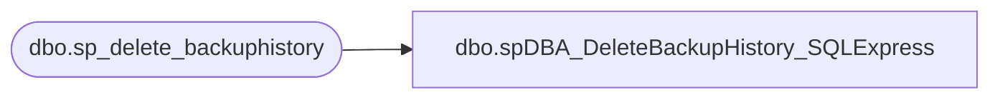

# dbo.spDBA_DeleteBackupHistory_SQLExpress

**Database:** DBAUtility  
**Server:** bedrockdb01  

## Architecture Diagram



## Table Dependencies

| Referenced Table |
|---|
| dbo.sp_delete_backuphistory |

## Stored Procedure Code

```sql
CREATE PROCEDURE spDBA_DeleteBackupHistory_SQLExpress
@Action VARCHAR
AS
-- =============================================================================================================
-- Name: spDBA_DeleteBackupHistory_SQLExpress
--
-- Description:	Calls sp_delete_backuphistory for SQL Express boxes
--
-- Output: 
--
-- Available actions:
--
-- Dependencies: 
--
-- Revision History
--		Name:			Date:			Comments:
--		Mike Pelikan	07/12/2012		Created because it is easier to execute a procedure with out dynamic variables

DECLARE @Revision DATETIME
SET @Revision = '07/12/2012'
 	
/*


*/
-- =============================================================================================================


SET NOCOUNT ON
----------------------------------------------------------------------------------------------------
--// Revision Return		                                                                    //--
----------------------------------------------------------------------------------------------------
IF @Action = 'ReturnVersion' GOTO Logging

----------------------------------------------------------------------------------------------------

DECLARE @CleanupDate datetime 
SET @CleanupDate = DATEADD(dd,-30,GETDATE()) 
EXECUTE msdb.dbo.sp_delete_backuphistory @oldest_date = @CleanupDate

Logging:
IF @Action = 'ReturnVersion'
BEGIN
	SELECT @Revision
END
```

