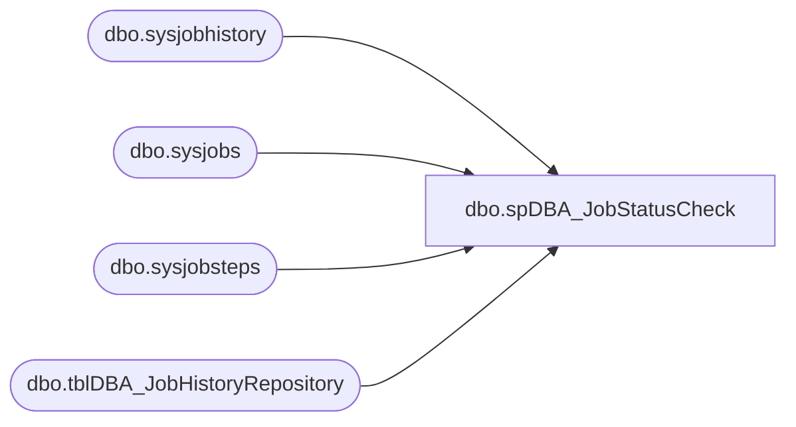

# dbo.spDBA_JobStatusCheck

**Database:** DBAUtility  
**Server:** bedrockdb01  

## Architecture Diagram



## Table Dependencies

| Referenced Table |
|---|
| dbo.sysjobhistory |
| dbo.sysjobs |
| dbo.sysjobsteps |
| dbo.tblDBA_JobHistoryRepository |

## Stored Procedure Code

```sql
CREATE PROCEDURE [dbo].[spDBA_JobStatusCheck]
	@DaysBack int = 7,
	@SQLVersion nvarchar(200) = 'SQL2005',
	@ResultsToTable nvarchar(200) = 'N',
	@Action VARCHAR(20) = 'Process'
AS
-- =============================================================================================================
-- Name: spDBA_JobStatusCheck
--
-- Description:	Checks the status of SQL Server jobs.  This version is intended to work with 2000 or 2005
--
-- Output: error logging.
-- 
-- Available actions:
--	@DaysBack =  Defines the date range for which information will be provided.
--	@SQLVersion = Currently supports SQL2005 or SQL2000
--	@ResultsToTable = record results in a table.
--

-- Dependencies: 
--
-- Revision History
--		Name:			Date:			Comments:
--		Gary Derikito	05/11/2009		Created based on http://www.mssqltips.com/tip.asp?tip=1054
--		Gary Derikito	05/13/2009		Add functionality to write results to a table.
--		Gary Derikito	06/24/2009		Replace hardcoded value in 2000 @PreviousDate calc with variable.
--		Mike Pelikan	06/27/2012		Modified for versioning
--										Changed repository
DECLARE @Revision DATETIME
SET @Revision = '06/27/2012'
 	
/*
exec spDBA_JobStatusCheck
exec spDBA_JobStatusCheck @DaysBack = -1
exec spDBA_JobStatusCheck @DaysBack = 7 , @SQLVersion = 'SQL2005', @ResultsToTable = 'Y'
exec spDBA_JobStatusCheck @DaysBack = 27 , @SQLVersion = 'SQL2005', @ResultsToTable = 'N'
exec spDBA_JobStatusCheck @DaysBack = 700 , @SQLVersion = 'SQL2000', @ResultsToTable = 'N'
exec spDBA_JobStatusCheck @DaysBack = 7 , @SQLVersion = 'SQL2000', @ResultsToTable = 'Y'


*/
-- =============================================================================================================

BEGIN

  ----------------------------------------------------------------------------------------------------
  --// Set options                                                                                //--
  ----------------------------------------------------------------------------------------------------

  SET NOCOUNT ON
  
----------------------------------------------------------------------------------------------------
--// Revision                                                                                  //--
----------------------------------------------------------------------------------------------------
IF @Action = 'ReturnVersion'
BEGIN
	GOTO EndHere
END

  ----------------------------------------------------------------------------------------------------
  --// Declare variables                                                                          //--
  ----------------------------------------------------------------------------------------------------

--  DECLARE @StartMessage nvarchar(max)
  DECLARE @EndMessage nvarchar(2000)
--  DECLARE @DatabaseMessage nvarchar(max)
  DECLARE @ErrorMessage nvarchar(2000)

  DECLARE @CurrentID int
--  DECLARE @CurrentDatabase nvarchar(max)
--  DECLARE @CurrentCommand01 nvarchar(max)
--  DECLARE @CurrentCommandOutput01 int

	-- Variable Declarations 
	DECLARE @PreviousDate datetime 
	DECLARE @Year VARCHAR(4) 
	DECLARE @Month VARCHAR(2) 
	DECLARE @MonthPre VARCHAR(2) 
	DECLARE @Day VARCHAR(2) 
	DECLARE @DayPre VARCHAR(2) 
	DECLARE @FinalDate INT 

  DECLARE @Error int

  SET @Error = 0

  ----------------------------------------------------------------------------------------------------
  --// Log initial information                                                                    //--
  ----------------------------------------------------------------------------------------------------

--  SET @StartMessage = 'DateTime: ' + CONVERT(nvarchar,GETDATE(),120) + CHAR(13) + CHAR(10)
--  SET @StartMessage = @StartMessage + 'Server: ' + CAST(SERVERPROPERTY('ServerName') AS nvarchar) + CHAR(13) + CHAR(10)
--  SET @StartMessage = @StartMessage + 'Version: ' + CAST(SERVERPROPERTY('ProductVersion') AS nvarchar) + CHAR(13) + CHAR(10)
--  SET @StartMessage = @StartMessage + 'Edition: ' + CAST(SERVERPROPERTY('Edition') AS nvarchar) + CHAR(13) + CHAR(10)
--  SET @StartMessage = @StartMessage + 'Procedure: ' + QUOTENAME(DB_NAME(DB_ID())) + '.' + QUOTENAME(OBJECT_SCHEMA_NAME(@@PROCID)) + '.' + QUOTENAME(OBJECT_NAME(@@PROCID)) + CHAR(13) + CHAR(10)
--  SET @StartMessage = @StartMessage + 'Parameters: @DaysBack = ' + ISNULL('''' + REPLACE(@DaysBack,'''','''''') + '''','NULL')
--  SET @StartMessage = @StartMessage + ', @SQLVersion = ' + ISNULL('''' + REPLACE(@SQLVersion,'''','''''') + '''','NULL')
--  SET @StartMessage = @StartMessage + ', @ResultsToTable = ' + ISNULL('''' + REPLACE(@ResultsToTable,'''','''''') + '''','NULL')
--  SET @StartMessage = @StartMessage + CHAR(13) + CHAR(10)
--  SET @StartMessage = REPLACE(@StartMessage,'%','%%')
 
  ----------------------------------------------------------------------------------------------------
  --// Check input parameters                                                                     //--
  ----------------------------------------------------------------------------------------------------

  IF @DaysBack < 0 OR @DaysBack IS NULL
  BEGIN
    SET @ErrorMessage = 'The value for parameter @DaysBack is not supported.' + CHAR(13) + CHAR(10)
    RAISERROR(@ErrorMessage,16,1) WITH LOG
    SET @Error = @@ERROR
  END

  IF @SQLVersion NOT IN ('SQL2005','SQL2000') OR @SQLVersion IS NULL
  BEGIN
    SET @ErrorMessage = 'The value for parameter @SQLVersion is not supported.' + CHAR(13) + CHAR(10)
    RAISERROR(@ErrorMessage,16,1) WITH LOG
    SET @Error = @@ERROR
  END

 IF @ResultsToTable NOT IN ('Y','N') OR @ResultsToTable IS NULL
  BEGIN
    SET @ErrorMessage = 'The value for parameter @ResultsToTable is not supported.' + CHAR(13) + CHAR(10)
    RAISERROR(@ErrorMessage,16,1) WITH LOG
    SET @Error = @@ERROR
  END

  ----------------------------------------------------------------------------------------------------
  --// Check error variable                                                                       //--
  ----------------------------------------------------------------------------------------------------

  IF @Error <> 0 GOTO Crash

  ----------------------------------------------------------------------------------------------------
  --// Execute commands                                                                           //--
  ----------------------------------------------------------------------------------------------------

--TODO:  Add logic to write to a table.
IF @SQLVersion = 'SQL2005'
BEGIN
	SET @PreviousDate = DATEADD(dd, -@DaysBack, GETDATE()) -- Last 7 days  
	SET @Year = DATEPART(yyyy, @PreviousDate)  
	SELECT @MonthPre = CONVERT(VARCHAR(2), DATEPART(mm, @PreviousDate)) 
	SELECT @Month = RIGHT(CONVERT(VARCHAR, (@MonthPre + 1000000000)),2) 
	SELECT @DayPre = CONVERT(VARCHAR(2), DATEPART(dd, @PreviousDate)) 
	SELECT @Day = RIGHT(CONVERT(VARCHAR, (@DayPre + 1000000000)),2) 
	SET @FinalDate = CAST(@Year + @Month + @Day AS INT) 


	IF @ResultsToTable = 'N'
	BEGIN
		-- Final Logic 
		SELECT  h.server, 
				j.[name], 
				 s.step_name, 
				 h.step_id, 
				 h.step_name, 
				 h.run_date, 
				 h.run_time, 
				 h.sql_severity, 
				 h.message 				 
		FROM     msdb.dbo.sysjobhistory h 
				 INNER JOIN msdb.dbo.sysjobs j 
				   ON h.job_id = j.job_id 
				 INNER JOIN msdb.dbo.sysjobsteps s 
				   ON j.job_id = s.job_id
				   AND h.step_id = s.step_id
		WHERE    h.run_status = 0 -- Failure 
				 AND h.run_date > @FinalDate 
		ORDER BY h.instance_id DESC 
	END
	IF @ResultsToTable = 'Y'
	BEGIN

		-- Final Logic 
		INSERT INTO COREDB01_MAINT.DBAUtilityMaster.dbo.tblDBA_JobHistoryRepository(
				InstanceName
				, JobName
				, StepName
				, StepID
				, StepNameHistory
				, RunDate
				, RunTime
				, SQLSeverity
				, MessageText)
		SELECT  h.server, 
				j.[name], 
				 s.step_name, 
				 h.step_id, 
				 h.step_name, 
				 h.run_date, 
				 h.run_time, 
				 h.sql_severity, 
				 h.message 				 
		FROM     msdb.dbo.sysjobhistory h 
				 INNER JOIN msdb.dbo.sysjobs j 
				   ON h.job_id = j.job_id 
				 INNER JOIN msdb.dbo.sysjobsteps s 
				   ON j.job_id = s.job_id
				   AND h.step_id = s.step_id
		WHERE    h.run_status = 0 -- Failure 
				 AND h.run_date > @FinalDate 
		ORDER BY h.instance_id DESC 
	END


END

IF @SQLVersion = 'SQL2000'
BEGIN
-- Initialize Variables 
SET @PreviousDate = DATEADD(dd, -@DaysBack, GETDATE()) -- Last 7 days  
SET @Year = DATEPART(yyyy, @PreviousDate)  
SELECT @MonthPre = CONVERT(VARCHAR(2), DATEPART(mm, @PreviousDate)) 
SELECT @Month = RIGHT(CONVERT(VARCHAR, (@MonthPre + 1000000000)),2) 
SELECT @DayPre = CONVERT(VARCHAR(2), DATEPART(dd, @PreviousDate)) 
SELECT @Day = RIGHT(CONVERT(VARCHAR, (@DayPre + 1000000000)),2) 
SET @FinalDate = CAST(@Year + @Month + @Day AS INT) 

	IF @ResultsToTable = 'N'
	BEGIN
		-- Final Logic 
		SELECT  h.server, 
				j.[name], 
				 s.step_name, 
				 h.step_id, 
				 h.step_name, 
				 h.run_date, 
				 h.run_time, 
				 h.sql_severity, 
				 h.message 
		FROM     msdb.dbo.sysjobhistory h 
				 INNER JOIN msdb.dbo.sysjobs j 
				   ON h.job_id = j.job_id 
				 INNER JOIN msdb.dbo.sysjobsteps s 
				   ON j.job_id = s.job_id 
		WHERE    h.run_status = 0 -- Failure 
				 AND h.run_date > @FinalDate 
		ORDER BY h.instance_id DESC 
	END
	IF @ResultsToTable = 'Y'
	BEGIN

		-- Final Logic 
		INSERT INTO COREDB01_MAINT.DBAUtilityMaster.dbo.tblDBA_JobHistoryRepository(
				InstanceName
				, JobName
				, StepName
				, StepID
				, StepNameHistory
				, RunDate
				, RunTime
				, SQLSeverity
				, MessageText)
		SELECT  h.server, 
				j.[name], 
				 s.step_name, 
				 h.step_id, 
				 h.step_name, 
				 h.run_date, 
				 h.run_time, 
				 h.sql_severity, 
				 h.message 
		FROM     msdb.dbo.sysjobhistory h 
				 INNER JOIN msdb.dbo.sysjobs j 
				   ON h.job_id = j.job_id 
				 INNER JOIN msdb.dbo.sysjobsteps s 
				   ON j.job_id = s.job_id 
		WHERE    h.run_status = 0 -- Failure 
				 AND h.run_date > @FinalDate 
		ORDER BY h.instance_id DESC 
	END

END

RETURN 0


  ----------------------------------------------------------------------------------------------------
  --// Log completing information                                                                 //--
  ----------------------------------------------------------------------------------------------------

Logging:

--SET @EndMessage = 'DateTime: ' + CONVERT(nvarchar,GETDATE(),120)
--
--RAISERROR(@EndMessage,10,1) WITH LOG

RETURN 0


  Crash:
	  SET @EndMessage = 'DateTime: ' + CONVERT(nvarchar,GETDATE(),120) + ' Error with ' + OBJECT_NAME(@@PROCID)
	  SET @EndMessage = REPLACE(@EndMessage,'%','%%')
	  RAISERROR(@EndMessage,10,1) WITH Log
	  RETURN 99
  ----------------------------------------------------------------------------------------------------

END

EndHere:
IF @Action = 'ReturnVersion'
BEGIN
	SELECT @Revision 
END
```

