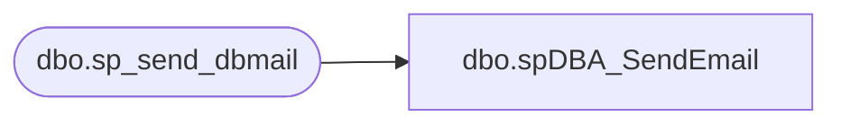

# dbo.spDBA_SendEmail

**Database:** DBAUtility  
**Server:** bedrockdb01  

## Architecture Diagram



## Table Dependencies

| Referenced Table |
|---|
| dbo.sp_send_dbmail |

## Stored Procedure Code

```sql
CREATE PROCEDURE [dbo].[spDBA_SendEmail]
@recipients NVARCHAR(2000),
@copy_recipients NVARCHAR(2000) = NULL,
@subject NVARCHAR(1000) = 'DBA Maintenance Procedure Email',
@MessageTxt NVARCHAR(2000) = NULL

AS
-- =============================================================================================================
-- Name: spDBA_SendEmail
--
-- Description:	Use to send email from remote servers.  The procedure is intended to run
-- on a repository server.  Using this procedure allows a remote server that does not have
-- email functionality to send email via the repository server. 
--
-- Output: error logging.
-- 
-- Available actions:
--	@recipients =  recipient of email
--	@copy_recipients = email address of those copied.
--	@subject = subject of email passed in from calling procedure.
--  @MessageTxt = message text of email passed in by calling procedure.
--	@AttachedHistFile = Allowable values are 'JOB_HIST', ...  If this is provided, the procedure will query the table and return the results as an attachment.

-- Dependencies: 
--	Papamart.dw.dbo.usp_delete_old_files
-- Revision History
--		Name:			Date:			Comments:
--		Gary Derikito	05/12/2009		Created initial version.
--		Gary Derikito	05/13/2009		Add optional file attaching capability
--		Mike Pelikan	04/02/2012		Removed File Attaching capablitiy - this will be re added at a later time.
--										Added logic to return version date of backup script if @Databases = 'ReturnVersion'
--		Mike Pelikan	05/29/2012		Added logic to use dbmail or xp_sendmail depending on server version
--										
DECLARE @Revision DATETIME
SET @Revision = '5/29/2012'
 	
/*
exec spDBA_SendEmail @recipients = 'garyd@buildabear.com'
exec spDBA_SendEmail @recipients = 'garyd@buildabear.com', @subject = 'Test'
exec spDBA_SendEmail @recipients = 'garyd@buildabear.com', @subject = 'Test', @MessageTxt = 'Test message body...'
exec spDBA_SendEmail @recipients = 'garyd@buildabear.com', @subject = 'Test', @MessageTxt = 'Test message body...', @AttachedHistFile = 'JOB_HIST'

exec spDBA_SendEmail @recipients = 'badnewsBear'

 
*/
-- =============================================================================================================

BEGIN

  ----------------------------------------------------------------------------------------------------
  --// Set options                                                                                //--
  ----------------------------------------------------------------------------------------------------

  SET NOCOUNT ON

  ----------------------------------------------------------------------------------------------------
  --// Declare variables                                                                          //--
  ----------------------------------------------------------------------------------------------------
	


DECLARE @outputsql VARCHAR(4000),
        @bcpsql VARCHAR(4000),
		@cmd VARCHAR(4000),
		@filename VARCHAR(100),
		@ErrorMessage nvarchar(4000),
		@Error int,
		@EndMessage nvarchar(4000)

	----------------------------------------------------------------------------------------------------
	--// Revision Return		                                                                    //--
	----------------------------------------------------------------------------------------------------
IF @recipients = 'ReturnVersion' GOTO Logging

  ----------------------------------------------------------------------------------------------------
  --// Check input parameters                                                                     //--
  ----------------------------------------------------------------------------------------------------

  IF @recipients NOT LIKE '%@%' OR @recipients IS NULL
  BEGIN
    SET @ErrorMessage = 'The value for parameter @recipients is not supported.' + CHAR(13) + CHAR(10)
    RAISERROR(@ErrorMessage,16,1) WITH LOG
    SET @Error = @@ERROR
  END

  IF @copy_recipients NOT LIKE '%@%'
  BEGIN
    SET @ErrorMessage = 'The value for parameter @copy_recipients is not supported.' + CHAR(13) + CHAR(10)
    RAISERROR(@ErrorMessage,16,1) WITH LOG
    SET @Error = @@ERROR
  END


  ----------------------------------------------------------------------------------------------------
  --// Check error variable                                                                       //--
  ----------------------------------------------------------------------------------------------------

  IF @Error <> 0 GOTO Logging

  ----------------------------------------------------------------------------------------------------
  --// Execute commands                                                                           //--
  ----------------------------------------------------------------------------------------------------
IF (SELECT COUNT(*) from msdb.dbo.sysobjects where name = 'sp_send_dbmail') > 0 
BEGIN
      EXEC msdb.dbo.sp_send_dbmail @recipients = @recipients, @copy_recipients = @copy_recipients, @subject = @subject, @body = @MessageTxt

END
ELSE
BEGIN
      EXEC master.dbo.xp_sendmail @recipients = @recipients, @copy_recipients = @copy_recipients, @subject = @subject, @message = @MessageTxt
END      
	
RETURN 0

Logging:
	IF @recipients = 'ReturnVersion'
	BEGIN
		SELECT @Revision 
	END
	ELSE
	BEGIN
		SET @EndMessage = 'DateTime: ' + CONVERT(nvarchar,GETDATE(),120) + ' Error with ' + OBJECT_NAME(@@PROCID)
		SET @EndMessage = REPLACE(@EndMessage,'%','%%')
		RAISERROR(@EndMessage,10,1) WITH LOG
	END
	
END
```

