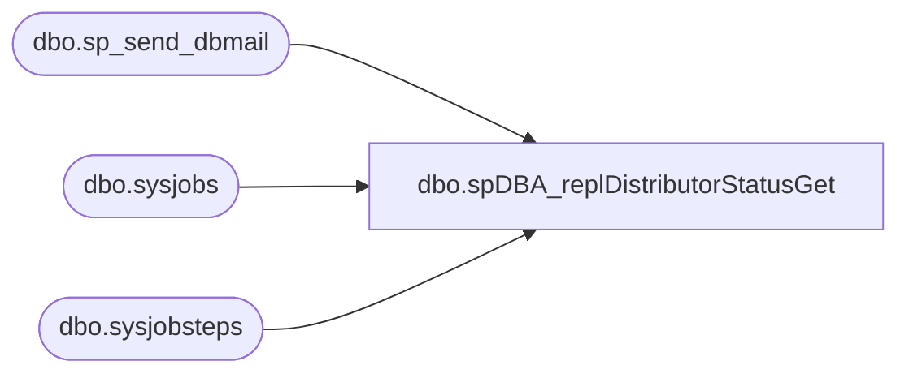

# dbo.spDBA_replDistributorStatusGet

**Database:** DBAUtility  
**Server:** bedrockdb01  

## Architecture Diagram



## Table Dependencies

| Referenced Table |
|---|
| dbo.sp_send_dbmail |
| dbo.sysjobs |
| dbo.sysjobsteps |

## Stored Procedure Code

```sql
CREATE   procedure [dbo].[spDBA_replDistributorStatusGet]    
@pRecipients varchar(255) = 'databears@buildabear.com'  
AS  
-- =============================================================================================================
-- Name: spDBA_replDistributorStatusGet
--
-- Description:	Checks the status of the continous distributor agent.
-- Based on http://www.mssqltips.com/sqlservertip/1901/customized-alerts-for-sql-server-transactional-replication/
--
-- Output: 
-- 
-- Available actions:
-- @pRecipients:
--		email address of recipient of alert
--
-- Dependencies: 
--	Only to be used on servers with Replication 
--
-- Revision History
--		Name:			Date:			Comments:
--		Mike Pelikan	12/30/2013		Created
--		Mike Pelikan	01/03/2014		commented out "step_id = 2 and " in the WHERE clauses
--
-- =============================================================================================================

SET NOCOUNT ON
SET TRANSACTION ISOLATION LEVEL READ UNCOMMITTED

DECLARE @is_sysadmin INT  
DECLARE @job_owner   sysname  
DECLARE @job_id uniqueidentifier  
DECLARE @job_name sysname  
DECLARE @running int   
DECLARE @cnt int  
DECLARE @msg varchar(8000)  
DECLARE @msg_header varchar(4000)  
DECLARE @categoryid int   

SELECT  @job_owner =   SUSER_SNAME()  
     ,@is_sysadmin = 1   
     ,@running = 0  
     ,@categoryid = 10 -- Distributor jobs  

CREATE TABLE #jobStatus (job_id  UNIQUEIDENTIFIER NOT NULL,  
                last_run_date         INT ,  
                last_run_time         INT ,  
                next_run_date         INT ,  
                next_run_time         INT ,  
                next_run_schedule_id  INT ,  
                requested_to_run      INT ,   
                request_source        INT ,  
                request_source_id     sysname COLLATE database_default NULL,  
                running               int ,  
                current_step          INT ,  
                current_retry_attempt INT ,  
                job_state             INT)  

  INSERT INTO #jobStatus  
  EXECUTE master.dbo.xp_sqlagent_enum_jobs @is_sysadmin, @job_owner--, @job_id   
   

--
select j.name, js.command, jss.running
from msdb.dbo.sysjobsteps js
	join msdb.dbo.sysjobs j on js.job_id = j.job_id
	join #jobStatus jss on js.job_id = jss.job_id
where --step_id = 2 and 
subsystem = 'Distribution'
	and command like '%-Continuous'
	and jss.running <> 1 -- Not running

  
 if @@ROWCOUNT > 0
 BEGIN  
 
  SELECT @msg_header = 'Distributor job(s) FAILING OR STOPPED. Please check replication job(s) ASAP.'  
  SELECT @msg_header = @msg_header + char(10)  
    SELECT @msg_header = @msg_header + 'Here is the list of Job(s) that are failing or stopped'
  SELECT @msg_header = @msg_header + char(10)   
  SELECT @msg_header = @msg_header + '****************************************************************************'   
  
  set @msg = ''
	select @msg = @msg + CHAR(10) + j.name
	from msdb.dbo.sysjobsteps js
		join msdb.dbo.sysjobs j on js.job_id = j.job_id
		join #jobStatus jss on js.job_id = jss.job_id
	where --step_id = 2 and 
	subsystem = 'Distribution'
		and command like '%-Continuous'
		and jss.running <> 1 -- Not running
	
    
  SELECT @msg = @msg_header + char(10) + nullif(@msg,'')  
  
  print @msg
     
  if @@version like 'Microsoft SQL Server  2000%'  
     exec master.dbo.xp_sendmail                     
     @recipients= @pRecipients , --'youremail@yourcompany.com',  
     @subject='Production Replication Distributor Alert',  
     @message = @msg,  
       @width = 100    
  else   
    exec msdb.dbo.sp_send_dbmail --@profile_name = 'SQLMail Profile',                     
     @recipients= @pRecipients , --'youremail@yourcompany.com',  
     @subject= 'Production Replication Distributor Alert',  
     @body = @msg   
 END  

drop table #jobStatus
```

