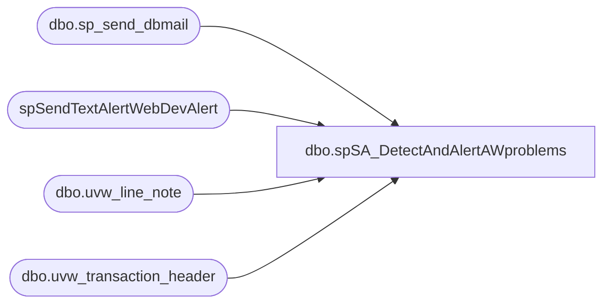

# dbo.spSA_DetectAndAlertAWproblems

**Database:** DBAUtility  
**Server:** bedrockdb01  

## Architecture Diagram



## Table Dependencies

| Referenced Table |
|---|
| dbo.sp_send_dbmail |
| spSendTextAlertWebDevAlert |
| dbo.uvw_line_note |
| dbo.uvw_transaction_header |

## Stored Procedure Code

```sql
CREATE procedure  [dbo].[spSA_DetectAndAlertAWproblems]
(@daysToAudit int)

as
-- =============================================================================================================
-- Name: spDetectAndAlertAWproblems
--
-- Description:	Emails if there are potential duplicates or other issue with WEB Store SA transactions
--
-- Output: email
--
-- Available actions:
--
-- Dependencies: BEDROCKDB01.auditworks.dbo.uvw_transaction_header
--					BEDROCKDB01.auditworks.dbo.uvw_line_note
--
-- Revision History
--		Name:			Date:			Comments:
--		Mike Pelikan	07/15/2014		add comments section. 
--										Added nolocks to remote selects
--										add transaction_date to second remote select WHERE clause
--										updated email recipients
--										moved proc from BEARWEBDB\SQL2008.ecommerce
--		Justin Dorrah	07/17/2014		commented date check for #awNegAmt to look at all orders instead of looking at @daysToAudit
--		Justin Dorrah	01/21/2015		corrected the information at the bottom of the email that is sent from this proc to let
--											recipients know where the proc and job live

DECLARE @Revision DATETIME
SET @Revision = '07/15/2014'
 	
/*
--select * from ##awDuplicate where OrderNumber='46007419'
--exec spDetectAndAlertAWproblems 30

--declare @daysToAudit int
--select @daysToAudit = 45
*/
-- =============================================================================================================
SET NOCOUNT ON 
--FIND DUPLICATES
--collect orders in AW 
IF (Object_ID('tempdb..#aw') IS NOT NULL) DROP TABLE #aw
SELECT  a.store_no,
	a.register_no,
	a.transaction_date,
	a.transaction_no,
	a.cashier_no,
	a.entry_date_time,
	a.tender_total
, case 
	when len(line_note)=20 then  SUBSTRING (line_note ,12 ,9 )
	when len(line_note)=19 then  SUBSTRING (line_note ,12 ,8 ) 
	when len(line_note)=18 then SUBSTRING (line_note ,12 ,7 ) 
	else SUBSTRING (line_note ,12 ,7 ) 
	end as OrderNumber
, line_note
INTO #aw
FROM  auditworks.dbo.uvw_transaction_header a (NOLOCK)
LEFT JOIN auditworks.dbo.uvw_line_note ln (NOLOCK)
       on ln.transaction_id = a.transaction_id
where a.store_no  in ('13', '2013')
and note_type = 28
and a.transaction_void_flag = 0
and a.transaction_date > dateadd(day,-@daysToAudit, getdate())
order by a.transaction_date


--if NET SALE < $0, problem! Possibly Giving money away
		IF (Object_ID('tempdb..#awNetSellNegative') IS NOT NULL) DROP TABLE #awNetSellNegative
		select 'NET SALE < $0' as issue
			, OrderNumber
			, SUM(tender_total) as netSale
			, min(entry_date_time) as MinSalesDate
			, max(entry_date_time) as MaxSalesDate
		into #awNetSellNegative
		from #aw 
		group by OrderNumber
		having SUM(tender_total) < 0 --and count(*) > 1
		order by SUM(tender_total), OrderNumber

		--NOW get rid of orders that actually had prior money so it is NOT < $0
		--1. any order
		IF (Object_ID('tempdb..#awNegAmt') IS NOT NULL) DROP TABLE #awNegAmt
		SELECT  a.store_no, a.register_no, a.transaction_date, a.transaction_no, a.cashier_no, a.entry_date_time, a.tender_total
		, case 
			when len(line_note)=20 then  SUBSTRING (line_note ,12 ,9 )
			when len(line_note)=19 then  SUBSTRING (line_note ,12 ,8 ) 
			when len(line_note)=18 then SUBSTRING (line_note ,12 ,7 ) 
			else SUBSTRING (line_note ,12 ,7 ) 
			end as OrderNumber
		, line_note
		INTO #awNegAmt
		FROM  auditworks.dbo.uvw_transaction_header a (NOLOCK) 
		LEFT JOIN auditworks.dbo.uvw_line_note ln (NOLOCK)
			   on ln.transaction_id = a.transaction_id
		where a.store_no  in ('13', '2013')
		and note_type = 28
		and a.transaction_void_flag = 0
		--and a.transaction_date > dateadd(day,-@daysToAudit, getdate())
		and case 
			when len(line_note)=20 then  SUBSTRING (line_note ,12 ,9 )
			when len(line_note)=19 then  SUBSTRING (line_note ,12 ,8 ) 
			when len(line_note)=18 then SUBSTRING (line_note ,12 ,7 ) 
			else SUBSTRING (line_note ,12 ,7 ) 
			end 
			in (
					select OrderNumber from #awNetSellNegative
				)
		order by a.transaction_date


		--if NET SALE < $0, problem! Possibly Giving money away
		IF (Object_ID('tempdb..#awNetSellNegative2') IS NOT NULL) DROP TABLE #awNetSellNegative2
		select 'NET SALE < $0' as issue
			, OrderNumber
			, SUM(tender_total) as netSale
			, min(entry_date_time) as MinSalesDate
			, max(entry_date_time) as MaxSalesDate
		into #awNetSellNegative2
		from #awNegAmt 
		group by OrderNumber
		having SUM(tender_total) < 0 --and count(*) > 1
		order by SUM(tender_total), OrderNumber

		IF (Object_ID('tempdb..##awNetSellNegative_Detail') IS NOT NULL) DROP TABLE ##awNetSellNegative_Detail
		select 'NET SALE < $0' as issue, entry_date_time as SalesDate, store_no, register_no, OrderNumber, transaction_no, tender_total
		into ##awNetSellNegative_Detail
		from  #awNegAmt where OrderNumber in 
		(select distinct OrderNumber from #awNetSellNegative2)
		order by OrderNumber, entry_date_time
		--add all transaction numbers


IF (Object_ID('tempdb..##awDuplicate') IS NOT NULL) DROP TABLE ##awDuplicate
select store_no, register_no, min(tender_total) MinTotal, max(tender_total) MaxTotal, OrderNumber, min(transaction_no) as OK_TransNo, max(transaction_no) as DUP_TransNo, count(*) CountOf, min(entry_date_time) OK_SalesDate, MAX(entry_date_time) as DUP_SalesDate
INTO ##awDuplicate
from #aw
group by store_no, register_no, OrderNumber
having min(transaction_no) <> max(transaction_no)
order by  OrderNumber, OK_SalesDate


--Figure out what amount is the correct one if they don't match---------------------------------------
--====================================================================================================
/*
	--select * from Bearwebdb.webcart_Commerce.dbo.vwPT_Auth where sOrderNumber in (select OrderNumber from ##awDuplicate)

	--select Min(AuthDateTime) as MinAuthDateTime,sOrderNumber, sTransactionID
	--from Bearwebdb.webcart_Commerce.dbo.vwPT_Auth a 
	--JOIN ##awDuplicate b on a.sOrderNumber COLLATE DATABASE_DEFAULT like b.OrderNumber COLLATE DATABASE_DEFAULT + 'X%'
	--WHERE bIsApproved = 1
	--group by sOrderNumber, sTransactionID

	IF (Object_ID('tempdb..#listToGetFirstAuthFrom') IS NOT NULL) DROP TABLE #listToGetFirstAuthFrom
	select Min(AuthDateTime) as MinAuthDateTime, sOrderNumber, sTransactionID
	into #listToGetFirstAuthFrom
	from Bearwebdb.webcart_Commerce.dbo.vwPT_Auth a 
	JOIN ##awDuplicate b on a.sOrderNumber COLLATE DATABASE_DEFAULT like b.OrderNumber COLLATE DATABASE_DEFAULT + 'X%'
	WHERE a.bIsApproved = 1
	--and b.CountOf = 2 
	and b.MinTotal > 0 and b.MinTotal <> MaxTotal
	group by sOrderNumber, sTransactionID

	IF (Object_ID('tempdb..#firstAuthAmount') IS NOT NULL) DROP TABLE #firstAuthAmount
	select b.MinAuthDateTime, a.sOrderNumber, a.mAmount as firstAuthAmount, a.sTransactionID
	into #firstAuthAmount
	from Bearwebdb.webcart_Commerce.dbo.vwPT_Auth a 
	join #listToGetFirstAuthFrom b on a.AuthDateTime = b.MinAuthDateTime and a.sOrderNumber=b.sOrderNumber and a.sTransactionID=b.sTransactionID

	IF (Object_ID('tempdb..#firstAuthAmount_Settled') IS NOT NULL) DROP TABLE #firstAuthAmount_Settled
	select a.firstAuthAmount as SettledAmount, a.sTransactionID, s.sOrderNumber, s.dTimeStamp as SettlementDate, a.MinAuthDateTime
	into #firstAuthAmount_Settled
	from #firstAuthAmount a 
	JOIN Bearwebdb.webcart_Commerce.dbo.vwPT_Settle s on a.sTransactionID=s.sTransactionID and a.sOrderNumber=s.sOrderNumber	
	where bIsApproved = 1

--	select a.*
--	from #firstAuthAmount_Settled a 

	IF (Object_ID('tempdb..##firstAuthAmount_Settled_X') IS NOT NULL) DROP TABLE ##firstAuthAmount_Settled_X
	select b.store_no, b.MinTotal, b.MaxTotal, b.OK_TransNo, b.DUP_TransNo, b.CountOf, b.SalesDate, '<--AW:settlement-->' as msg, a.SettledAmount, a.SettlementDate, a.sTransactionID as PT_TransID, a.sOrderNumber, a.MinAuthDateTime
	into ##firstAuthAmount_Settled_X
	from #firstAuthAmount_Settled a 
	left JOIN ##awDuplicate b on a.sOrderNumber COLLATE DATABASE_DEFAULT like b.OrderNumber COLLATE DATABASE_DEFAULT + 'X%'
*/

	--second query to see each of them
	IF (Object_ID('tempdb..##awDuplicateV3') IS NOT NULL) DROP TABLE ##awDuplicateV3
	select store_no, register_no, tender_total, OrderNumber, transaction_no, entry_date_time as SalesDate
	INTO ##awDuplicateV3
	from #aw
	where OrderNumber in (select OrderNumber from ##awDuplicate where CountOf > 2)
	order by  OrderNumber, SalesDate

	IF (Object_ID('tempdb..##awMultiTrans') IS NOT NULL) DROP TABLE ##awMultiTrans
	--if more than one positive trans, probably a duplicate
	select 'DETAILS of trans count > 2' as issue, store_no, register_no, OrderNumber,
		SUM(PosCount) as PosCount,
		SUM(NegCount) as NegCount,
		SUM(tender_total) as netSale,
		SalesDate,
		transaction_no
	into ##awMultiTrans
	from (
		select OrderNumber, store_no, register_no,
			case when tender_total > 0 then 1 else 0	end as PosCount,
			case when tender_total < 0 then 1 else 0 end as NegCount,
			tender_total, SalesDate, transaction_no
		from ##awDuplicateV3 
		) x
	group by OrderNumber, SalesDate, store_no, transaction_no, register_no
	order by OrderNumber, SalesDate

/*
select * from ##awDuplicate
where OrderNumber = 4422074
*/

declare @ATGOrdersDupInAW numeric, @ATGOrdersDup2InAW numeric, @importanceOfEmail varchar(10), @possiblecount int
set @importanceOfEmail = 'Normal'	--'Low','Normal','High', defaults to 'Normal'

select @ATGOrdersDupInAW = count(*) 
from ##awDuplicate 
where CountOf = 2 and MinTotal = MaxTotal

select @ATGOrdersDup2InAW = count(*)
from ##awDuplicate 
where CountOf = 2 and MinTotal > 0 and MinTotal <> MaxTotal

select @possiblecount = COUNT(*)
from ##awMultiTrans

--disabled if statement, so email goes out even if there are no "Probable Duplicates"
--if (@ATGOrdersDupInAW > 0 or @ATGOrdersDup2InAW > 0) begin
	-- ############# EMAIL RESULTS ########################################  
	declare @subjectToSend varchar(1500), @BodyOfText varchar(500), @FirstDate varchar(50), @LastDate varchar(50)
	select @FirstDate = Convert(varchar(20), DateAdd(day, -@daysToAudit, getdate()), 101)
	select @LastDate = Convert(varchar(20), getdate(), 101)

	set @subjectToSend =  cast(@ATGOrdersDupInAW + @ATGOrdersDup2InAW as varchar(50)) + ' PROBABLE & ' + CAST(@possiblecount as varchar(10)) + ' POSSIBLE DUPLICATES in AW between ' + @FirstDate + ' and ' + @LastDate + ', ' + Cast(@daysToAudit as varchar(10)) + ' days - Reported ' + Convert(varchar(50), getdate(), 0)
	set @BodyOfText =  @subjectToSend

	if(@ATGOrdersDupInAW > 200) begin
		set @subjectToSend = 'ALERT! ' + @subjectToSend
		set @importanceOfEmail = 'High'
		EXEC spSendTextAlertWebDevAlert @subjectToSend, @BodyOfText
	end
	else begin
		set @subjectToSend = 'WARNING: ' + @subjectToSend
		set @importanceOfEmail = 'Normal'
	end


	--EXEC msdb.dbo.sp_send_dbmail @recipients='mikep@buildabear.com'
	EXEC msdb.dbo.sp_send_dbmail @recipients='WebAlerts@buildabear.com;lindak@buildabear.com;'  
		,@subject = @subjectToSend
		,@body = @BodyOfText
		,@body_format = 'TEXT' --'HTML' or 'TEXT', defaults to 'TEXT'
		,@query = 'SET ANSI_WARNINGS OFF 
					SET NOCOUNT ON 
					SET ANSI_NULLS ON

					select ''========= Probable DUPLICATES: ======================================''
					select ''Two trans with SAME amount'' as issue, * 
					from ##awDuplicate 
					where CountOf = 2 and MinTotal = MaxTotal
					UNION
					select ''Two trans with DIFF amount'' as issue,* 
					from ##awDuplicate 
					where CountOf = 2 and MinTotal > 0 and MinTotal <> MaxTotal
					ORDER BY issue, OK_SalesDate

					--select * from ##firstAuthAmount_Settled_X order by SalesDate
					
					if exists(select issue from ##awMultiTrans) Begin
						select ''========= Possible DUPLICATES: ======================================''
						select issue, store_no, register_no, OrderNumber, transaction_no, PosCount, NegCount, netSale, SalesDate
						from ##awMultiTrans
						ORDER BY issue, OrderNumber, SalesDate
					End

					if exists(select issue from ##awNetSellNegative_Detail) Begin
						select ''========= Net Loss Transactions =======''
						select issue, store_no, register_no, OrderNumber, transaction_no, tender_total, SalesDate
						from ##awNetSellNegative_Detail
						ORDER BY issue, SalesDate
					End
					
					select ''SQL Proc: BEDROCKDB01.DBAUtility.dbo.spSA_DetectAndAlertAWproblems''
					select ''SQL Agent: BEDROCKDB01 SATranslate_Audit_DetectDuplicatesInSalesAudit''  
					select ''SQL Agent Schedule: 6:30am''  
					'  
		--,@from_address='WebDevAlert@buildabear.com'
		,@importance=@importanceOfEmail;

--END

--exec spExecute_ADODB_SQL @DDL='Create table NetLoss 
--(issue Text, OrderNumber Text, NetSale Currency, MinSalesDate Date, MaxSalesDate Date)', 
--@DataSource ='C:\SqlExcel.xls' 
----the excel file will have been created on the Database server of the 
---- database you currently have a connection to 
-- 
----We could now insert data into the spreadsheet, if we wanted 
--exec spExecute_ADODB_SQL @DDL='insert into NetLoss 
--(issue, OrderNumber, NetSale, MinSalesDate, MaxSalesDate) 
--from 
--	select issue, OrderNumber, netSale, MinSalesDate, MaxSalesDate from #awNetSellNegative', 
--@DataSource ='C:\SqlExcel.xls' 

/*
---Manual output

select '========= Probable DUPLICATES: ======================================'
					select 'Two trans with SAME amount' as issue, * 
					from ##awDuplicate 
					where CountOf = 2 and MinTotal = MaxTotal
					UNION
					select 'Two trans with DIFF amount' as issue,* 
					from ##awDuplicate 
					where CountOf = 2 and MinTotal > 0 and MinTotal <> MaxTotal
					ORDER BY issue, SalesDate

					--select * from ##firstAuthAmount_Settled_X order by SalesDate
					
					if exists(select issue from ##awMultiTrans) Begin
						select '========= Possible DUPLICATES: ======================================'
						select issue, store_no, OrderNumber, PosCount, NegCount, netSale, SalesDate
						from ##awMultiTrans
						ORDER BY issue, SalesDate
					End

					if exists(select issue from ##awNetSellNegative_Detail) Begin
						select '========= Net Loss Transactions ======='
						select issue, store_no, OrderNumber, transaction_no, tender_total, SalesDate
						from ##awNetSellNegative_Detail
						ORDER BY issue, SalesDate
					End
					

*/
```

