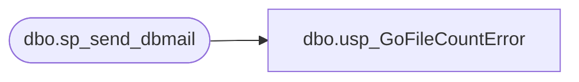

# dbo.usp_GoFileCountError

**Database:** DBAUtility  
**Server:** bedrockdb01  

## Architecture Diagram



## Table Dependencies

| Referenced Table |
|---|
| dbo.sp_send_dbmail |

## Stored Procedure Code

```sql
CREATE procedure [dbo].[usp_GoFileCountError]
AS

-- =============================================================================================================
-- Name: usp_GoFileCountError
--
-- Description:	sends email alerts if there is a problem with POSAPPsa01
--
-- Output: none
-- 
-- Available actions:

-- Dependencies: 

--
-- Revision History:
--		Mike Pelikan	04/16/2014		Added comment block. Changed email recipient.


DECLARE @Revision DATETIME
SET @Revision = '04/16/2014'
	
----------------------------------------------------------------------------------------------------
--// Set options                                                                                //--
----------------------------------------------------------------------------------------------------
SET NOCOUNT ON

----------------------------------------------------------------------------------------------------
--// Declare variables                                                                          //--
----------------------------------------------------------------------------------------------------

BEGIN

declare @sql varchar(8000)
declare @destdrive varchar(5)
declare @sourcedrive varchar(5)
declare @command varchar(300)

IF (Object_ID('tempdb..##go_error') IS NOT NULL) DROP TABLE ##go_error
create table ##go_error (
	message	varchar(250)
)

-- **********************************************************************************************************************
-- **********************************************************************************************************************
-- **********************************************************************************************************************

set @sourcedrive = 'y:'
set @sql = ''

truncate table ##go_error

set @command = 'net use ' + @sourcedrive + ' /d'
exec master..xp_cmdshell @command

set @command = 'net use ' + @sourcedrive + ' "\\saapp01\d$\EPICOR\auditworks\ICT_EDIT01" d3v@dm1n /user:bab\devadmin'
insert into ##go_error
exec master..xp_cmdshell @command

-- if not successful, then send error
if ((select count(*) from ##go_error where message like '%The command completed successfully%') = 0)
begin
	delete from ##go_error where message is null

	exec msdb.dbo.sp_send_dbmail  
		@profile_name = 'POSadmin',
		@recipients = 'poll@buildabear.com;',
		@subject='SAAPP01 Go File - Error', 
		@query= 'select * from ##go_error',
		@query_result_width = 250
end

-- **********************************************************************************************************************
-- **********************************************************************************************************************
-- **********************************************************************************************************************

IF (Object_ID('tempdb..##gofiles') IS NOT NULL) DROP TABLE ##gofiles
create table ##gofiles (
	filename	varchar(100)
)

set @command = 'dir /b ' + @sourcedrive + '\X*.GO'
insert into ##gofiles
exec master..xp_cmdshell @command

delete from ##gofiles where filename is null
delete from ##gofiles where filename = 'File Not Found'

-- **********************************************************************************************************************
-- **********************************************************************************************************************
-- **********************************************************************************************************************

declare @count int
declare @query varchar(8000)
set @count = (select count(*) from ##gofiles)

set @query = 
'
print ''GO Files Found (' + cast(@count as varchar) + ') on \\saapp01\d$\EPICOR\auditworks\ICT_EDIT01''
select * from ##gofiles
print ''''
print ''Check the Smartload Monitor on POSAPPSA01 to ensure that all processes are UP''
PRINT ''''
PRINT ''''
PRINT ''''
PRINT ''Server:  BEDROCKDB01''
PRINT ''Job Name:  GoFileCountError''
PRINT ''Stored Proc:  BEDROCKDB01.DBAUtility.dbo.usp_GoFileCountError''
PRINT ''Created by:  Paul Beckman''
PRINT ''Team Ownership:  POSadmin''
'

--	@recipients = 'davidr@buildabear.com;rsalert@buildabear.com',
--	@recipients = 'davidr@buildabear.com',

if (@count >= 20)
begin
	exec msdb.dbo.sp_send_dbmail  
		@profile_name = 'POSadmin',
		@recipients = 'rsalert@buildabear.com',
		@subject='WARNING - Too Many GO Files Found', 
		@query= @query,
		@query_result_width = 250
end

END
```

