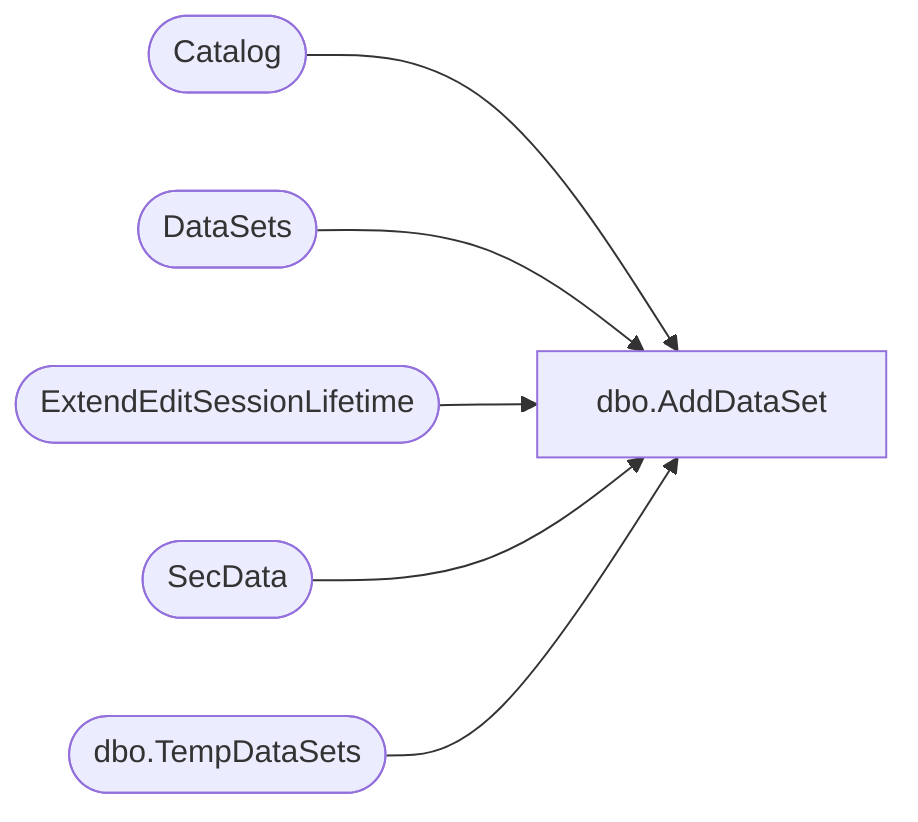

# dbo.AddDataSet

**Database:** ReportServerESell  
**Server:** bedrockdb01  

## Architecture Diagram



## Table Dependencies

| Referenced Table |
|---|
| Catalog |
| DataSets |
| ExtendEditSessionLifetime |
| SecData |
| dbo.TempDataSets |

## Stored Procedure Code

```sql
CREATE PROCEDURE [dbo].[AddDataSet]
@ID [uniqueidentifier],
@ItemID [uniqueidentifier],
@EditSessionID varchar(32) = NULL,
@Name [nvarchar] (260), 
@LinkID [uniqueidentifier] = NULL, -- link id is trusted, if it is provided - we use it
@LinkPath [nvarchar] (425) = NULL, -- if LinkId is not provided we try to look up LinkPath
@AuthType [int]
AS

DECLARE @ActualLinkID uniqueidentifier
SET @ActualLinkID = NULL

IF (@LinkID is NULL) AND (@LinkPath is not NULL) BEGIN
   SELECT
      ItemID, NtSecDescPrimary
   FROM
      Catalog LEFT OUTER JOIN SecData ON Catalog.PolicyID = SecData.PolicyID AND SecData.AuthType = @AuthType
   WHERE
      Path = @LinkPath AND Type = 8
   SET @ActualLinkID = (SELECT ItemID FROM Catalog WHERE Path = @LinkPath AND Type = 8)
END
ELSE BEGIN
   SET @ActualLinkID = @LinkID
END

IF(@EditSessionID is not null)
BEGIN
    INSERT 
        INTO [ReportServerESellTempDB].dbo.TempDataSets
            (ID, ItemID, [Name], LinkID)
        VALUES
            (@ID, @ItemID, @Name, @ActualLinkID)
    
    EXEC ExtendEditSessionLifetime @EditSessionID
END
ELSE
BEGIN
INSERT
    INTO DataSets
            (ID, ItemID, [Name], LinkID)
        VALUES
            (@ID, @ItemID, @Name, @ActualLinkID)
END
```

