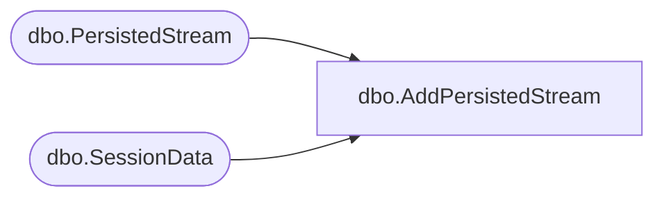

# dbo.AddPersistedStream

**Database:** ReportServerESell  
**Server:** bedrockdb01  

## Architecture Diagram



## Table Dependencies

| Referenced Table |
|---|
| dbo.PersistedStream |
| dbo.SessionData |

## Stored Procedure Code

```sql
CREATE PROCEDURE [dbo].[AddPersistedStream]
@SessionID varchar(32),
@Index int
AS

DECLARE @RefCount int
DECLARE @id varchar(32)
DECLARE @ExpirationDate datetime

set @RefCount = 0
set @ExpirationDate = DATEADD(day, 2, GETDATE())

set @id = (select SessionID from [ReportServerESellTempDB].dbo.SessionData where SessionID = @SessionID)

if @id is not null
begin
set @RefCount = 1
end

INSERT INTO [ReportServerESellTempDB].dbo.PersistedStream (SessionID, [Index], [RefCount], [ExpirationDate]) VALUES (@SessionID, @Index, @RefCount, @ExpirationDate)
```

