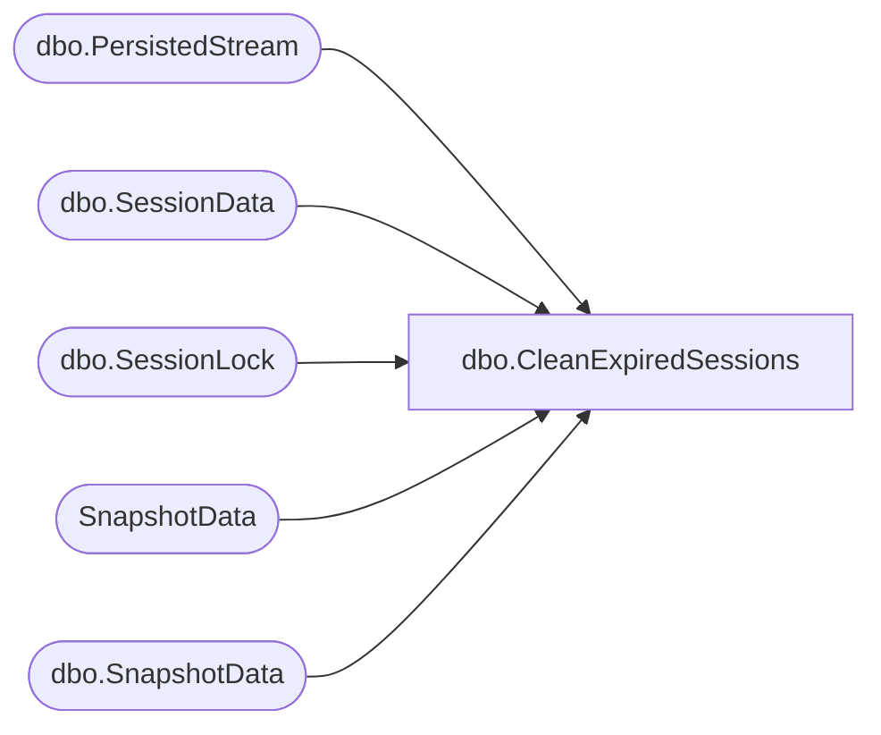

# dbo.CleanExpiredSessions

**Database:** ReportServerESell  
**Server:** bedrockdb01  

## Architecture Diagram



## Table Dependencies

| Referenced Table |
|---|
| dbo.PersistedStream |
| dbo.SessionData |
| dbo.SessionLock |
| SnapshotData |
| dbo.SnapshotData |

## Stored Procedure Code

```sql
CREATE PROCEDURE [dbo].[CleanExpiredSessions]
@SessionsCleaned int OUTPUT
AS
SET DEADLOCK_PRIORITY LOW

set @SessionsCleaned = 0;
declare @maxCleanCount int = 200;
declare @rc int;
declare @now as datetime = GETDATE();
declare @DeletedSessions table (
  SessionID varchar(32) collate Latin1_General_CI_AS_KS_WS primary key,
  SnapshotDataID uniqueidentifier,
  CompiledDefinition uniqueidentifier
);

-- Delete expired sessions
--
-- In this session, we attempt to delete the first batch of expired 
-- sessions. A session is considered expired if its Expiration date 
-- and time is reached and that there are no locks on its corresponding 
-- row in the SessionLock table. As you can see we ensure that there 
-- are no locks on the corresponding SessionLock row by providing the 
-- READPAST hint. The ROWLOCK hint here ensures that we only take ROWLOCKS
--
-- Delete operation is executed in the batches of 20 to avoid lock 
-- escalations. See http://support.microsoft.com/kb/323630 for more 
-- details.
while @SessionsCleaned < @maxCleanCount
begin
  
  -- Delete the locks first
  delete top(20) sl
  output s.SessionID, s.SnapshotDataID, s.CompiledDefinition into @DeletedSessions
  from [ReportServerESellTempDB].dbo.SessionLock sl with(rowlock, readpast)
  join [ReportServerESellTempDB].dbo.SessionData s with(readpast) on sl.SessionID = s.SessionID
  where s.Expiration <= @now;
  
  set @rc = @@ROWCOUNT;
  if @rc = 0 break;
  set @SessionsCleaned = @SessionsCleaned + @rc;

  -- Now delete the sessions that correspond to those locks
  delete top(20) l
  from [ReportServerESellTempDB].dbo.SessionData l
  join @DeletedSessions s on s.SessionID = l.SessionID;
end

-- Delete sessions with no corresponding locks (orphaned sessions)
--
-- In this section we attempt to find and delete any SessionData 
-- rows that do not have a corresponding SessionLock row. 
-- These rows are considered orphan and should be deleted. 
-- As you can see below, the SessionData table is queried using 
-- the READPAST hint. This means that SessionData rows that have 
-- locks on do not prevent this query from being executed. Also 
-- note that SessionLock is read using NOLOCK instead of READPAST. 
-- This is important because we need a true view on all rows that 
-- exists in the SessionLock table whether they are locked or not.
--
-- Delete operation is executed in the batches of 20 to avoid lock 
-- escalations. See http://support.microsoft.com/kb/323630 for more 
-- details.
while @SessionsCleaned < @maxCleanCount
begin
  delete top(20) s
  output deleted.SessionID, deleted.SnapshotDataID, deleted.CompiledDefinition into @DeletedSessions
  from [ReportServerESellTempDB].dbo.SessionData s with(readpast)
  left join [ReportServerESellTempDB].dbo.SessionLock sl with(nolock) on sl.SessionID = s.SessionID
  where sl.SessionID is null and s.Expiration <= @now;
  
  set @rc = @@ROWCOUNT;
  set @SessionsCleaned = @SessionsCleaned + @rc;
  if @rc < 20 break;
end

-- Was there anything to clean-up?
if @SessionsCleaned = 0 return;

-- Delete persisted streams
--
-- Delete operation is executed in the batches of 20 to avoid lock 
-- escalations. See http://support.microsoft.com/kb/323630 for more 
-- details.
deletePersistedStreams:
delete top(20) ps
from [ReportServerESellTempDB].dbo.PersistedStream as ps
join @DeletedSessions sd on ps.SessionID = sd.SessionID;
if @@ROWCOUNT = 20 goto deletePersistedStreams;

-- Update ref counts
UPDATE SN
SET
   TransientRefcount = TransientRefcount-1
FROM
   [ReportServerESellTempDB].dbo.SnapshotData AS SN
   JOIN @DeletedSessions AS SE ON SN.SnapshotDataID = SE.CompiledDefinition;

UPDATE SN
SET
   TransientRefcount = TransientRefcount-
      (SELECT COUNT(*)
       FROM @DeletedSessions AS SE1
       WHERE SE1.SnapshotDataID = SN.SnapshotDataID)
FROM
   SnapshotData AS SN
   JOIN @DeletedSessions AS SE ON SN.SnapshotDataID = SE.SnapshotDataID;

UPDATE SN
SET
   TransientRefcount = TransientRefcount-
      (SELECT COUNT(*)
       FROM @DeletedSessions AS SE1
       WHERE SE1.SnapshotDataID = SN.SnapshotDataID)
FROM
   [ReportServerESellTempDB].dbo.SnapshotData AS SN
   JOIN @DeletedSessions AS SE ON SN.SnapshotDataID = SE.SnapshotDataID;
```

