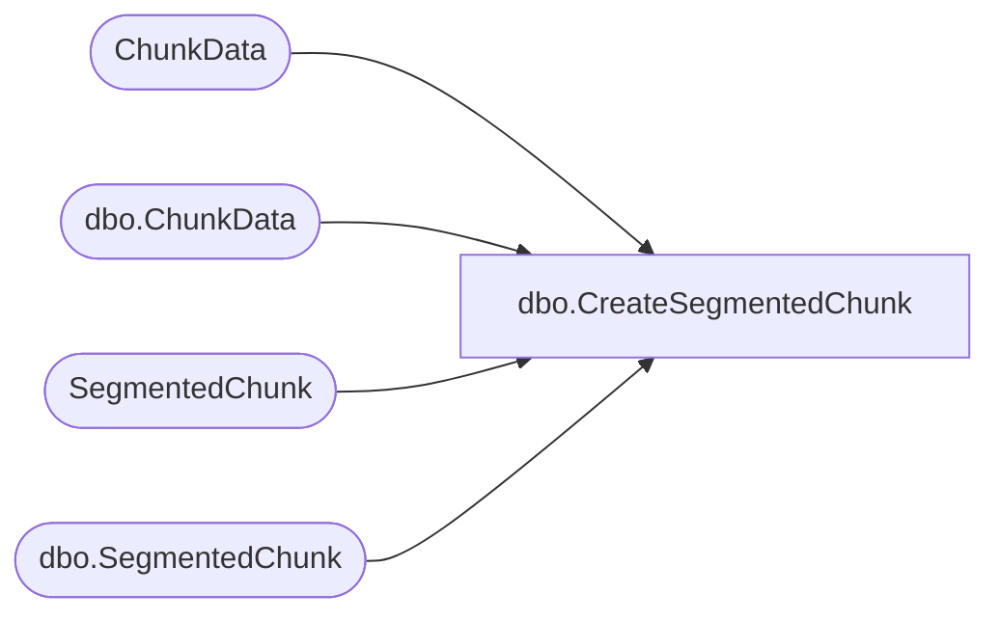

# dbo.CreateSegmentedChunk

**Database:** ReportServerESell  
**Server:** bedrockdb01  

## Architecture Diagram



## Table Dependencies

| Referenced Table |
|---|
| ChunkData |
| dbo.ChunkData |
| SegmentedChunk |
| dbo.SegmentedChunk |

## Stored Procedure Code

```sql
create proc [dbo].[CreateSegmentedChunk]
	@SnapshotId		uniqueidentifier,
	@IsPermanent	bit, 
	@ChunkName		nvarchar(260),
	@ChunkFlags		tinyint, 
	@ChunkType		int, 
	@Version		smallint, 
	@MimeType		nvarchar(260) = null, 
	@Machine		nvarchar(512),
	@ChunkId		uniqueidentifier out
as begin
	declare @output table (ChunkId uniqueidentifier) ;
	if (@IsPermanent = 1) begin
		delete SegmentedChunk
		where SnapshotDataId = @SnapshotId and ChunkName = @ChunkName and ChunkType = @ChunkType
		
		delete ChunkData
		where SnapshotDataID = @SnapshotId and ChunkName = @ChunkName and ChunkType = @ChunkType
							
		insert SegmentedChunk(SnapshotDataId, ChunkFlags, ChunkName, ChunkType, Version, MimeType)
		output inserted.ChunkId into @output
		values (@SnapshotId, @ChunkFlags, @ChunkName, @ChunkType, @Version, @MimeType) ;
	end
	else begin
		delete [ReportServerESellTempDB].dbo.SegmentedChunk
		where SnapshotDataId = @SnapshotId and ChunkName = @ChunkName and ChunkType = @ChunkType
		
		delete [ReportServerESellTempDB].dbo.ChunkData
		where SnapshotDataID = @SnapshotId and ChunkName = @ChunkName and ChunkType = @ChunkType

		insert [ReportServerESellTempDB].dbo.SegmentedChunk(SnapshotDataId, ChunkFlags, ChunkName, ChunkType, Version, MimeType, Machine)
		output inserted.ChunkId into @output
		values (@SnapshotId, @ChunkFlags, @ChunkName, @ChunkType, @Version, @MimeType, @Machine) ;
	end
	select top 1 @ChunkId = ChunkId from @output
end
```

