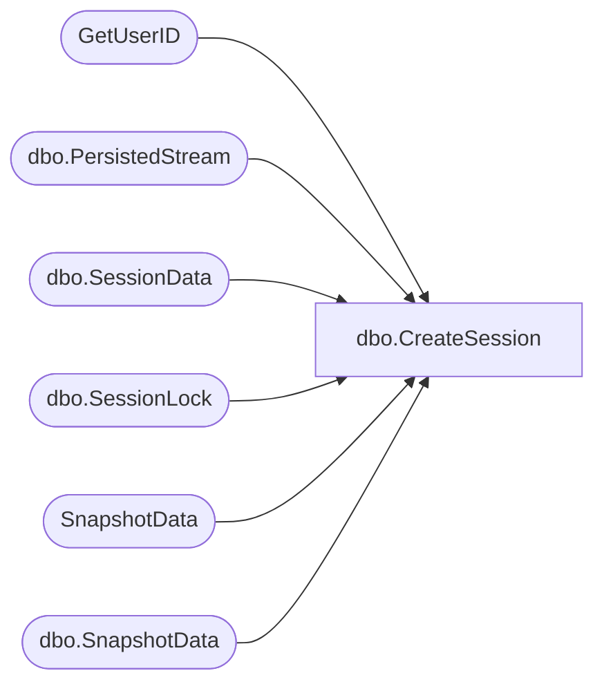

# dbo.CreateSession

**Database:** ReportServerESell  
**Server:** bedrockdb01  

## Architecture Diagram



## Table Dependencies

| Referenced Table |
|---|
| GetUserID |
| dbo.PersistedStream |
| dbo.SessionData |
| dbo.SessionLock |
| SnapshotData |
| dbo.SnapshotData |

## Stored Procedure Code

```sql
-- Writes or updates session record
CREATE PROCEDURE [dbo].[CreateSession]
@SessionID as varchar(32),
@CompiledDefinition as uniqueidentifier = NULL,
@SnapshotDataID as uniqueidentifier = NULL,
@IsPermanentSnapshot as bit = NULL,
@ReportPath as nvarchar(464) = NULL,
@Timeout as int,
@AutoRefreshSeconds as int = NULL,
@DataSourceInfo as image = NULL,
@OwnerName as nvarchar (260),
@OwnerSid as varbinary (85) = NULL,
@AuthType as int,
@EffectiveParams as ntext = NULL,
@HistoryDate as datetime = NULL,
@PageHeight as float = NULL,
@PageWidth as float = NULL,
@TopMargin as float = NULL,
@BottomMargin as float = NULL,
@LeftMargin as float = NULL,
@RightMargin as float = NULL,
@AwaitingFirstExecution as bit = NULL,
@EditSessionID as varchar(32) = NULL,
@SitePath as nvarchar(440) = NULL,
@SiteZone as int,
@DataSetInfo as varbinary(max) = NULL,
@ReportDefinitionPath as nvarchar(464) = NULL
AS

UPDATE PS
SET PS.RefCount = 1
FROM
    [ReportServerESellTempDB].dbo.PersistedStream as PS
WHERE
    PS.SessionID = @SessionID	
    
UPDATE SN
SET TransientRefcount = TransientRefcount + 1
FROM
   SnapshotData AS SN
WHERE
   SN.SnapshotDataID = @SnapshotDataID
   
UPDATE SN
SET TransientRefcount = TransientRefcount + 1
FROM
   [ReportServerESellTempDB].dbo.SnapshotData AS SN
WHERE
   SN.SnapshotDataID = @SnapshotDataID

DECLARE @OwnerID uniqueidentifier
EXEC GetUserID @OwnerSid, @OwnerName, @AuthType, @OwnerID OUTPUT

DECLARE @now datetime
SET @now = GETDATE()

INSERT
   INTO [ReportServerESellTempDB].dbo.SessionData (
      SessionID,
      CompiledDefinition,
      SnapshotDataID,
      IsPermanentSnapshot,
      ReportPath,
      Timeout,
      AutoRefreshSeconds,
      Expiration,
      DataSourceInfo,
      OwnerID,
      EffectiveParams,
      CreationTime,
      HistoryDate,
      PageHeight,
      PageWidth,
      TopMargin,
      BottomMargin,
      LeftMargin,
      RightMargin,
      AwaitingFirstExecution,
      EditSessionID,
      SitePath,
      SiteZone,
      DataSetInfo,
      ReportDefinitionPath )      
   VALUES (
      @SessionID,
      @CompiledDefinition,
      @SnapshotDataID,
      @IsPermanentSnapshot,
      @ReportPath,
      @Timeout,
      @AutoRefreshSeconds,
      DATEADD(s, @Timeout, @now),
      @DataSourceInfo,
      @OwnerID,
      @EffectiveParams,
      @now,
      @HistoryDate,
      @PageHeight,
      @PageWidth,
      @TopMargin,
      @BottomMargin,
      @LeftMargin,
      @RightMargin,
      @AwaitingFirstExecution, 
      @EditSessionID,
      @SitePath,
      @SiteZone,
      @DataSetInfo,
      @ReportDefinitionPath )
      
INSERT INTO [ReportServerESellTempDB].dbo.SessionLock(SessionID)
VALUES (@SessionID)
```

