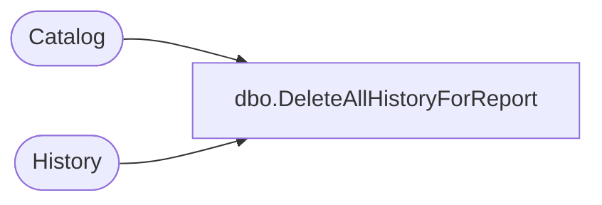

# dbo.DeleteAllHistoryForReport

**Database:** ReportServerESell  
**Server:** bedrockdb01  

## Architecture Diagram



## Table Dependencies

| Referenced Table |
|---|
| Catalog |
| History |

## Stored Procedure Code

```sql
-- delete all snapshots for a report
CREATE PROCEDURE [dbo].[DeleteAllHistoryForReport]
@ReportID uniqueidentifier
AS
SET NOCOUNT OFF
DELETE
FROM History
WHERE HistoryID in
   (SELECT HistoryID
    FROM History JOIN Catalog on ItemID = ReportID
    WHERE ReportID = @ReportID
   )
```

