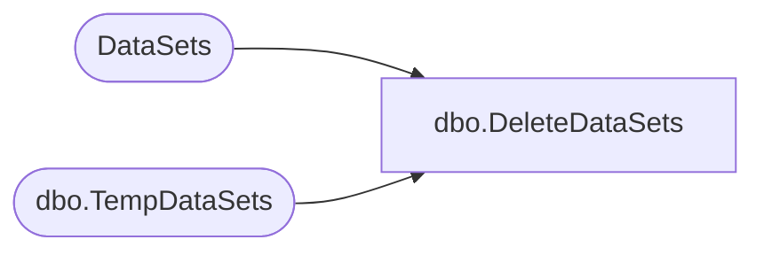

# dbo.DeleteDataSets

**Database:** ReportServerESell  
**Server:** bedrockdb01  

## Architecture Diagram



## Table Dependencies

| Referenced Table |
|---|
| DataSets |
| dbo.TempDataSets |

## Stored Procedure Code

```sql
CREATE PROCEDURE [dbo].[DeleteDataSets]
@ItemID [uniqueidentifier]
AS
DELETE
FROM [DataSets]
WHERE [ItemID] = @ItemID
DELETE
FROM [ReportServerESellTempDB].dbo.TempDataSets
WHERE [ItemID] = @ItemID
```

