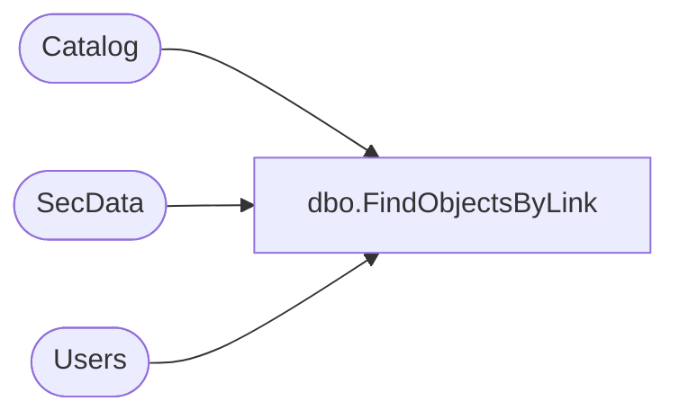

# dbo.FindObjectsByLink

**Database:** ReportServerESell  
**Server:** bedrockdb01  

## Architecture Diagram



## Table Dependencies

| Referenced Table |
|---|
| Catalog |
| SecData |
| Users |

## Stored Procedure Code

```sql
CREATE PROCEDURE [dbo].[FindObjectsByLink]
@Link uniqueidentifier,
@AuthType int
AS
SELECT 
    C.Type, 
    C.PolicyID,
    SD.NtSecDescPrimary,
    C.Name, 
    C.Path, 
    C.ItemID, 
    DATALENGTH( C.Content ) AS [Size], 
    C.Description,
    C.CreationDate, 
    C.ModifiedDate, 
    SUSER_SNAME(CU.Sid),
    CU.UserName,
    SUSER_SNAME(MU.Sid),
    MU.UserName,
    C.MimeType,
    C.ExecutionTime,
    C.Hidden,
    C.SubType,
    C.ComponentID
FROM
   Catalog AS C
   INNER JOIN Users AS CU ON C.CreatedByID = CU.UserID
   INNER JOIN Users AS MU ON C.ModifiedByID = MU.UserID
   LEFT OUTER JOIN SecData AS SD ON C.PolicyID = SD.PolicyID AND SD.AuthType = @AuthType
WHERE C.LinkSourceID = @Link
```

